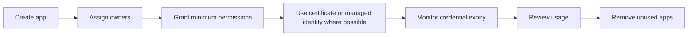

# App Registration Hygiene Best Practices

Application identities should be treated like production credentials and service inventory, not like forgotten setup artifacts.

## Why This Matters

Stale secrets, missing owners, and abandoned app registrations are common causes of outage, excess privilege, and tenant-wide attack surface growth.

## Prerequisites

- Inventory of app registrations and enterprise applications.
- Defined ownership model for app teams.
- Secret and certificate rotation process.

<!-- diagram-id: app-registration-lifecycle -->


## Recommended Practices

### Practice 1: Require at least two accountable owners

**Why**

Single-owner app registrations become operational dead ends when staff changes occur.

**How**

- Assign at least two owners to important app registrations.
- Use team-based ownership where possible.
- Review ownerless apps regularly.

**Validation**

```http
GET https://graph.microsoft.com/v1.0/applications?$select=id,appId,displayName
Authorization: Bearer <token>
```

### Practice 2: Prefer certificates or managed identities over long-lived secrets

**Why**

Client secrets are easy to forget, easier to leak, and often harder to rotate safely.

**How**

- Use managed identities for Azure-hosted workloads when possible.
- Use certificates for app registrations when managed identities are not available.
- Keep secret validity periods short if secrets are unavoidable.

**Validation**

- New production apps do not default to long-lived client secrets.
- Exceptions for secrets are documented.

### Practice 3: Monitor credential expiry and rotate before outage windows

**Why**

Expired secrets and certificates can create sudden authentication failures with little visible warning to app owners.

**How**

- Track expiration dates in automation or operational dashboards.
- Rotate credentials before their final weeks.
- Use overlap periods so new and old credentials can coexist during cutover.

**Validation**

```bash
az ad app credential list --id "$APP_ID"
az rest --method get --url "https://graph.microsoft.com/v1.0/applications(appId='$APP_ID')"
```

### Practice 4: Remove unused applications and service principals

**Why**

Unused identities accumulate permissions and create unnecessary review burden.

**How**

- Review sign-in and audit activity for inactivity.
- Confirm with app owners before deletion.
- Remove both the app registration and related enterprise application objects when appropriate.

**Validation**

- Inactive apps have review outcomes recorded.
- Decommission steps are part of project offboarding.

!!! warning
    Never delete an app registration based only on age. Validate ownership, dependent environments, and service principal usage first.

### Practice 5: Keep permissions and consent narrow

**Why**

Excess API permission scope increases the impact of token misuse or compromised workload identity.

**How**

- Request only the scopes or app roles the workload truly needs.
- Revisit permissions after feature changes.
- Separate production and non-production app registrations.

**Validation**

```http
GET https://graph.microsoft.com/v1.0/applications(appId='$APP_ID')/owners
Authorization: Bearer <token>
```

## Common Mistakes / Anti-Patterns

- One owner or no owner on production apps.
- Multi-year secrets without monitoring.
- Reusing one app registration across unrelated environments.
- Forgetting enterprise applications created from app registrations.
- Leaving broad Graph permissions after a pilot or proof of concept.

## Validation Checklist

- [ ] Important apps have at least two owners.
- [ ] Managed identities or certificates are preferred over secrets.
- [ ] Credential expiry is monitored.
- [ ] Unused apps are reviewed and removed.
- [ ] Permissions are least privilege and environment-specific.
- [ ] Ownerless apps trigger remediation.

## Cost Impact

App hygiene does not usually require large direct spend, but it reduces outage risk, incident response effort, and premium feature waste caused by unmanaged service principals.

## See Also

- [Least Privilege RBAC](least-privilege-rbac.md)
- [App Consent Management](../operations/app-consent-management.md)
- [App Registrations and Service Principals](../platform/app-registrations-and-service-principals.md)
- [App Permission Consent Issues](../troubleshooting/playbooks/app-permission-consent-issues.md)

## Sources

- Microsoft Learn: [Register an application with the Microsoft identity platform](https://learn.microsoft.com/entra/identity-platform/quickstart-register-app)
- Microsoft Learn: [Application management in Microsoft Entra ID](https://learn.microsoft.com/entra/identity/enterprise-apps/application-management)
- Microsoft Learn: [Remove an application from Microsoft Entra ID](https://learn.microsoft.com/entra/identity/enterprise-apps/howto-remove-app)
- Microsoft Graph: [application resource type](https://learn.microsoft.com/graph/api/resources/application)
