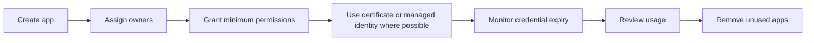

# App Registration Hygiene Best Practices

Application identities should be treated like production credentials and service inventory, not like forgotten setup artifacts.

## Why This Matters

Stale secrets, missing owners, and abandoned app registrations are common causes of outage, excess privilege, and tenant-wide attack surface growth.

## Prerequisites

- Inventory of app registrations and enterprise applications.
- Defined ownership model for app teams.
- Secret and certificate rotation process.
- Access to Microsoft Graph or Azure CLI with permission to review application objects.
- A standard for separating production, non-production, and proof-of-concept identities.
- A decommission checklist that includes both the application object and the related service principal.

<!-- diagram-id: app-registration-lifecycle -->


## Recommended Practices

### Practice 1: Require at least two accountable owners

**Why**

Single-owner app registrations become operational dead ends when staff changes occur.

**How**

- Assign at least two owners to important app registrations.
- Use team-based ownership where possible.
- Review ownerless apps regularly.

```bash
az rest --method GET \
    --url "https://graph.microsoft.com/v1.0/applications?$select=id,appId,displayName" \
    --output json
```

Example output:

```json
{
    "value": [
        {
            "id": "<object-id>",
            "appId": "<app-id>",
            "displayName": "APP-ERP-Prod"
        }
    ]
}
```

- Use a recurring review to identify applications with no reachable operational owner.
- Record a shared mailbox, team channel, or service ownership group in internal inventory, even though Entra ownership stays assigned to named people.

**Validation**

```http
GET https://graph.microsoft.com/v1.0/applications?$select=id,appId,displayName
Authorization: Bearer <token>
```

- Every production app has at least two owners.
- Owner reviews are part of joiner, mover, and leaver processes.

### Practice 2: Prefer certificates or managed identities over long-lived secrets

**Why**

Client secrets are easy to forget, easier to leak, and often harder to rotate safely.

**How**

- Use managed identities for Azure-hosted workloads when possible.
- Use certificates for app registrations when managed identities are not available.
- Keep secret validity periods short if secrets are unavoidable.

```bash
az ad app credential list \
    --id "$APP_ID" \
    --output table
```

Example output:

```text
CustomKeyIdentifier    EndDateTime            KeyId                                 StartDateTime
---------------------- ---------------------- ------------------------------------ ----------------------
<not-set>              2026-10-01T00:00:00Z   <object-id>                          2026-04-01T00:00:00Z
```

- Treat certificate rollover as a tested release task, not as a manual emergency step.
- Use secrets only when the workload hosting model cannot use managed identity and the application does not support certificate-based authentication cleanly.

**Validation**

- New production apps do not default to long-lived client secrets.
- Exceptions for secrets are documented.
- Credential type and expiry expectations are visible in operational inventory.

### Practice 3: Monitor credential expiry and rotate before outage windows

**Why**

Expired secrets and certificates can create sudden authentication failures with little visible warning to app owners.

**How**

- Track expiration dates in automation or operational dashboards.
- Rotate credentials before their final weeks.
- Use overlap periods so new and old credentials can coexist during cutover.

```bash
az rest --method GET \
    --url "https://graph.microsoft.com/v1.0/applications(appId='$APP_ID')?$select=displayName,passwordCredentials,keyCredentials" \
    --output json
```

Example output:

```json
{
    "displayName": "APP-ERP-Prod",
    "passwordCredentials": [],
    "keyCredentials": [
        {
            "endDateTime": "2026-10-01T00:00:00Z",
            "keyId": "<object-id>"
        }
    ]
}
```

- Rotate before maintenance freezes and peak business periods.
- Validate both issuing and consuming systems during overlap so rollback remains possible.

**Validation**

```bash
az ad app credential list --id "$APP_ID"
az rest --method get --url "https://graph.microsoft.com/v1.0/applications(appId='$APP_ID')"
```

- Rotation records include planned expiry date, replacement date, and owner confirmation.

### Practice 4: Remove unused applications and service principals

**Why**

Unused identities accumulate permissions and create unnecessary review burden.

**How**

- Review sign-in and audit activity for inactivity.
- Confirm with app owners before deletion.
- Remove both the app registration and related enterprise application objects when appropriate.

```bash
az ad sp list \
    --display-name "$DISPLAY_NAME" \
    --output table
```

Example output:

```text
DisplayName      Id           AppId
---------------  -----------  -----------
APP-ERP-Prod     <object-id>  <app-id>
```

- Verify whether the app is used in automation, line-of-business integrations, or external federation before removing it.
- Decommission dev and test objects aggressively so production reviews stay focused.

**Validation**

- Inactive apps have review outcomes recorded.
- Decommission steps are part of project offboarding.
- The corresponding enterprise application object is reviewed with the same rigor as the app registration.

!!! warning
    Never delete an app registration based only on age. Validate ownership, dependent environments, and service principal usage first.

### Practice 5: Keep permissions and consent narrow

**Why**

Excess API permission scope increases the impact of token misuse or compromised workload identity.

**How**

- Request only the scopes or app roles the workload truly needs.
- Revisit permissions after feature changes.
- Separate production and non-production app registrations.

```bash
az rest --method GET \
    --url "https://graph.microsoft.com/v1.0/applications(appId='$APP_ID')?$select=requiredResourceAccess" \
    --output json
```

Example output:

```json
{
    "requiredResourceAccess": [
        {
            "resourceAppId": "00000003-0000-0000-c000-000000000000",
            "resourceAccess": [
                {
                    "id": "<object-id>",
                    "type": "Role"
                }
            ]
        }
    ]
}
```

- Review delegated permissions separately from application permissions because the blast radius is different.
- Keep pilot permissions out of production registrations after testing is complete.

**Validation**

```http
GET https://graph.microsoft.com/v1.0/applications(appId='$APP_ID')/owners
Authorization: Bearer <token>
```

- Requested permissions match documented application behavior.
- Production and non-production registrations are not sharing one consent boundary.

### Practice 6: Standardize lifecycle metadata for reviewability

**Why**

Good hygiene depends on fast answers to basic questions: who owns the app, what environment it serves, and when it should be reviewed.

**How**

- Standardize display names so environment and purpose are obvious.
- Store review date, owner team, and retirement status in your service inventory or CMDB.
- Use a periodic application review that checks ownership, credentials, permissions, and recent activity together.

```bash
az ad app list \
    --display-name "$DISPLAY_NAME" \
    --query "[].{appId:appId,displayName:displayName}" \
    --output table
```

**Validation**

- Operators can tell whether an app is production, non-production, or deprecated.
- Review outcomes are discoverable without searching old tickets.

## Common Mistakes / Anti-Patterns

### Anti-Pattern 1: One owner or no owner on production apps

**What happens**: Ownership questions turn into incident delays when credentials expire or permissions need review.

**Why it's wrong**: A single person becomes a hidden dependency for security and operations.

**Correct approach**: Assign at least two accountable owners and record the owning team in operational inventory.

### Anti-Pattern 2: Multi-year secrets without monitoring

**What happens**: Secrets become invisible until outage day or until they are exposed in logs, code, or tickets.

**Why it's wrong**: Long validity increases compromise exposure and reduces discipline around rotation.

**Correct approach**: Prefer managed identities or certificates, and monitor expiry for any secret that remains.

### Anti-Pattern 3: Reusing one app registration across unrelated environments

**What happens**: Dev, test, and production share the same permissions, credentials, and blast radius.

**Why it's wrong**: A low-trust environment can now affect a high-trust one.

**Correct approach**: Use separate registrations per environment, with separate owners and separate credential lifecycle.

### Anti-Pattern 4: Forgetting enterprise applications created from app registrations

**What happens**: Teams delete or review only the application object while the service principal remains overlooked.

**Why it's wrong**: Access and consent footprint can remain broader than expected.

**Correct approach**: Review application and enterprise application objects together during onboarding and decommissioning.

### Anti-Pattern 5: Leaving broad Graph permissions after a pilot or proof of concept

**What happens**: Experimental permissions survive into production and become normalized.

**Why it's wrong**: Pilot-era overreach expands the damage potential of token misuse.

**Correct approach**: Re-approve only the exact permissions required for the final design before go-live.

## Validation Checklist

- [ ] Important apps have at least two owners.
- [ ] Managed identities or certificates are preferred over secrets.
- [ ] Credential expiry is monitored.
- [ ] Unused apps are reviewed and removed.
- [ ] Permissions are least privilege and environment-specific.
- [ ] Ownerless apps trigger remediation.

## Cost Impact

App hygiene does not usually require large direct spend, but it reduces outage risk, incident response effort, and premium feature waste caused by unmanaged service principals.

- Better ownership reduces engineering time lost during secret expiry incidents.
- Environment separation can increase object count slightly, but it usually lowers operational risk and review cost.
- Managed identities often reduce secret management overhead compared to application secrets.

## See Also

- [Least Privilege RBAC](least-privilege-rbac.md)
- [App Consent Management](../operations/app-consent-management.md)
- [App Registrations and Service Principals](../platform/app-registrations-and-service-principals.md)
- [App Permission Consent Issues](../troubleshooting/playbooks/app-permission-consent-issues.md)

## Sources

- Microsoft Learn: [Register an application with the Microsoft identity platform](https://learn.microsoft.com/entra/identity-platform/quickstart-register-app)
- Microsoft Learn: [Application management in Microsoft Entra ID](https://learn.microsoft.com/entra/identity/enterprise-apps/application-management)
- Microsoft Learn: [Remove an application from Microsoft Entra ID](https://learn.microsoft.com/entra/identity/enterprise-apps/howto-remove-app)
- Microsoft Graph: [application resource type](https://learn.microsoft.com/graph/api/resources/application)
