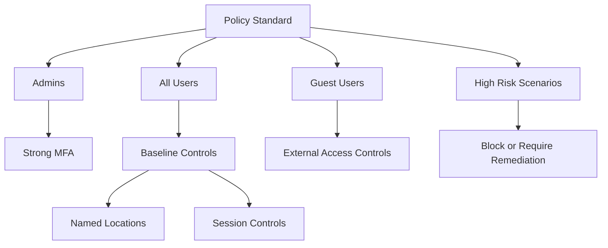

# Conditional Access Design Best Practices

Conditional Access should be structured like a policy program, not a random collection of one-off rules.

## Why This Matters

Conditional Access can strengthen every sign-in path, but poor design can block administrators, confuse users, and hide policy intent.

## Prerequisites

- Premium licensing for Conditional Access features.
- Emergency access accounts.
- Test groups and report-only rollout process.
- Agreement on trusted networks, device posture, and app targeting.

<!-- diagram-id: conditional-access-layering -->


## Recommended Practices

### Practice 1: Organize policies by intent and audience

**Why**

Policy sprawl makes troubleshooting harder and increases the chance of conflicting logic.

**How**

- Create categories such as admin protection, baseline user access, guest access, device controls, and risk controls.
- Use a naming convention that includes scope and effect.
- Keep policy descriptions explicit about why the policy exists.

**Validation**

- An operator can identify policy purpose from its name alone.
- Duplicate app targeting is limited and documented.

### Practice 2: Use named locations carefully

**Why**

Named locations help scope trusted or blocked networks, but they are easy to over-trust.

**How**

- Use named locations for operational clarity, not as a sole trust anchor.
- Review VPN egress ranges, branch office changes, and cloud proxy paths regularly.
- Do not exempt privileged activity just because traffic originates from a corporate location.

**Validation**

```http
GET https://graph.microsoft.com/v1.0/identity/conditionalAccess/namedLocations
Authorization: Bearer <token>
```

### Practice 3: Separate grant controls from session controls intentionally

**Why**

Grant controls decide whether access is allowed. Session controls shape what happens after access is granted.

**How**

- Use grant controls for MFA, compliant device requirements, or blocks.
- Use session controls for sign-in frequency, persistent browser handling, or app-enforced restrictions where needed.
- Keep user experience tradeoffs documented.

**Validation**

- Session controls are applied only where risk justifies friction.
- Grant controls are consistent for similar user classes.

### Practice 4: Roll out in report-only mode before enforcement

**Why**

Report-only mode reduces the chance of disruptive outages and reveals unplanned dependencies.

**How**

- Pilot policies with a test group.
- Review sign-in impact before enabling enforcement.
- Stage rollouts by audience or application criticality.

**Validation**

```bash
az rest --method get --url "https://graph.microsoft.com/v1.0/identity/conditionalAccess/policies"
```

!!! note
    Report-only mode is most useful when paired with defined success criteria. Decide in advance what evidence is required before changing a policy to enabled.

### Practice 5: Exclude only what you must and record why

**Why**

Unchecked exclusions quietly become the largest control gap in mature tenants.

**How**

- Limit exclusions to emergency access accounts, specific service constraints, or transitional scenarios.
- Assign an owner and review date for each exclusion.
- Prefer small, purpose-built exclusion groups instead of broad catch-all groups.

**Validation**

- Every exclusion has a documented business reason.
- Exclusion groups are monitored for membership changes.

## Common Mistakes / Anti-Patterns

- Creating too many app-specific policies without a framework.
- Trusting named locations as equivalent to strong identity assurance.
- Mixing baseline, admin, guest, and risk logic in one policy.
- Enforcing new policies without report-only analysis.
- Forgetting to protect workload admin paths separately from regular users.

## Validation Checklist

- [ ] Policies follow a naming and category standard.
- [ ] Named locations are reviewed regularly.
- [ ] Grant and session controls are used intentionally.
- [ ] New policies are tested in report-only mode.
- [ ] Exclusions are minimal and documented.
- [ ] Emergency access accounts are handled safely.

## Cost Impact

Conditional Access requires premium licensing, but disciplined design reduces outage cost, troubleshooting effort, and insecure exception growth.

## See Also

- [Security Defaults and MFA](security-defaults-and-mfa.md)
- [Identity Protection](identity-protection.md)
- [Conditional Access Management](../operations/conditional-access-management.md)
- [Unexpected Conditional Access Block](../troubleshooting/playbooks/conditional-access-unexpected-block.md)

## Sources

- Microsoft Learn: [What is Conditional Access?](https://learn.microsoft.com/entra/identity/conditional-access/overview)
- Microsoft Learn: [Conditional Access policies](https://learn.microsoft.com/entra/identity/conditional-access/concept-conditional-access-policies)
- Microsoft Learn: [Conditional Access: network assignment](https://learn.microsoft.com/entra/identity/conditional-access/concept-assignment-network)
- Microsoft Learn: [Conditional Access insights and reporting](https://learn.microsoft.com/entra/identity/conditional-access/howto-conditional-access-insights-reporting)
