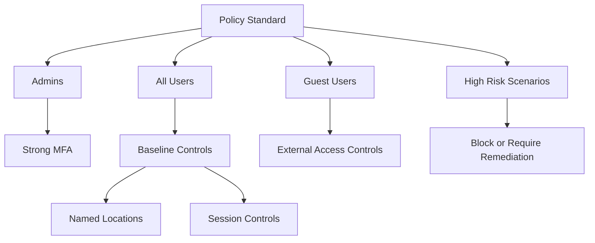

# Conditional Access Design Best Practices

Conditional Access should be structured like a policy program, not a random collection of one-off rules.

## Why This Matters

Conditional Access can strengthen every sign-in path, but poor design can block administrators, confuse users, and hide policy intent.

## Prerequisites

- Premium licensing for Conditional Access features.
- Emergency access accounts.
- Test groups and report-only rollout process.
- Agreement on trusted networks, device posture, and app targeting.
- Naming and documentation standards for policy purpose, owner, and exception review date.
- Sign-in log access for the operators who will evaluate report-only impact.

<!-- diagram-id: conditional-access-layering -->


## Recommended Practices

### Practice 1: Organize policies by intent and audience

**Why**

Policy sprawl makes troubleshooting harder and increases the chance of conflicting logic.

**How**

- Create categories such as admin protection, baseline user access, guest access, device controls, and risk controls.
- Use a naming convention that includes scope and effect.
- Keep policy descriptions explicit about why the policy exists.

```bash
az rest --method GET \
    --url "https://graph.microsoft.com/v1.0/identity/conditionalAccess/policies" \
    --output json
```

Example output:

```json
{
    "value": [
        {
            "id": "<object-id>",
            "displayName": "CA-Admins-Require-Phishing-Resistant-MFA",
            "state": "enabledForReportingButNotEnforced"
        }
    ]
}
```

- Reserve dedicated policy families for admins, workforce baseline, guests, device requirements, and risk-based controls.
- Keep naming stable so operators can compare policies over time instead of re-learning policy intent during incidents.

**Validation**

- An operator can identify policy purpose from its name alone.
- Duplicate app targeting is limited and documented.
- Policy descriptions explain audience, exception reason, and expected user experience.

### Practice 2: Use named locations carefully

**Why**

Named locations help scope trusted or blocked networks, but they are easy to over-trust.

**How**

- Use named locations for operational clarity, not as a sole trust anchor.
- Review VPN egress ranges, branch office changes, and cloud proxy paths regularly.
- Do not exempt privileged activity just because traffic originates from a corporate location.

```bash
az rest --method GET \
    --url "https://graph.microsoft.com/v1.0/identity/conditionalAccess/namedLocations" \
    --output json
```

- Treat named locations as one signal among identity strength, device trust, and session context.
- Coordinate IP range changes with network teams before CA behavior changes unexpectedly.

**Validation**

```http
GET https://graph.microsoft.com/v1.0/identity/conditionalAccess/namedLocations
Authorization: Bearer <token>
```

- Every trusted location has an owner and review schedule.

### Practice 3: Separate grant controls from session controls intentionally

**Why**

Grant controls decide whether access is allowed. Session controls shape what happens after access is granted.

**How**

- Use grant controls for MFA, compliant device requirements, or blocks.
- Use session controls for sign-in frequency, persistent browser handling, or app-enforced restrictions where needed.
- Keep user experience tradeoffs documented.

```bash
az rest --method GET \
    --url "https://graph.microsoft.com/v1.0/identity/conditionalAccess/policies?$select=id,displayName,grantControls,sessionControls" \
    --output json
```

- Avoid mixing fundamentally different objectives in one policy when separate policies are easier to test and explain.
- Document when friction is expected so support teams can distinguish intended behavior from failure.

**Validation**

- Session controls are applied only where risk justifies friction.
- Grant controls are consistent for similar user classes.
- Sign-in frequency and persistent browser choices are reviewed with application owners.

### Practice 4: Roll out in report-only mode before enforcement

**Why**

Report-only mode reduces the chance of disruptive outages and reveals unplanned dependencies.

**How**

- Pilot policies with a test group.
- Review sign-in impact before enabling enforcement.
- Stage rollouts by audience or application criticality.

```bash
az rest --method GET \
    --url "https://graph.microsoft.com/v1.0/identity/conditionalAccess/policies?$select=id,displayName,state" \
    --output table
```

Example output:

```text
DisplayName                               Id           State
----------------------------------------  -----------  --------------------------------------
CA-AllUsers-Require-MFA                  <object-id>  enabledForReportingButNotEnforced
```

- Define success criteria before testing, such as acceptable impact on guest sign-ins, legacy protocols, or line-of-business applications.
- Promote from test users to broader groups only after reviewing sign-in logs and unresolved failures.

**Validation**

```bash
az rest --method get --url "https://graph.microsoft.com/v1.0/identity/conditionalAccess/policies"
```

- Report-only results are reviewed by both identity and application owners.

!!! note
    Report-only mode is most useful when paired with defined success criteria. Decide in advance what evidence is required before changing a policy to enabled.

### Practice 5: Exclude only what you must and record why

**Why**

Unchecked exclusions quietly become the largest control gap in mature tenants.

**How**

- Limit exclusions to emergency access accounts, specific service constraints, or transitional scenarios.
- Assign an owner and review date for each exclusion.
- Prefer small, purpose-built exclusion groups instead of broad catch-all groups.

```bash
az rest --method GET \
    --url "https://graph.microsoft.com/v1.0/identity/conditionalAccess/policies?$select=id,displayName,conditions" \
    --output json
```

- Review exclusion group membership changes with the same rigor as admin group membership changes.
- Remove transitional exclusions after the dependent application or device population is remediated.

**Validation**

- Every exclusion has a documented business reason.
- Exclusion groups are monitored for membership changes.
- Exclusions are time-bound unless they support emergency access design.

### Practice 6: Protect administrators and high-impact apps separately

**Why**

Admin sign-ins and high-value cloud apps have very different risk tolerance than ordinary workforce access.

**How**

- Create stronger policies for admin roles, including phishing-resistant MFA or stricter device controls where available.
- Identify critical management planes and high-impact applications that justify dedicated policy review.
- Test administrative workflows separately from end-user workflows.

**Validation**

- Admin policies are easy to identify and are not mixed into general workforce baseline rules.
- Critical apps have known policy dependencies before production changes.

## Common Mistakes / Anti-Patterns

### Anti-Pattern 1: Creating too many app-specific policies without a framework

**What happens**: Policy count grows faster than operator understanding.

**Why it's wrong**: Troubleshooting becomes guesswork and policy conflicts become harder to identify.

**Correct approach**: Start with policy families by audience and control objective, then add app-specific rules only when justified.

### Anti-Pattern 2: Trusting named locations as equivalent to strong identity assurance

**What happens**: Traffic from a familiar IP range is treated as safe even when credentials or sessions are suspicious.

**Why it's wrong**: Network origin alone does not prove user legitimacy.

**Correct approach**: Combine location with MFA, device trust, or risk-based controls.

### Anti-Pattern 3: Mixing baseline, admin, guest, and risk logic in one policy

**What happens**: One policy change unexpectedly affects several unrelated populations.

**Why it's wrong**: It hides intent and raises rollback risk.

**Correct approach**: Separate policies by audience and control type so testing and ownership stay clear.

### Anti-Pattern 4: Enforcing new policies without report-only analysis

**What happens**: Unplanned outages and urgent exclusions appear after enablement.

**Why it's wrong**: You discover dependencies in production instead of during controlled review.

**Correct approach**: Use report-only, inspect sign-in results, and define success criteria before enforcement.

### Anti-Pattern 5: Forgetting to protect workload admin paths separately from regular users

**What happens**: Highly privileged portals and APIs inherit only standard baseline controls.

**Why it's wrong**: The highest-impact sign-ins are under-protected.

**Correct approach**: Create dedicated administrator protections and validate them independently.

## Validation Checklist

- [ ] Policies follow a naming and category standard.
- [ ] Named locations are reviewed regularly.
- [ ] Grant and session controls are used intentionally.
- [ ] New policies are tested in report-only mode.
- [ ] Exclusions are minimal and documented.
- [ ] Emergency access accounts are handled safely.

## Cost Impact

Conditional Access requires premium licensing, but disciplined design reduces outage cost, troubleshooting effort, and insecure exception growth.

- Clear policy families reduce the labor cost of audits and incident response.
- Minimal exclusions prevent long-lived workaround debt that later consumes engineering time.
- Report-only testing lowers the cost of disruptive rollbacks and emergency support spikes.

## See Also

- [Security Defaults and MFA](security-defaults-and-mfa.md)
- [Identity Protection](identity-protection.md)
- [Conditional Access Management](../operations/conditional-access-management.md)
- [Unexpected Conditional Access Block](../troubleshooting/playbooks/conditional-access-unexpected-block.md)

## Sources

- Microsoft Learn: [What is Conditional Access?](https://learn.microsoft.com/entra/identity/conditional-access/overview)
- Microsoft Learn: [Conditional Access policies](https://learn.microsoft.com/entra/identity/conditional-access/concept-conditional-access-policies)
- Microsoft Learn: [Conditional Access: network assignment](https://learn.microsoft.com/entra/identity/conditional-access/concept-assignment-network)
- Microsoft Learn: [Conditional Access insights and reporting](https://learn.microsoft.com/entra/identity/conditional-access/howto-conditional-access-insights-reporting)
