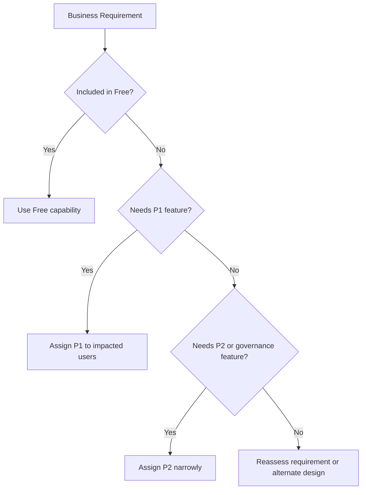

# Cost Optimization Best Practices

Entra ID cost optimization is mainly about matching capabilities to the right users, workflows, and administrative maturity level.

## Why This Matters

Identity licensing can drift upward quickly when premium features are assigned broadly but used narrowly, or when features are duplicated across tools without governance.

## Prerequisites

- Current license inventory and assignment method.
- Feature inventory for Conditional Access, PIM, Identity Protection, and governance.
- Ownership for license lifecycle reviews.

<!-- diagram-id: entra-license-right-sizing -->


## Recommended Practices

### Practice 1: Map features to licensing tiers explicitly

**Why**

Teams often enable advanced controls without a durable record of which license tier supports them.

**How**

- Document which capabilities depend on Free, P1, or P2.
- Include licensing assumptions in architecture decisions and rollout plans.
- Recheck licensing before expanding premium controls to new audiences.

**Validation**

- Each premium feature has a named owner and target population.
- Architecture documents state license dependencies.

### Practice 2: Assign premium licenses to the users who need the feature

**Why**

The best savings often come from narrowing scope, not removing security controls.

**How**

- Use group-based licensing where appropriate.
- Limit P2-heavy features to privileged users, high-risk populations, or regulated groups when justified.
- Remove premium licenses from inactive or transferred users.

**Validation**

```bash
az rest --method get --url "https://graph.microsoft.com/v1.0/subscribedSkus"
az rest --method get --url "https://graph.microsoft.com/v1.0/users/$OBJECT_ID/licenseDetails"
```

### Practice 3: Avoid paying twice for overlapping controls

**Why**

Organizations sometimes license multiple platforms for similar identity outcomes without clarifying which one is authoritative.

**How**

- Decide whether Entra ID, another IAM product, or a security suite owns each control area.
- Avoid duplicating workflows for risk remediation, access reviews, or MFA governance unless required.
- Retire old controls after transition.

**Validation**

- Each control family has one primary system of record.
- Duplicate reporting and alerting paths are minimized.

### Practice 4: Right-size P1 and P2 adoption around real operations

**Why**

Premium capabilities deliver value only when processes exist to use them.

**How**

- Use P1 when Conditional Access and dynamic access needs justify it.
- Use P2 when you will actively operate Identity Protection, PIM, or advanced governance.
- Pilot advanced features with a focused population before wide assignment.

**Validation**

- P2 detections and governance outputs are reviewed on a schedule.
- There are no large populations with premium licenses but no premium process owner.

!!! tip
    Cost optimization does not mean choosing the cheapest tier. It means paying for the smallest tier that still enables the control outcome you actually operate.

### Practice 5: Review license consumption regularly

**Why**

User populations change faster than license assignment assumptions.

**How**

- Review assigned versus consumed license counts monthly or quarterly.
- Reconcile dormant accounts, contractors, and role changes.
- Compare premium license assignment with actual use of protected features.

**Validation**

```http
GET https://graph.microsoft.com/v1.0/subscribedSkus
Authorization: Bearer <token>
```

## Common Mistakes / Anti-Patterns

- Assigning P2 broadly “just in case.”
- Using premium features without an operational owner.
- Assuming every security recommendation requires the highest license tier.
- Failing to remove licenses from inactive users.
- Running overlapping IAM tools without control ownership clarity.

## Validation Checklist

- [ ] Features are mapped to license tiers.
- [ ] Premium licenses are scoped to users who need them.
- [ ] Duplicate control platforms are reviewed.
- [ ] P1 and P2 features have operational owners.
- [ ] License assignment is reviewed regularly.
- [ ] Dormant or transferred users are cleaned up.

## Cost Impact

This page is about cost impact directly: the biggest savings usually come from better scoping, better offboarding, and avoiding premium features that the organization will not operate effectively.

| Tier | Typical use |
|---|---|
| Free | Baseline identity and simple protection scenarios |
| P1 | Conditional Access and broader enterprise access controls |
| P2 | Identity Protection, PIM, and advanced governance workflows |

## See Also

- [Security Defaults and MFA](security-defaults-and-mfa.md)
- [Conditional Access Design](conditional-access-design.md)
- [Least Privilege RBAC](least-privilege-rbac.md)
- [Identity Protection](identity-protection.md)

## Sources

- Microsoft Learn: [Microsoft Entra ID licensing](https://learn.microsoft.com/entra/fundamentals/licensing)
- Microsoft Learn: [Licensing fundamentals for Microsoft Entra ID Governance](https://learn.microsoft.com/entra/id-governance/licensing-fundamentals)
- Microsoft Learn: [What is Microsoft Entra ID Protection?](https://learn.microsoft.com/entra/id-protection/overview-identity-protection)
- Microsoft Learn: [What is Conditional Access?](https://learn.microsoft.com/entra/identity/conditional-access/overview)
