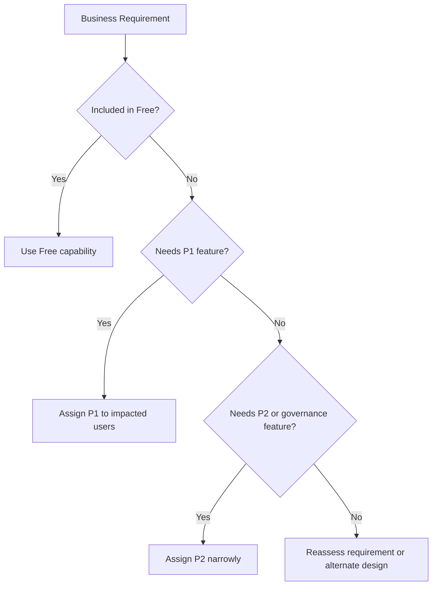

# Cost Optimization Best Practices

Entra ID cost optimization is mainly about matching capabilities to the right users, workflows, and administrative maturity level.

## Why This Matters

Identity licensing can drift upward quickly when premium features are assigned broadly but used narrowly, or when features are duplicated across tools without governance.

## Prerequisites

- Current license inventory and assignment method.
- Feature inventory for Conditional Access, PIM, Identity Protection, and governance.
- Ownership for license lifecycle reviews.
- Agreement on which team owns renewal, assignment logic, and periodic cleanup.
- Visibility into inactive users, transferred users, contractors, and privileged populations.

<!-- diagram-id: entra-license-right-sizing -->


## Recommended Practices

### Practice 1: Map features to licensing tiers explicitly

**Why**

Teams often enable advanced controls without a durable record of which license tier supports them.

**How**

- Document which capabilities depend on Free, P1, or P2.
- Include licensing assumptions in architecture decisions and rollout plans.
- Recheck licensing before expanding premium controls to new audiences.

```bash
az rest --method GET \
    --url "https://graph.microsoft.com/v1.0/subscribedSkus" \
    --output json
```

Example output:

```json
{
    "value": [
        {
            "skuPartNumber": "AAD_PREMIUM_P2",
            "consumedUnits": 125,
            "prepaidUnits": {
                "enabled": 150
            }
        }
    ]
}
```

- Capture license assumptions in standards for Conditional Access, Identity Protection, Privileged Identity Management, and governance.
- Review new projects for accidental premium dependency before rollout is approved.

**Validation**

- Each premium feature has a named owner and target population.
- Architecture documents state license dependencies.
- License assumptions are visible before a control is enabled tenant-wide.

### Practice 2: Assign premium licenses to the users who need the feature

**Why**

The best savings often come from narrowing scope, not removing security controls.

**How**

- Use group-based licensing where appropriate.
- Limit P2-heavy features to privileged users, high-risk populations, or regulated groups when justified.
- Remove premium licenses from inactive or transferred users.

```bash
az rest --method GET \
    --url "https://graph.microsoft.com/v1.0/users/$OBJECT_ID/licenseDetails" \
    --output json
```

- Use dynamic or administrative grouping only when membership quality is trustworthy.
- Pair assignment review with offboarding and role-change processes so premium entitlements do not linger.

**Validation**

```bash
az rest --method get --url "https://graph.microsoft.com/v1.0/subscribedSkus"
az rest --method get --url "https://graph.microsoft.com/v1.0/users/$OBJECT_ID/licenseDetails"
```

- License cleanup is part of user lifecycle operations, not an annual special project.

### Practice 3: Avoid paying twice for overlapping controls

**Why**

Organizations sometimes license multiple platforms for similar identity outcomes without clarifying which one is authoritative.

**How**

- Decide whether Entra ID, another IAM product, or a security suite owns each control area.
- Avoid duplicating workflows for risk remediation, access reviews, or MFA governance unless required.
- Retire old controls after transition.

- Build a simple control matrix that names the system of record for MFA policy, role elevation, access review, and risk remediation.
- Remove duplicate alerting and reporting once the preferred platform is accepted by operations and audit teams.

**Validation**

- Each control family has one primary system of record.
- Duplicate reporting and alerting paths are minimized.
- Operators know which tool to use first during incidents and periodic review.

### Practice 4: Right-size P1 and P2 adoption around real operations

**Why**

Premium capabilities deliver value only when processes exist to use them.

**How**

- Use P1 when Conditional Access and dynamic access needs justify it.
- Use P2 when you will actively operate Identity Protection, PIM, or advanced governance.
- Pilot advanced features with a focused population before wide assignment.

```bash
az rest --method GET \
    --url "https://graph.microsoft.com/v1.0/directoryRoles" \
    --output table
```

- Match P2 to users who actually need privileged access workflows, risk-driven remediation, or governance controls.
- Expand from admins and regulated populations only after the operating team proves the process adds measurable value.

**Validation**

- P2 detections and governance outputs are reviewed on a schedule.
- There are no large populations with premium licenses but no premium process owner.
- Pilot scope and business outcome are documented before broader rollout.

!!! tip
    Cost optimization does not mean choosing the cheapest tier. It means paying for the smallest tier that still enables the control outcome you actually operate.

### Practice 5: Review license consumption regularly

**Why**

User populations change faster than license assignment assumptions.

**How**

- Review assigned versus consumed license counts monthly or quarterly.
- Reconcile dormant accounts, contractors, and role changes.
- Compare premium license assignment with actual use of protected features.

```bash
az rest --method GET \
    --url "https://graph.microsoft.com/v1.0/groups/$OBJECT_ID/licenseDetails" \
    --output json
```

- Look for users who retain premium assignment but no longer belong to the program or role that justified it.
- Review whether mergers, acquisitions, or organizational reshaping changed the right-sizing assumptions.

**Validation**

```http
GET https://graph.microsoft.com/v1.0/subscribedSkus
Authorization: Bearer <token>
```

- Assigned counts, consumed counts, and cleanup actions are tracked over time.

### Practice 6: Use the cheapest viable control pattern before upgrading tiers

**Why**

Some security outcomes can be achieved with simpler included controls, while others truly require premium capabilities.

**How**

- Use security defaults where they satisfy baseline MFA requirements and exception handling is not required.
- Upgrade to Conditional Access or P2 features only when the business case depends on those conditions or workflows.
- Record the reason a premium design was selected instead of a lower-cost alternative.

**Validation**

- The design team can explain why a premium feature is necessary for each scoped audience.
- Lower-tier options were considered before tenant-wide expansion.

## Common Mistakes / Anti-Patterns

### Anti-Pattern 1: Assigning P2 broadly just in case

**What happens**: Spend rises faster than operational value.

**Why it's wrong**: Premium controls deliver value only when they are actively used and reviewed.

**Correct approach**: Scope P2 to privileged, regulated, or high-risk populations with active process ownership.

### Anti-Pattern 2: Using premium features without an operational owner

**What happens**: Features remain technically enabled but operationally ignored.

**Why it's wrong**: The organization pays for detections and workflows it does not consume.

**Correct approach**: Assign named operational owners before rollout and review outcomes regularly.

### Anti-Pattern 3: Assuming every security recommendation requires the highest license tier

**What happens**: Architects jump to premium design even when included controls would have met the baseline need.

**Why it's wrong**: It increases spend and complexity without improving the outcome proportionally.

**Correct approach**: Start from the control objective, then pick the smallest tier that satisfies it.

### Anti-Pattern 4: Failing to remove licenses from inactive users

**What happens**: Consumed units drift upward long after the business need ends.

**Why it's wrong**: License waste accumulates quietly through role changes and offboarding lag.

**Correct approach**: Tie cleanup to user lifecycle processes and scheduled license reviews.

### Anti-Pattern 5: Running overlapping IAM tools without control ownership clarity

**What happens**: Multiple teams pay for and operate duplicated controls.

**Why it's wrong**: Operational ambiguity adds both licensing cost and incident complexity.

**Correct approach**: Define a system of record for each control family and retire the redundant path.

## Validation Checklist

- [ ] Features are mapped to license tiers.
- [ ] Premium licenses are scoped to users who need them.
- [ ] Duplicate control platforms are reviewed.
- [ ] P1 and P2 features have operational owners.
- [ ] License assignment is reviewed regularly.
- [ ] Dormant or transferred users are cleaned up.

## Cost Impact

This page is about cost impact directly: the biggest savings usually come from better scoping, better offboarding, and avoiding premium features that the organization will not operate effectively.

- Group-based assignment can reduce manual overhead, but only if membership governance is accurate.
- Quarterly cleanup often finds more savings than aggressive feature removal because it targets real waste.
- Premium features usually justify their cost best when focused on admins, high-risk populations, and regulated workflows.

| Tier | Typical use |
|---|---|
| Free | Baseline identity and simple protection scenarios |
| P1 | Conditional Access and broader enterprise access controls |
| P2 | Identity Protection, PIM, and advanced governance workflows |

## See Also

- [Security Defaults and MFA](security-defaults-and-mfa.md)
- [Conditional Access Design](conditional-access-design.md)
- [Least Privilege RBAC](least-privilege-rbac.md)
- [Identity Protection](identity-protection.md)

## Sources

- Microsoft Learn: [Microsoft Entra ID licensing](https://learn.microsoft.com/entra/fundamentals/licensing)
- Microsoft Learn: [Licensing fundamentals for Microsoft Entra ID Governance](https://learn.microsoft.com/entra/id-governance/licensing-fundamentals)
- Microsoft Learn: [What is Microsoft Entra ID Protection?](https://learn.microsoft.com/entra/id-protection/overview-identity-protection)
- Microsoft Learn: [What is Conditional Access?](https://learn.microsoft.com/entra/identity/conditional-access/overview)
