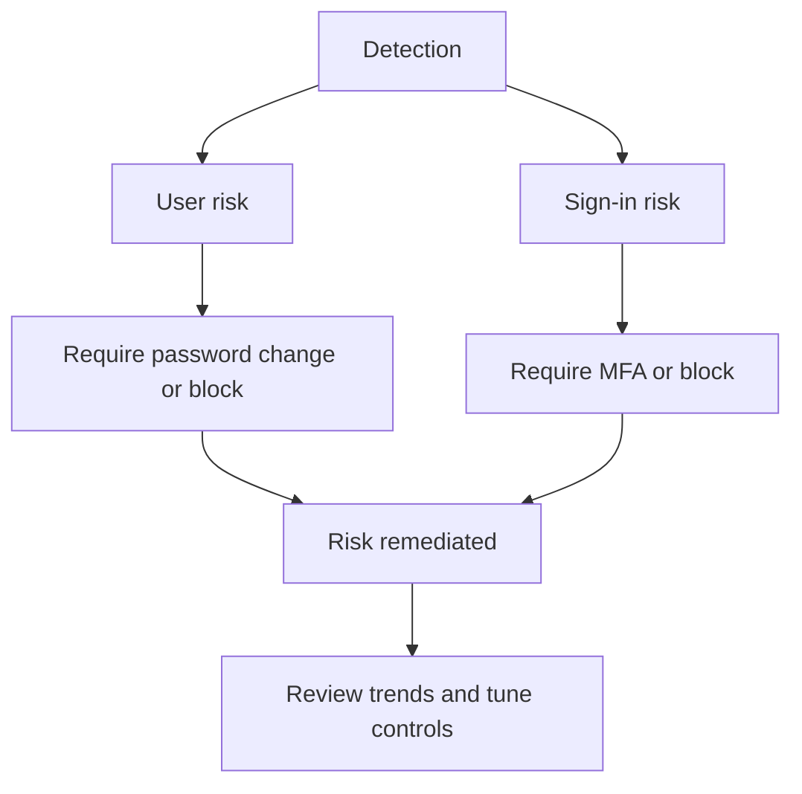

# Identity Protection Best Practices

Identity Protection is most effective when risk signals lead to fast remediation, not when they are only observed after compromise.

## Why This Matters

User risk and sign-in risk detections help identify compromised credentials, suspicious sessions, and users who need immediate remediation.

## Prerequisites

- Microsoft Entra ID P2 licensing for Identity Protection capabilities.
- Operational ownership for risk review and remediation.
- MFA and password reset paths for affected users.
- Sign-in and incident responders who understand the difference between detection, remediation, and dismissal.
- Authentication method coverage for users who may need to satisfy stronger challenges during remediation.

<!-- diagram-id: identity-protection-response-loop -->


## Recommended Practices

### Practice 1: Turn risk detections into policy-backed action

**Why**

Risk data has limited value if response depends on manual review alone.

**How**

- Configure user risk and sign-in risk policies where licensing and process maturity allow.
- Map high-risk users to password reset or account investigation workflows.
- Align risk handling with your incident response process.

```bash
az rest --method GET \
    --url "https://graph.microsoft.com/v1.0/identityProtection/riskDetections" \
    --output json
```

Example output:

```json
{
    "value": [
        {
            "id": "<object-id>",
            "riskType": "unlikelyTravel",
            "riskLevel": "medium"
        }
    ]
}
```

- Define ahead of time whether high sign-in risk should trigger MFA, block, or analyst review for each audience.
- Make the password reset and investigation process explicit for high user risk outcomes.

**Validation**

```bash
az rest --method get --url "https://graph.microsoft.com/v1.0/identityProtection/riskDetections"
```

- Risk detections map to named actions rather than informal case-by-case decisions.

### Practice 2: Distinguish user risk from sign-in risk operationally

**Why**

User risk indicates likelihood of account compromise. Sign-in risk indicates the current authentication attempt may be suspicious.

**How**

- Use sign-in risk for immediate session response.
- Use user risk for account-level remediation like password reset.
- Teach operators the difference so they choose the right action.

```bash
az rest --method GET \
    --url "https://graph.microsoft.com/v1.0/identityProtection/riskyUsers" \
    --output json
```

- Include examples in runbooks so responders know when to challenge a session versus when to recover an account.
- Review false positives by risk type so operators do not build unsafe habits around dismissal.

**Validation**

- Runbooks distinguish sign-in containment from account recovery.
- Review dashboards separate user and sign-in risk trends.
- Incident tickets capture which kind of risk was present and what action was taken.

### Practice 3: Keep remediation user-friendly and recoverable

**Why**

Security controls that users cannot recover from often create support bypasses or risky exceptions.

**How**

- Ensure self-service password reset and MFA registration paths are ready before enforcement.
- Validate that help desk escalation paths exist for locked or high-risk users.
- Coordinate user communications for risk-triggered actions.

```bash
az rest --method GET \
    --url "https://graph.microsoft.com/v1.0/policies/authenticationMethodsPolicy" \
    --output json
```

- Document fallback support when a user loses an authenticator device during a risk event.
- Keep remediation instructions simple enough for urgent use during account compromise scenarios.

**Validation**

```http
GET https://graph.microsoft.com/v1.0/identityProtection/riskyUsers
Authorization: Bearer <token>
```

- Recovery instructions are tested, not just written.

### Practice 4: Review the MFA registration policy as part of risk strategy

**Why**

Risk-based enforcement depends on users having strong authentication methods available when challenged.

**How**

- Pair Identity Protection with strong authentication method enablement.
- Track MFA registration completion for high-value populations.
- Reduce use of weak methods for privileged accounts.

```bash
az rest --method GET \
    --url "https://graph.microsoft.com/v1.0/reports/authenticationMethods/userRegistrationDetails" \
    --output json
```

- Review whether admins and high-value users have phishing-resistant methods available where supported.
- Coordinate method policy changes with user readiness campaigns so risk-based challenges succeed on the first attempt.

**Validation**

- High-value users can satisfy MFA challenges with approved methods.
- Risk-triggered policy outcomes do not strand users unnecessarily.
- Registration coverage is measured for the populations subject to risk-based controls.

!!! note
    Identity Protection does not replace Conditional Access, secure authentication methods, or least privilege. It improves them by making controls more responsive to suspicious behavior.

### Practice 5: Measure remediation speed, not only detection count

**Why**

An organization with many detections but slow response is still exposed.

**How**

- Track time from detection to remediation.
- Review recurring risk patterns by user segment, app, and geography.
- Use insights to improve policy tuning and user education.

```bash
az rest --method GET \
    --url "https://graph.microsoft.com/v1.0/identityProtection/riskyUsers?$select=id,riskLevel,lastUpdatedDateTime" \
    --output json
```

- Compare remediation speed across help desk, security, and privileged user populations.
- Use recurring detections to identify training gaps, weak authentication habits, or over-broad trusted assumptions.

**Validation**

```bash
az rest --method get --url "https://graph.microsoft.com/v1.0/identityProtection/riskyUsers"
```

- Trends show whether the organization is reducing time-to-remediate over time.

### Practice 6: Review policy outcomes and dismissals regularly

**Why**

Identity Protection is only trustworthy when detections and analyst actions are periodically reviewed for quality and consistency.

**How**

- Review dismissals and remediations for recurring patterns.
- Validate that analysts are not dismissing repeated signals without investigation.
- Adjust Conditional Access or authentication method strategy when detections point to persistent exposure.

**Validation**

- Dismissal reasons are documented.
- Review cadence exists for high-volume or high-severity detections.

## Common Mistakes / Anti-Patterns

### Anti-Pattern 1: Buying P2 and never operationalizing the detections

**What happens**: Risk data accumulates with little security value.

**Why it's wrong**: Licensing alone does not create protection; response workflow does.

**Correct approach**: Assign owners, define remediation actions, and review outcomes on a schedule.

### Anti-Pattern 2: Treating all risk signals as equal severity

**What happens**: Teams overreact to low-confidence signals or underreact to critical ones.

**Why it's wrong**: It wastes analyst time and erodes trust in detections.

**Correct approach**: Differentiate response by signal type, level, and user impact.

### Anti-Pattern 3: Blocking risky users without a recovery path

**What happens**: Users are locked out and support teams improvise insecure bypasses.

**Why it's wrong**: Recovery friction often leads to exception debt and unsafe workarounds.

**Correct approach**: Pair blocking or password reset with tested recovery and escalation steps.

### Anti-Pattern 4: Enforcing risk policies before MFA registration readiness

**What happens**: Legitimate users cannot satisfy risk-triggered challenges.

**Why it's wrong**: Control quality depends on method readiness.

**Correct approach**: Measure registration readiness first, then enforce gradually.

### Anti-Pattern 5: Ignoring recurring risk trends after each incident is closed

**What happens**: The same exposures keep producing new incidents.

**Why it's wrong**: Tactical closure replaces strategic improvement.

**Correct approach**: Review patterns by geography, app, method, and user population to tune the control set.

## Validation Checklist

- [ ] User risk and sign-in risk handling are documented separately.
- [ ] Risk policies are mapped to remediation actions.
- [ ] MFA registration supports risk-based enforcement.
- [ ] Help desk and incident response teams have runbooks.
- [ ] Risk remediation time is measured.
- [ ] Premium licensing is assigned only where needed.

## Cost Impact

Identity Protection requires P2 licensing, so it should be used where the business will actively consume the detections and remediation workflows. Right-sized deployment often delivers better value than broad unused P2 assignment.

- The biggest waste pattern is paying for risk detections that nobody reviews or operationalizes.
- Measured remediation time helps prove that P2 value is being realized for the scoped population.
- Strong MFA readiness can reduce support cost during risk-driven remediation events.

## See Also

- [Security Defaults and MFA](security-defaults-and-mfa.md)
- [Conditional Access Design](conditional-access-design.md)
- [Sign-In Log Analysis](../operations/sign-in-log-analysis.md)
- [Audit Log Analysis](../operations/audit-log-analysis.md)

## Sources

- Microsoft Learn: [What is Microsoft Entra ID Protection?](https://learn.microsoft.com/entra/id-protection/overview-identity-protection)
- Microsoft Learn: [Configure risk policies](https://learn.microsoft.com/entra/id-protection/howto-identity-protection-configure-risk-policies)
- Microsoft Learn: [Risk detections and investigation](https://learn.microsoft.com/entra/id-protection/concept-identity-protection-risks)
- Microsoft Learn: [Manage authentication methods for Microsoft Entra ID](https://learn.microsoft.com/entra/identity/authentication/how-to-authentication-methods-manage)
