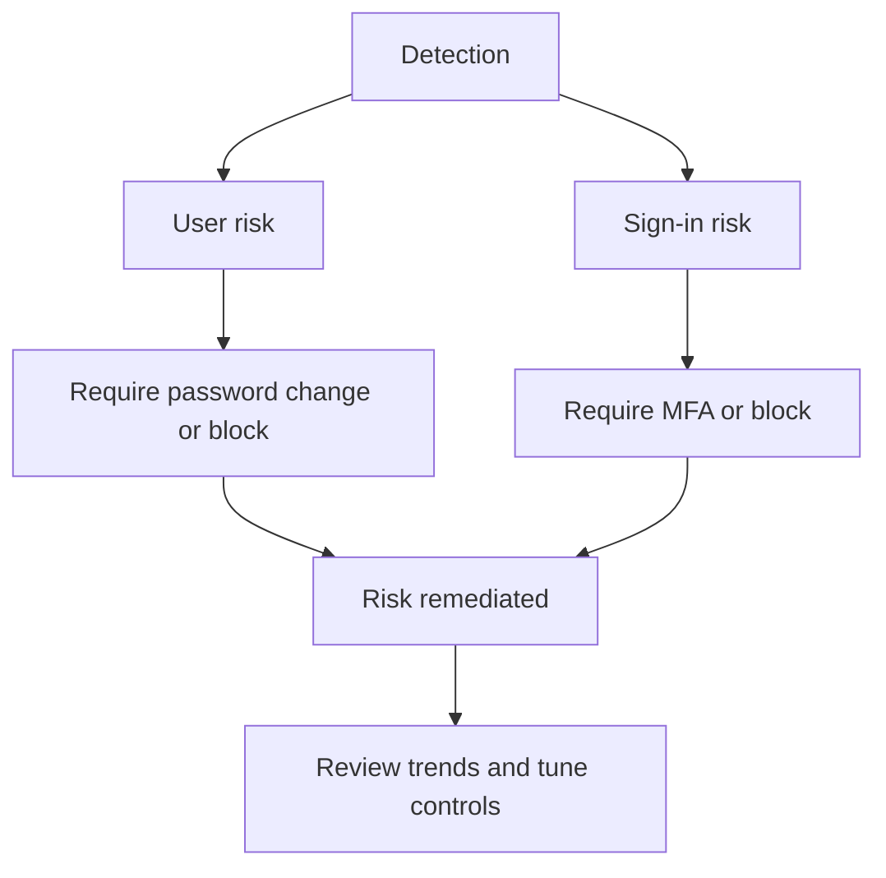

# Identity Protection Best Practices

Identity Protection is most effective when risk signals lead to fast remediation, not when they are only observed after compromise.

## Why This Matters

User risk and sign-in risk detections help identify compromised credentials, suspicious sessions, and users who need immediate remediation.

## Prerequisites

- Microsoft Entra ID P2 licensing for Identity Protection capabilities.
- Operational ownership for risk review and remediation.
- MFA and password reset paths for affected users.

<!-- diagram-id: identity-protection-response-loop -->


## Recommended Practices

### Practice 1: Turn risk detections into policy-backed action

**Why**

Risk data has limited value if response depends on manual review alone.

**How**

- Configure user risk and sign-in risk policies where licensing and process maturity allow.
- Map high-risk users to password reset or account investigation workflows.
- Align risk handling with your incident response process.

**Validation**

```bash
az rest --method get --url "https://graph.microsoft.com/v1.0/identityProtection/riskDetections"
```

### Practice 2: Distinguish user risk from sign-in risk operationally

**Why**

User risk indicates likelihood of account compromise. Sign-in risk indicates the current authentication attempt may be suspicious.

**How**

- Use sign-in risk for immediate session response.
- Use user risk for account-level remediation like password reset.
- Teach operators the difference so they choose the right action.

**Validation**

- Runbooks distinguish sign-in containment from account recovery.
- Review dashboards separate user and sign-in risk trends.

### Practice 3: Keep remediation user-friendly and recoverable

**Why**

Security controls that users cannot recover from often create support bypasses or risky exceptions.

**How**

- Ensure self-service password reset and MFA registration paths are ready before enforcement.
- Validate that help desk escalation paths exist for locked or high-risk users.
- Coordinate user communications for risk-triggered actions.

**Validation**

```http
GET https://graph.microsoft.com/v1.0/identityProtection/riskyUsers
Authorization: Bearer <token>
```

### Practice 4: Review the MFA registration policy as part of risk strategy

**Why**

Risk-based enforcement depends on users having strong authentication methods available when challenged.

**How**

- Pair Identity Protection with strong authentication method enablement.
- Track MFA registration completion for high-value populations.
- Reduce use of weak methods for privileged accounts.

**Validation**

- High-value users can satisfy MFA challenges with approved methods.
- Risk-triggered policy outcomes do not strand users unnecessarily.

!!! note
    Identity Protection does not replace Conditional Access, secure authentication methods, or least privilege. It improves them by making controls more responsive to suspicious behavior.

### Practice 5: Measure remediation speed, not only detection count

**Why**

An organization with many detections but slow response is still exposed.

**How**

- Track time from detection to remediation.
- Review recurring risk patterns by user segment, app, and geography.
- Use insights to improve policy tuning and user education.

**Validation**

```bash
az rest --method get --url "https://graph.microsoft.com/v1.0/identityProtection/riskyUsers"
```

## Common Mistakes / Anti-Patterns

- Buying P2 and never operationalizing the detections.
- Treating all risk signals as equal severity.
- Blocking risky users without a recovery path.
- Enforcing risk policies before MFA registration readiness.
- Ignoring recurring risk trends after each incident is closed.

## Validation Checklist

- [ ] User risk and sign-in risk handling are documented separately.
- [ ] Risk policies are mapped to remediation actions.
- [ ] MFA registration supports risk-based enforcement.
- [ ] Help desk and incident response teams have runbooks.
- [ ] Risk remediation time is measured.
- [ ] Premium licensing is assigned only where needed.

## Cost Impact

Identity Protection requires P2 licensing, so it should be used where the business will actively consume the detections and remediation workflows. Right-sized deployment often delivers better value than broad unused P2 assignment.

## See Also

- [Security Defaults and MFA](security-defaults-and-mfa.md)
- [Conditional Access Design](conditional-access-design.md)
- [Sign-In Log Analysis](../operations/sign-in-log-analysis.md)
- [Audit Log Analysis](../operations/audit-log-analysis.md)

## Sources

- Microsoft Learn: [What is Microsoft Entra ID Protection?](https://learn.microsoft.com/entra/id-protection/overview-identity-protection)
- Microsoft Learn: [Configure risk policies](https://learn.microsoft.com/entra/id-protection/howto-identity-protection-configure-risk-policies)
- Microsoft Learn: [Risk detections and investigation](https://learn.microsoft.com/entra/id-protection/concept-identity-protection-risks)
- Microsoft Learn: [Manage authentication methods for Microsoft Entra ID](https://learn.microsoft.com/entra/identity/authentication/how-to-authentication-methods-manage)
