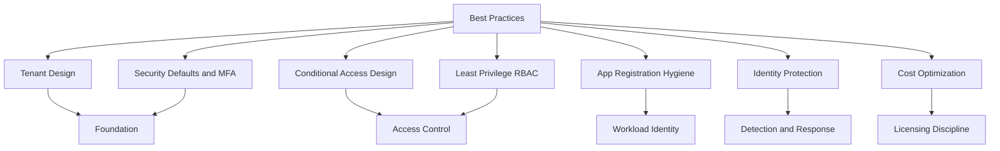

# Best Practices

Use this section to turn Microsoft Entra ID from a basic directory into a resilient, governable, and cost-aware identity platform.

## Why This Matters

Identity mistakes scale quickly. A weak tenant design, broad role assignment, or unmanaged application secret can create tenant-wide risk.

Best practices help you:

- reduce sign-in disruption
- contain administrative blast radius
- standardize operational decisions
- align premium features to real business need
- improve auditability before an incident happens

<!-- diagram-id: best-practices-map -->


## Prerequisites

- A Microsoft Entra tenant.
- Access to the Microsoft Entra admin center.
- Azure CLI and Microsoft Graph access for validation tasks.
- Awareness of your organization's identity lifecycle, compliance, and licensing model.

!!! info
    Treat these pages as design guidance, not one-time deployment steps. Review them whenever your tenant adds new apps, new admins, new subsidiaries, or new compliance requirements.

## Recommended Practices

### Practice 1: Start with foundation-first decisions

**Why**

Tenant structure, admin model, and MFA strategy determine how safe every later configuration will be.

**How**

- Read tenant design guidance before building Conditional Access.
- Define emergency access accounts before tightening sign-in controls.
- Document which features require Free, P1, or P2 licensing.

**Validation**

- You can explain why the tenant is single-tenant, multi-tenant, or part of a cross-tenant operating model.
- Break-glass accounts exist and are excluded from blocking controls.

### Practice 2: Build layered controls instead of one control

**Why**

No single control covers phishing, token theft, stale secrets, excessive privilege, and risky sign-ins at the same time.

**How**

- Combine MFA, Conditional Access, RBAC, app hygiene, and monitoring.
- Use report-only mode and staged rollout for risky access changes.
- Use Privileged Identity Management where premium licensing supports it.

**Validation**

- At least one detective control exists for every major preventive control.
- Role assignments and app credentials are reviewed on a schedule.

### Practice 3: Validate with repeatable checks

**Why**

Best practices degrade over time unless they are measured.

**How**

- Use a recurring review for MFA coverage, risky users, app secrets, and privileged roles.
- Keep CLI and Graph examples standardized so teams can automate checks.

**Validation**

```bash
az ad signed-in-user show --query "id"
az rest --method get --url "https://graph.microsoft.com/v1.0/organization"
```

## Common Mistakes / Anti-Patterns

- Treating Entra ID as a static directory instead of a continuously governed platform.
- Enabling powerful premium features without mapping them to owners and processes.
- Assigning Global Administrator for convenience.
- Using long-lived client secrets without rotation discipline.
- Rolling out Conditional Access without exclusions, testing, or report-only evaluation.
- Paying for P2 features that are not actively used in operations.

## Validation Checklist

- [ ] Tenant design decisions are documented.
- [ ] MFA strategy is standardized.
- [ ] Conditional Access policies have naming and rollout conventions.
- [ ] Administrative roles follow least privilege.
- [ ] App registrations have owners and credential lifecycle controls.
- [ ] Identity Protection signals are reviewed where licensing allows.
- [ ] License assignments align to required features.

## Cost Impact

Strong best practices usually reduce downstream cost by preventing emergency response, account compromise, and uncontrolled premium license sprawl.

| Topic | Typical cost outcome |
|---|---|
| Tenant design | Prevents rework during mergers, divestitures, or app onboarding |
| MFA and Conditional Access | Reduces incident cost and help desk noise when rolled out well |
| Least privilege | Reduces change risk and audit remediation effort |
| App hygiene | Lowers outage risk from expired credentials |
| License right-sizing | Avoids over-assigning P1 or P2 licenses |

## See Also

- [Tenant Design](tenant-design.md)
- [Security Defaults and MFA](security-defaults-and-mfa.md)
- [Conditional Access Design](conditional-access-design.md)
- [Least Privilege RBAC](least-privilege-rbac.md)
- [App Registration Hygiene](app-registration-hygiene.md)
- [Identity Protection](identity-protection.md)
- [Cost Optimization](cost-optimization.md)
- [Platform Overview](../platform/index.md)
- [Identity Secure Score](../operations/identity-secure-score.md)

## Sources

- Microsoft Learn: [What is Conditional Access?](https://learn.microsoft.com/entra/identity/conditional-access/overview)
- Microsoft Learn: [Identity Secure Score](https://learn.microsoft.com/entra/fundamentals/identity-secure-score)
- Microsoft Learn: [Microsoft Entra monitoring and health overview](https://learn.microsoft.com/entra/identity/monitoring-health/overview-monitoring-health)
- Microsoft Learn: [Microsoft Entra built-in roles](https://learn.microsoft.com/entra/identity/role-based-access-control/permissions-reference)
