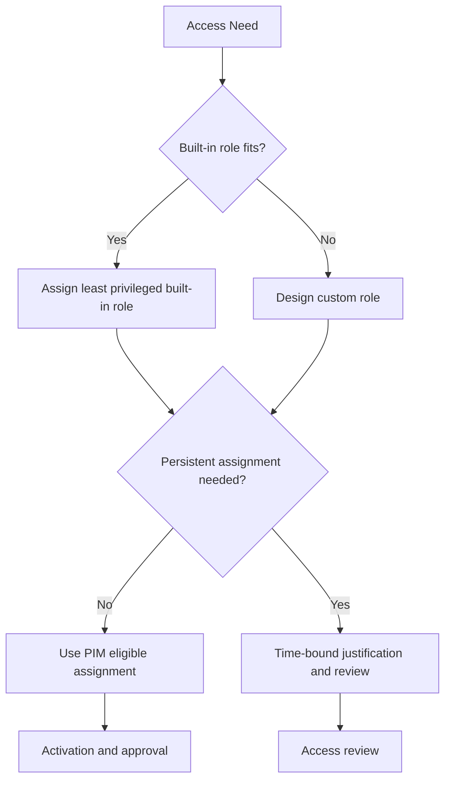

# Least Privilege RBAC Best Practices

Administrative access in Microsoft Entra ID should be narrow, time-bound where possible, and easy to review.

## Why This Matters

Over-privileged admin accounts create a large blast radius for mistakes, insider abuse, and account compromise.

## Prerequisites

- A role ownership model.
- Inventory of privileged users, groups, and service principals.
- Premium governance features if using Privileged Identity Management.
- Agreement on which tasks truly require directory roles versus Azure RBAC roles.
- Logging and review access for operators who will validate role assignments and activations.

<!-- diagram-id: least-privilege-rbac-model -->


## Recommended Practices

### Practice 1: Use the narrowest built-in role first

**Why**

Built-in roles are easier to reason about, document, and support than custom alternatives.

**How**

- Start with the permissions reference and avoid defaulting to Global Administrator.
- Map operational tasks to specialized roles such as Authentication Administrator, Application Administrator, or Conditional Access Administrator.
- Separate directory administration from Azure subscription administration.

```bash
az rest --method GET \
    --url "https://graph.microsoft.com/v1.0/roleManagement/directory/roleDefinitions" \
    --output json
```

Example output:

```json
{
    "value": [
        {
            "id": "<object-id>",
            "displayName": "Application Administrator"
        }
    ]
}
```

- Use task-based mapping so help desk, identity engineering, and security operations do not all inherit the same broad role set.
- Revisit role mapping after platform changes because new built-in roles may narrow privilege further.

**Validation**

```bash
az rest --method get --url "https://graph.microsoft.com/v1.0/roleManagement/directory/roleDefinitions"
```

- Global Administrator is reserved for the smallest practical set of accounts.

### Practice 2: Use custom roles only for clear permission gaps

**Why**

Custom roles can reduce privilege, but they also create maintenance overhead and require careful testing.

**How**

- Create a custom role only when no built-in role matches the required task set.
- Keep custom roles small and purpose-specific.
- Review custom roles after platform updates, because new built-in roles may eliminate the need.

```bash
az rest --method GET \
    --url "https://graph.microsoft.com/v1.0/roleManagement/directory/roleDefinitions?$filter=isBuiltIn eq false" \
    --output json
```

- Write down the exact permission gap the custom role solves.
- Test custom roles against real operational tasks before assigning them broadly.

**Validation**

- Every custom role has documented scope, owner, and test cases.
- Custom roles are not used as informal “mini-global-admin” roles.
- Custom role inventory is reviewed when built-in role coverage evolves.

### Practice 3: Prefer PIM eligible assignment over standing access

**Why**

Just-in-time access lowers exposure time for privileged permissions.

**How**

- Use eligible assignment for sensitive roles.
- Require approval, justification, and MFA where supported.
- Limit activation duration based on task pattern.

```bash
az rest --method GET \
    --url "https://graph.microsoft.com/v1.0/roleManagement/directory/roleEligibilitySchedules" \
    --output json
```

Example output:

```json
{
    "value": [
        {
            "principalId": "<object-id>",
            "roleDefinitionId": "<object-id>",
            "memberType": "Eligible"
        }
    ]
}
```

- Use permanent active assignment only when service continuity truly depends on it and a review process exists.
- Tune activation duration to the task, not to operator convenience.

**Validation**

```http
GET https://graph.microsoft.com/v1.0/roleManagement/directory/roleEligibilitySchedules
Authorization: Bearer <token>
```

- Eligible and active privileged assignments are reviewed separately.

### Practice 4: Review privileged access regularly

**Why**

Least privilege decays over time as people change jobs, projects, or support responsibilities.

**How**

- Review Global Administrator, Privileged Role Administrator, and app-related admin roles on a schedule.
- Use access reviews or equivalent governance processes.
- Pay extra attention to dormant accounts with active assignments.

```bash
az rest --method GET \
    --url "https://graph.microsoft.com/v1.0/roleManagement/directory/roleAssignments" \
    --output json
```

- Review service principals with privileged roles, not only human accounts.
- Compare privileged assignments with actual operational need after reorganizations and project closures.

**Validation**

- There is a review cadence for privileged roles.
- Review outcomes are recorded and acted on.
- Dormant privileged identities trigger immediate follow-up.

!!! important
    The strongest RBAC design is not the one with the most role types. It is the one with the smallest standing privilege footprint that still allows support teams to work efficiently.

### Practice 5: Use groups and break-glass exclusions carefully

**Why**

Role-assignable groups can simplify governance, but they can also hide privilege expansion if ownership is weak.

**How**

- Use role-assignable groups for repeatable admin patterns.
- Protect group ownership and membership changes.
- Keep emergency access accounts outside standard day-to-day group assignment patterns.

```bash
az ad group show \
    --group "$DISPLAY_NAME" \
    --query "{id:objectId,displayName:displayName}" \
    --output json
```

- Limit who can change membership of privileged groups.
- Review group nesting and ownership so privilege expansion does not become hidden.

**Validation**

```bash
az ad group show --group "$DISPLAY_NAME" --query "{id:objectId,displayName:displayName}"
```

- Privileged groups have clear owners, membership review, and change logging.

### Practice 6: Separate human administration from workload identity privilege

**Why**

Service principals and automation accounts can accumulate powerful directory roles without the same visibility as human admins.

**How**

- Review service principals for privileged directory roles.
- Avoid granting broad admin privilege to automation when a narrower API permission or Azure RBAC scope is sufficient.
- Include workload identities in privileged access review and decommissioning processes.

**Validation**

- Service principal privilege is inventoried and reviewed.
- Automation identities use the smallest required privilege surface.

## Common Mistakes / Anti-Patterns

### Anti-Pattern 1: Giving Global Administrator to every platform engineer

**What happens**: Routine work is performed with maximum blast radius.

**Why it's wrong**: One mistake or compromise can affect the whole tenant.

**Correct approach**: Map tasks to narrower built-in roles and reserve Global Administrator for exceptional cases.

### Anti-Pattern 2: Treating custom roles as a shortcut instead of a precision tool

**What happens**: Custom roles proliferate without testing or ownership.

**Why it's wrong**: Complexity rises and privilege boundaries become harder to audit.

**Correct approach**: Create custom roles only for well-defined gaps and retire them when built-in roles catch up.

### Anti-Pattern 3: Leaving privileged access permanently active

**What happens**: Sensitive privilege is available long after the task ends.

**Why it's wrong**: Exposure time is much larger than operational need.

**Correct approach**: Use eligible assignment, approval, and short activation windows where possible.

### Anti-Pattern 4: Ignoring service principals with directory roles

**What happens**: Automation identities become silent long-term admin paths.

**Why it's wrong**: Workload compromise now has tenant-wide consequences.

**Correct approach**: Review workload identities alongside human admins and narrow their privileges aggressively.

### Anti-Pattern 5: Using large shared admin groups with unclear ownership

**What happens**: Membership growth quietly expands privilege.

**Why it's wrong**: No one clearly owns the blast radius.

**Correct approach**: Keep privileged groups small, role-specific, and tightly governed.

## Validation Checklist

- [ ] Built-in roles are preferred where possible.
- [ ] Global Administrator assignments are minimal.
- [ ] Custom roles are documented and justified.
- [ ] PIM is used for sensitive roles where licensing supports it.
- [ ] Privileged assignments are reviewed regularly.
- [ ] Role-assignable groups are tightly governed.

## Cost Impact

PIM and advanced governance features can require premium licensing, but they often reduce audit findings and the operational impact of over-privileged accounts.

- The biggest savings often appear as reduced audit remediation and lower incident impact rather than direct license reduction.
- Narrower role mapping lowers the operational cost of access review because reviewers examine fewer broad assignments.
- Including workload identities in review prevents costly hidden privilege buildup.

## See Also

- [Tenant Design](tenant-design.md)
- [Identity Protection](identity-protection.md)
- [User Lifecycle Management](../operations/user-lifecycle-management.md)
- [Identity Secure Score](../operations/identity-secure-score.md)

## Sources

- Microsoft Learn: [Microsoft Entra built-in roles](https://learn.microsoft.com/entra/identity/role-based-access-control/permissions-reference)
- Microsoft Learn: [Create and assign a custom role in Microsoft Entra ID](https://learn.microsoft.com/entra/identity/role-based-access-control/custom-create)
- Microsoft Learn: [Configure Privileged Identity Management](https://learn.microsoft.com/entra/id-governance/privileged-identity-management/pim-configure)
- Microsoft Learn: [Activate a role in Privileged Identity Management](https://learn.microsoft.com/entra/id-governance/privileged-identity-management/pim-how-to-activate-role)
