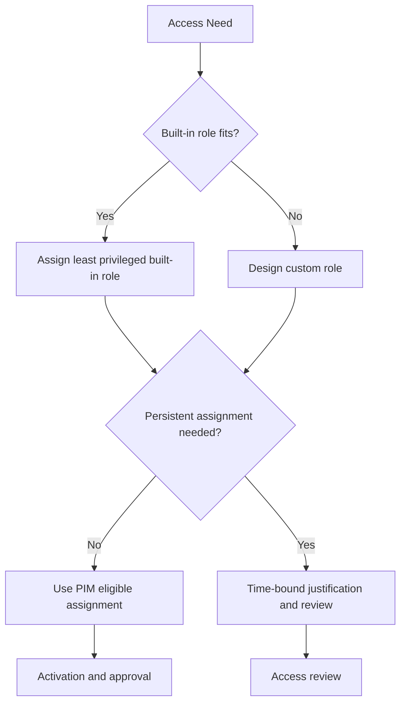

# Least Privilege RBAC Best Practices

Administrative access in Microsoft Entra ID should be narrow, time-bound where possible, and easy to review.

## Why This Matters

Over-privileged admin accounts create a large blast radius for mistakes, insider abuse, and account compromise.

## Prerequisites

- A role ownership model.
- Inventory of privileged users, groups, and service principals.
- Premium governance features if using Privileged Identity Management.

<!-- diagram-id: least-privilege-rbac-model -->


## Recommended Practices

### Practice 1: Use the narrowest built-in role first

**Why**

Built-in roles are easier to reason about, document, and support than custom alternatives.

**How**

- Start with the permissions reference and avoid defaulting to Global Administrator.
- Map operational tasks to specialized roles such as Authentication Administrator, Application Administrator, or Conditional Access Administrator.
- Separate directory administration from Azure subscription administration.

**Validation**

```bash
az rest --method get --url "https://graph.microsoft.com/v1.0/roleManagement/directory/roleDefinitions"
```

### Practice 2: Use custom roles only for clear permission gaps

**Why**

Custom roles can reduce privilege, but they also create maintenance overhead and require careful testing.

**How**

- Create a custom role only when no built-in role matches the required task set.
- Keep custom roles small and purpose-specific.
- Review custom roles after platform updates, because new built-in roles may eliminate the need.

**Validation**

- Every custom role has documented scope, owner, and test cases.
- Custom roles are not used as informal “mini-global-admin” roles.

### Practice 3: Prefer PIM eligible assignment over standing access

**Why**

Just-in-time access lowers exposure time for privileged permissions.

**How**

- Use eligible assignment for sensitive roles.
- Require approval, justification, and MFA where supported.
- Limit activation duration based on task pattern.

**Validation**

```http
GET https://graph.microsoft.com/v1.0/roleManagement/directory/roleEligibilitySchedules
Authorization: Bearer <token>
```

### Practice 4: Review privileged access regularly

**Why**

Least privilege decays over time as people change jobs, projects, or support responsibilities.

**How**

- Review Global Administrator, Privileged Role Administrator, and app-related admin roles on a schedule.
- Use access reviews or equivalent governance processes.
- Pay extra attention to dormant accounts with active assignments.

**Validation**

- There is a review cadence for privileged roles.
- Review outcomes are recorded and acted on.

!!! important
    The strongest RBAC design is not the one with the most role types. It is the one with the smallest standing privilege footprint that still allows support teams to work efficiently.

### Practice 5: Use groups and break-glass exclusions carefully

**Why**

Role-assignable groups can simplify governance, but they can also hide privilege expansion if ownership is weak.

**How**

- Use role-assignable groups for repeatable admin patterns.
- Protect group ownership and membership changes.
- Keep emergency access accounts outside standard day-to-day group assignment patterns.

**Validation**

```bash
az ad group show --group "$DISPLAY_NAME" --query "{id:objectId,displayName:displayName}"
```

## Common Mistakes / Anti-Patterns

- Giving Global Administrator to every platform engineer.
- Treating custom roles as a shortcut instead of a precision tool.
- Leaving privileged access permanently active.
- Ignoring service principals with directory roles.
- Using large shared admin groups with unclear ownership.

## Validation Checklist

- [ ] Built-in roles are preferred where possible.
- [ ] Global Administrator assignments are minimal.
- [ ] Custom roles are documented and justified.
- [ ] PIM is used for sensitive roles where licensing supports it.
- [ ] Privileged assignments are reviewed regularly.
- [ ] Role-assignable groups are tightly governed.

## Cost Impact

PIM and advanced governance features can require premium licensing, but they often reduce audit findings and the operational impact of over-privileged accounts.

## See Also

- [Tenant Design](tenant-design.md)
- [Identity Protection](identity-protection.md)
- [User Lifecycle Management](../operations/user-lifecycle-management.md)
- [Identity Secure Score](../operations/identity-secure-score.md)

## Sources

- Microsoft Learn: [Microsoft Entra built-in roles](https://learn.microsoft.com/entra/identity/role-based-access-control/permissions-reference)
- Microsoft Learn: [Create and assign a custom role in Microsoft Entra ID](https://learn.microsoft.com/entra/identity/role-based-access-control/custom-create)
- Microsoft Learn: [Configure Privileged Identity Management](https://learn.microsoft.com/entra/id-governance/privileged-identity-management/pim-configure)
- Microsoft Learn: [Activate a role in Privileged Identity Management](https://learn.microsoft.com/entra/id-governance/privileged-identity-management/pim-how-to-activate-role)
