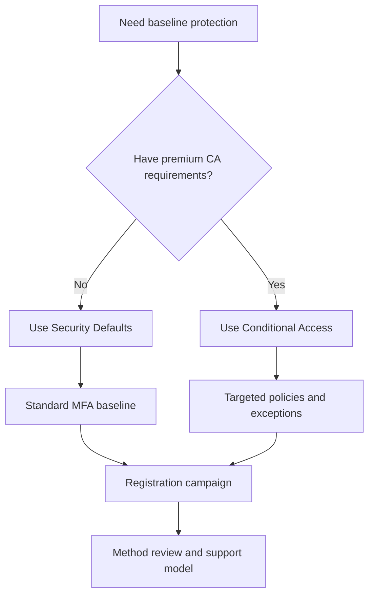

# Security Defaults and MFA Best Practices

Use security defaults or Conditional Access deliberately, then back that choice with a practical MFA registration and method strategy.

## Why This Matters

Most account compromise starts with weak or phished credentials. MFA is foundational, but poor rollout design can lock out users or leave critical gaps.

## Prerequisites

- A tenant with known admin accounts and emergency access accounts.
- A supported set of authentication methods for users.
- A rollout owner for user communications and support.

<!-- diagram-id: mfa-strategy-choice -->


## Recommended Practices

### Practice 1: Use security defaults when you need fast baseline protection

**Why**

Security defaults give smaller or less mature tenants a simple way to require stronger sign-in behavior without building custom policies.

**How**

- Choose security defaults when you do not need granular exclusions, advanced conditions, or premium Conditional Access scenarios.
- Disable legacy assumptions that conflict with strong authentication.
- Validate emergency access guidance before enabling.

**Validation**

```http
GET https://graph.microsoft.com/beta/policies/identitySecurityDefaultsEnforcementPolicy
Authorization: Bearer <token>
```

### Practice 2: Move to Conditional Access when business exceptions are unavoidable

**Why**

Larger organizations usually need location, device, app, user, or risk-aware controls that security defaults cannot express.

**How**

- Use Conditional Access if you must scope MFA by user group, app, sign-in risk, device state, or session condition.
- Avoid running overlapping controls without understanding policy precedence and exclusions.
- Do not recreate complex policy logic if security defaults already satisfy the requirement.

**Validation**

- You can explain why security defaults are disabled.
- Every CA exception has an owner and review date.

### Practice 3: Standardize strong MFA methods

**Why**

Not all MFA methods provide the same phishing resistance or user experience.

**How**

- Prefer Microsoft Authenticator, passkeys where supported, or FIDO2 security keys for high-value roles.
- Minimize reliance on weaker or operationally fragile methods.
- Define a recovery path for lost devices.

**Validation**

```bash
az rest --method get --url "https://graph.microsoft.com/v1.0/policies/authenticationMethodsPolicy"
```

### Practice 4: Use registration campaigns instead of passive expectation

**Why**

Users frequently delay MFA setup unless the platform nudges them with a structured campaign.

**How**

- Enable registration campaign features where supported.
- Roll out by group or audience segment.
- Coordinate support, communication, and deadline messaging.

**Validation**

- Registration completion trends are visible.
- Help desk teams know which methods are approved.

!!! tip
    A registration campaign works best when it is paired with method guidance, a support playbook, and a clear deadline for incomplete users.

### Practice 5: Protect administrators with stronger requirements than standard users

**Why**

Administrative accounts have a higher impact if compromised.

**How**

- Require stronger MFA methods for admins.
- Review authentication method registration for privileged roles.
- Confirm emergency access accounts remain recoverable.

**Validation**

```bash
az ad user show --id "$OBJECT_ID" --query "{id:objectId,userPrincipalName:userPrincipalName}"
```

## Common Mistakes / Anti-Patterns

- Disabling security defaults before equivalent protections are in place.
- Assuming SMS or voice are adequate for all sensitive roles.
- Enabling MFA without planning registration support.
- Forcing all users at once instead of staged rollout.
- Forgetting service desks, executives, and privileged admins have different support needs.

## Validation Checklist

- [ ] The tenant has a documented choice between security defaults and Conditional Access.
- [ ] MFA methods are standardized by user risk or role sensitivity.
- [ ] A registration campaign or equivalent enforcement path exists.
- [ ] Admins have stronger MFA controls than typical users.
- [ ] Emergency access accounts remain usable.
- [ ] Support documentation exists for recovery scenarios.

## Cost Impact

Security defaults are included and cost-effective for baseline security. Conditional Access and advanced authentication governance may require premium licensing, but can lower breach and support costs when used intentionally.

## See Also

- [Conditional Access Design](conditional-access-design.md)
- [Identity Protection](identity-protection.md)
- [Authentication Methods](../platform/authentication-methods.md)
- [MFA Registration Issues](../troubleshooting/playbooks/mfa-registration-issues.md)

## Sources

- Microsoft Learn: [What are security defaults?](https://learn.microsoft.com/entra/fundamentals/security-defaults)
- Microsoft Learn: [Authentication methods in Microsoft Entra ID](https://learn.microsoft.com/entra/identity/authentication/concept-authentication-methods)
- Microsoft Learn: [Manage authentication methods for Microsoft Entra ID](https://learn.microsoft.com/entra/identity/authentication/how-to-authentication-methods-manage)
- Microsoft Learn: [Microsoft Authenticator registration campaign](https://learn.microsoft.com/entra/identity/authentication/how-to-mfa-registration-campaign)
