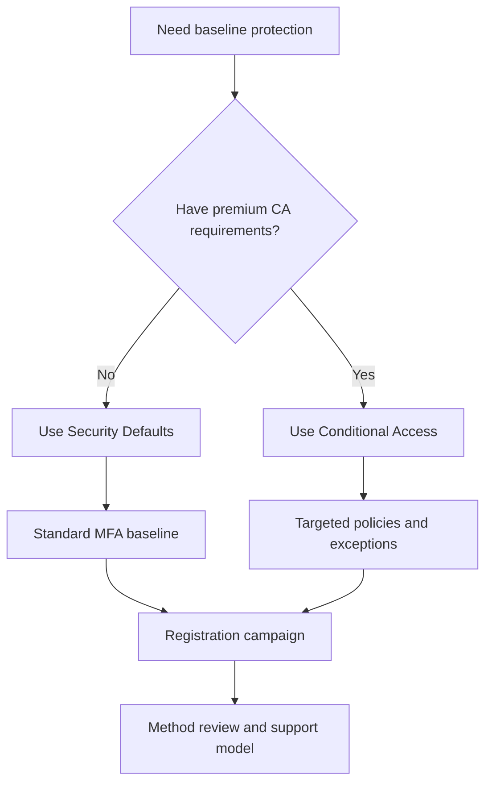

# Security Defaults and MFA Best Practices

Use security defaults or Conditional Access deliberately, then back that choice with a practical MFA registration and method strategy.

## Why This Matters

Most account compromise starts with weak or phished credentials. MFA is foundational, but poor rollout design can lock out users or leave critical gaps.

## Prerequisites

- A tenant with known admin accounts and emergency access accounts.
- A supported set of authentication methods for users.
- A rollout owner for user communications and support.
- A documented decision on whether security defaults or Conditional Access is the authoritative control path.
- Help desk and recovery guidance for lost devices, registration issues, and temporary access interruptions.

<!-- diagram-id: mfa-strategy-choice -->


## Recommended Practices

### Practice 1: Use security defaults when you need fast baseline protection

**Why**

Security defaults give smaller or less mature tenants a simple way to require stronger sign-in behavior without building custom policies.

**How**

- Choose security defaults when you do not need granular exclusions, advanced conditions, or premium Conditional Access scenarios.
- Disable legacy assumptions that conflict with strong authentication.
- Validate emergency access guidance before enabling.

```bash
az rest --method GET \
    --url "https://graph.microsoft.com/beta/policies/identitySecurityDefaultsEnforcementPolicy" \
    --output json
```

Example output:

```json
{
    "id": "IdentitySecurityDefaultsEnforcementPolicy",
    "isEnabled": true
}
```

- Use security defaults when simplicity and fast baseline protection matter more than tailored exceptions.
- Review whether legacy authentication or unsupported application flows would block enablement.

**Validation**

```http
GET https://graph.microsoft.com/beta/policies/identitySecurityDefaultsEnforcementPolicy
Authorization: Bearer <token>
```

- Emergency access accounts are documented and tested before enablement.

### Practice 2: Move to Conditional Access when business exceptions are unavoidable

**Why**

Larger organizations usually need location, device, app, user, or risk-aware controls that security defaults cannot express.

**How**

- Use Conditional Access if you must scope MFA by user group, app, sign-in risk, device state, or session condition.
- Avoid running overlapping controls without understanding policy precedence and exclusions.
- Do not recreate complex policy logic if security defaults already satisfy the requirement.

```bash
az rest --method GET \
    --url "https://graph.microsoft.com/v1.0/identity/conditionalAccess/policies?$select=id,displayName,state" \
    --output json
```

- Document the business reason for disabling security defaults so future operators do not assume protection exists when it has been replaced.
- Keep baseline MFA intent visible even after moving to Conditional Access.

**Validation**

- You can explain why security defaults are disabled.
- Every CA exception has an owner and review date.
- Equivalent or stronger protection exists before the included baseline is turned off.

### Practice 3: Standardize strong MFA methods

**Why**

Not all MFA methods provide the same phishing resistance or user experience.

**How**

- Prefer Microsoft Authenticator, passkeys where supported, or FIDO2 security keys for high-value roles.
- Minimize reliance on weaker or operationally fragile methods.
- Define a recovery path for lost devices.

```bash
az rest --method GET \
    --url "https://graph.microsoft.com/v1.0/policies/authenticationMethodsPolicy" \
    --output json
```

Example output:

```json
{
    "id": "authenticationMethodsPolicy",
    "policyVersion": "1.5"
}
```

- Standardize approved methods by user segment so the help desk does not have to guess which fallback is allowed.
- Prefer phishing-resistant methods for administrators and highly sensitive access paths where supported.

**Validation**

```bash
az rest --method get --url "https://graph.microsoft.com/v1.0/policies/authenticationMethodsPolicy"
```

- Approved methods and forbidden methods are documented for support teams.

### Practice 4: Use registration campaigns instead of passive expectation

**Why**

Users frequently delay MFA setup unless the platform nudges them with a structured campaign.

**How**

- Enable registration campaign features where supported.
- Roll out by group or audience segment.
- Coordinate support, communication, and deadline messaging.

```bash
az rest --method GET \
    --url "https://graph.microsoft.com/v1.0/reports/authenticationMethods/userRegistrationDetails" \
    --output json
```

- Measure completion progress by business unit or role so support effort can be targeted.
- Combine reminders with guidance on approved methods and recovery expectations.

**Validation**

- Registration completion trends are visible.
- Help desk teams know which methods are approved.
- Campaign scope is staged rather than enabled for everyone without preparation.

!!! tip
    A registration campaign works best when it is paired with method guidance, a support playbook, and a clear deadline for incomplete users.

### Practice 5: Protect administrators with stronger requirements than standard users

**Why**

Administrative accounts have a higher impact if compromised.

**How**

- Require stronger MFA methods for admins.
- Review authentication method registration for privileged roles.
- Confirm emergency access accounts remain recoverable.

```bash
az ad user show \
    --id "$OBJECT_ID" \
    --query "{id:objectId,userPrincipalName:userPrincipalName}" \
    --output json
```

- Validate that privileged admins can satisfy required methods before enforcement changes go live.
- Keep emergency access accounts outside normal day-to-day administration patterns.

**Validation**

```bash
az ad user show --id "$OBJECT_ID" --query "{id:objectId,userPrincipalName:userPrincipalName}"
```

- Privileged account recovery steps are tested and documented.

### Practice 6: Reduce method sprawl and exception debt

**Why**

MFA becomes harder to support when every user segment has a different unmanaged exception or fallback method.

**How**

- Define a small approved catalog of methods per audience.
- Review exceptions for executives, field workers, and service desks on a schedule.
- Retire temporary fallback methods once users complete registration and recovery planning.

**Validation**

- Exception counts trend downward instead of becoming permanent.
- Support teams can explain the standard method path for each user segment.

## Common Mistakes / Anti-Patterns

### Anti-Pattern 1: Disabling security defaults before equivalent protections are in place

**What happens**: The tenant loses baseline MFA enforcement while replacement controls are still incomplete.

**Why it's wrong**: Included protection is removed before a stronger design is operational.

**Correct approach**: Turn off security defaults only after Conditional Access or equivalent controls are validated.

### Anti-Pattern 2: Assuming SMS or voice are adequate for all sensitive roles

**What happens**: High-impact admins rely on weaker methods than their risk level warrants.

**Why it's wrong**: Method strength should align with account impact.

**Correct approach**: Prefer phishing-resistant or stronger methods for privileged and high-value roles.

### Anti-Pattern 3: Enabling MFA without planning registration support

**What happens**: Users are told to register, but support teams are not ready for failures or device loss.

**Why it's wrong**: Rollout friction turns into emergency exception pressure.

**Correct approach**: Pair enforcement with campaigns, support playbooks, and recovery guidance.

### Anti-Pattern 4: Forcing all users at once instead of staged rollout

**What happens**: Support demand spikes and line-of-business issues are discovered too late.

**Why it's wrong**: It compresses learning and remediation into one disruptive event.

**Correct approach**: Roll out by group and review completion plus failure patterns between phases.

### Anti-Pattern 5: Forgetting service desks, executives, and privileged admins have different support needs

**What happens**: One-size-fits-all rollout leaves critical groups with poor recovery experience.

**Why it's wrong**: High-impact users and support roles need tailored readiness.

**Correct approach**: Define stronger methods and tested recovery procedures for privileged and operationally sensitive audiences.

## Validation Checklist

- [ ] The tenant has a documented choice between security defaults and Conditional Access.
- [ ] MFA methods are standardized by user risk or role sensitivity.
- [ ] A registration campaign or equivalent enforcement path exists.
- [ ] Admins have stronger MFA controls than typical users.
- [ ] Emergency access accounts remain usable.
- [ ] Support documentation exists for recovery scenarios.

## Cost Impact

Security defaults are included and cost-effective for baseline security. Conditional Access and advanced authentication governance may require premium licensing, but can lower breach and support costs when used intentionally.

- Security defaults provide a low-cost baseline when granular exceptions are unnecessary.
- Standardizing methods reduces help desk cost compared to supporting many inconsistent fallback paths.
- Staged registration campaigns reduce outage-style support spikes during enforcement changes.

## See Also

- [Conditional Access Design](conditional-access-design.md)
- [Identity Protection](identity-protection.md)
- [Authentication Methods](../platform/authentication-methods.md)
- [MFA Registration Issues](../troubleshooting/playbooks/mfa-registration-issues.md)

## Sources

- Microsoft Learn: [What are security defaults?](https://learn.microsoft.com/entra/fundamentals/security-defaults)
- Microsoft Learn: [Authentication methods in Microsoft Entra ID](https://learn.microsoft.com/entra/identity/authentication/concept-authentication-methods)
- Microsoft Learn: [Manage authentication methods for Microsoft Entra ID](https://learn.microsoft.com/entra/identity/authentication/how-to-authentication-methods-manage)
- Microsoft Learn: [Microsoft Authenticator registration campaign](https://learn.microsoft.com/entra/identity/authentication/how-to-mfa-registration-campaign)
