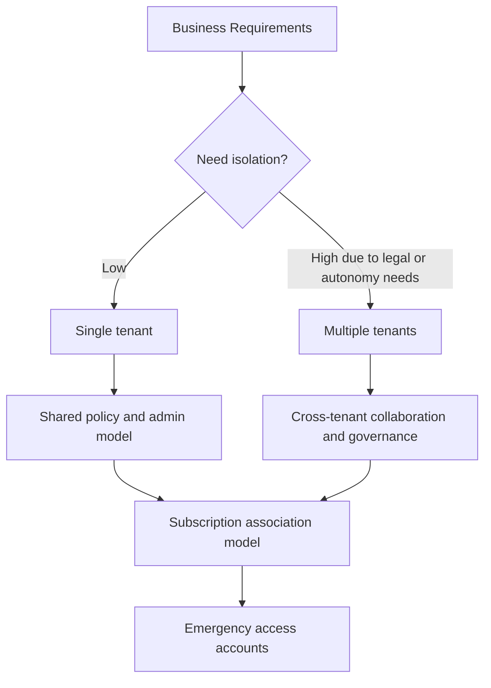

# Tenant Design Best Practices

Good tenant design reduces future identity friction by making ownership, isolation, and recovery decisions explicit from the start.

## Why This Matters

Your tenant is the administrative and security boundary for users, apps, policies, and logs. Poor early choices create painful migration work later.

## Prerequisites

- A documented operating model for business units and subscriptions.
- Agreement on primary identity authority for workforce identities.
- At least two emergency access account owners.

<!-- diagram-id: tenant-design-decision-flow -->


## Recommended Practices

### Practice 1: Prefer a single tenant unless there is a real boundary requirement

**Why**

Single-tenant designs simplify app registration, user lifecycle, Conditional Access, and reporting.

**How**

- Use one tenant for most organizations that share identity policy, administration, and compliance obligations.
- Choose multiple tenants only for legal separation, acquisition autonomy, sovereign requirements, or sharply different security boundaries.
- If multiple tenants are required, plan cross-tenant access and standardized naming from day one.

**Validation**

- You can describe the business reason for every tenant.
- Shared services and line-of-business apps have a clear home tenant.

### Practice 2: Standardize naming for tenant-connected objects

**Why**

Names become part of every operational workflow, especially for app registrations, groups, and subscriptions.

**How**

- Define conventions for display names, admin groups, app registrations, and privileged access groups.
- Include scope or purpose in names, such as `GRP-CA-Admins` or `APP-ERP-Prod`.
- Avoid names that depend on individuals.

**Validation**

```bash
az ad group list --display-name "$DISPLAY_NAME" --query "[].{id:id,displayName:displayName}"
az ad app list --display-name "$DISPLAY_NAME" --query "[].{appId:appId,displayName:displayName}"
```

### Practice 3: Align tenant design with Azure subscription association

**Why**

Azure subscriptions trust a tenant for role assignment and workload identity. Misalignment creates ownership confusion and onboarding delays.

**How**

- Decide which tenant owns production subscriptions.
- Keep landing zone identity groups in the same tenant that governs Azure RBAC.
- Document how guest users or external admins are handled for subscriptions.

**Validation**

```bash
az rest --method get --url "https://management.azure.com/subscriptions?api-version=2020-01-01"
az rest --method get --url "https://graph.microsoft.com/v1.0/organization"
```

### Practice 4: Create and protect emergency access accounts

**Why**

You need a recovery path when MFA systems, federation, or Conditional Access controls fail.

**How**

- Maintain at least two cloud-only emergency access accounts.
- Exclude them from blocking Conditional Access policies while still monitoring sign-ins.
- Store credentials securely, review usage, and test sign-in periodically.

**Validation**

- Emergency accounts are not tied to a single person.
- Emergency accounts are excluded only where necessary.
- Alerting exists for any interactive use.

!!! warning
    Do not use emergency access accounts for day-to-day administration. Their value is preserved only when they remain rare, monitored, and isolated from standard admin workflows.

### Practice 5: Plan for mergers, subsidiaries, and B2B collaboration early

**Why**

Most tenant design pain appears when organizations need to collaborate across boundaries after the fact.

**How**

- Decide whether acquired entities will be consolidated or remain separate.
- Use cross-tenant access settings and B2B collaboration patterns instead of ad hoc guest sprawl.
- Record who owns trust settings between tenants.

**Validation**

```http
GET https://graph.microsoft.com/v1.0/policies/crossTenantAccessPolicy
Authorization: Bearer <token>
```

## Common Mistakes / Anti-Patterns

- Creating extra tenants because departments want visual separation.
- Naming privileged groups after current employees.
- Associating subscriptions to a tenant without identity governance ownership.
- Having one break-glass account instead of two.
- Forgetting to test emergency access after new sign-in controls are introduced.

## Validation Checklist

- [ ] The single-tenant or multi-tenant decision has documented rationale.
- [ ] Naming standards exist for groups, apps, and privileged identities.
- [ ] Subscription-to-tenant ownership is documented.
- [ ] At least two emergency access accounts exist.
- [ ] Emergency access sign-ins are monitored.
- [ ] Cross-tenant collaboration rules are documented where applicable.

## Cost Impact

Single-tenant designs typically reduce operational overhead. Multi-tenant designs can be necessary, but they increase administration, governance, and integration cost.

## See Also

- [Best Practices](index.md)
- [Security Defaults and MFA](security-defaults-and-mfa.md)
- [Least Privilege RBAC](least-privilege-rbac.md)
- [Guest User Management](../scenarios/b2b-collaboration/guest-user-management.md)
- [Cross-Tenant Access](../scenarios/b2b-collaboration/cross-tenant-access.md)

## Sources

- Microsoft Learn: [What is Microsoft Entra ID?](https://learn.microsoft.com/entra/fundamentals/what-is-entra)
- Microsoft Learn: [Emergency access accounts in Microsoft Entra ID](https://learn.microsoft.com/entra/identity/role-based-access-control/security-emergency-access)
- Microsoft Learn: [Cross-tenant access overview](https://learn.microsoft.com/entra/external-id/cross-tenant-access-overview)
- Microsoft Learn: [Assign Azure roles using the Azure portal](https://learn.microsoft.com/azure/role-based-access-control/role-assignments-portal)
