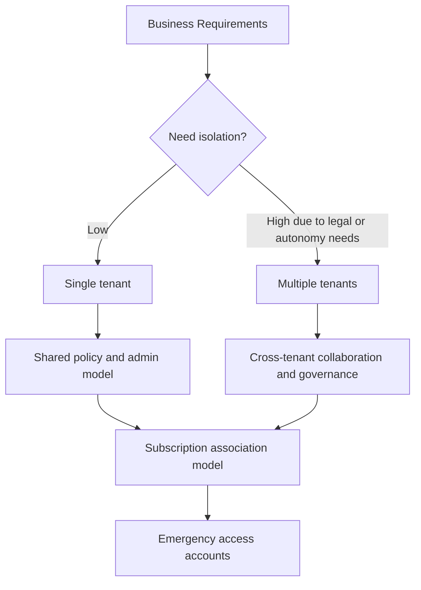

# Tenant Design Best Practices

Good tenant design reduces future identity friction by making ownership, isolation, and recovery decisions explicit from the start.

## Why This Matters

Your tenant is the administrative and security boundary for users, apps, policies, and logs. Poor early choices create painful migration work later.

## Prerequisites

- A documented operating model for business units and subscriptions.
- Agreement on primary identity authority for workforce identities.
- At least two emergency access account owners.
- A decision record for legal, regulatory, or acquisition-related isolation requirements.
- Subscription and platform teams that agree how identity ownership maps to Azure administration.

<!-- diagram-id: tenant-design-decision-flow -->


## Recommended Practices

### Practice 1: Prefer a single tenant unless there is a real boundary requirement

**Why**

Single-tenant designs simplify app registration, user lifecycle, Conditional Access, and reporting.

**How**

- Use one tenant for most organizations that share identity policy, administration, and compliance obligations.
- Choose multiple tenants only for legal separation, acquisition autonomy, sovereign requirements, or sharply different security boundaries.
- If multiple tenants are required, plan cross-tenant access and standardized naming from day one.

```bash
az rest --method GET \
    --url "https://graph.microsoft.com/v1.0/organization" \
    --output json
```

Example output:

```json
{
    "value": [
        {
            "id": "<tenant-id>",
            "displayName": "Contoso"
        }
    ]
}
```

- Treat extra tenants as real administrative and governance boundaries, not as convenience containers.
- Document how shared services, identity operations, and external collaboration will work before adding another tenant.

**Validation**

- You can describe the business reason for every tenant.
- Shared services and line-of-business apps have a clear home tenant.
- The operating model explains where global identity standards are centralized and where local autonomy is allowed.

### Practice 2: Standardize naming for tenant-connected objects

**Why**

Names become part of every operational workflow, especially for app registrations, groups, and subscriptions.

**How**

- Define conventions for display names, admin groups, app registrations, and privileged access groups.
- Include scope or purpose in names, such as `GRP-CA-Admins` or `APP-ERP-Prod`.
- Avoid names that depend on individuals.

```bash
az ad group list \
    --display-name "$DISPLAY_NAME" \
    --query "[].{id:id,displayName:displayName}" \
    --output table

az ad app list \
    --display-name "$DISPLAY_NAME" \
    --query "[].{appId:appId,displayName:displayName}" \
    --output table
```

- Keep naming consistent across tenants if multi-tenant design is unavoidable.
- Use names that reveal environment and purpose so operational review is faster.

**Validation**

```bash
az ad group list --display-name "$DISPLAY_NAME" --query "[].{id:id,displayName:displayName}"
az ad app list --display-name "$DISPLAY_NAME" --query "[].{appId:appId,displayName:displayName}"
```

- Operators can identify scope, environment, and purpose without relying on tribal knowledge.

### Practice 3: Align tenant design with Azure subscription association

**Why**

Azure subscriptions trust a tenant for role assignment and workload identity. Misalignment creates ownership confusion and onboarding delays.

**How**

- Decide which tenant owns production subscriptions.
- Keep landing zone identity groups in the same tenant that governs Azure RBAC.
- Document how guest users or external admins are handled for subscriptions.

```bash
az rest --method GET \
    --url "https://management.azure.com/subscriptions?api-version=2020-01-01" \
    --output json
```

- Make subscription association part of identity architecture, not a separate platform afterthought.
- Avoid ambiguous ownership where one team manages subscriptions but another team controls the trusted tenant with no shared review process.

**Validation**

```bash
az rest --method get --url "https://management.azure.com/subscriptions?api-version=2020-01-01"
az rest --method get --url "https://graph.microsoft.com/v1.0/organization"
```

- Subscription ownership and tenant trust boundaries are documented together.

### Practice 4: Create and protect emergency access accounts

**Why**

You need a recovery path when MFA systems, federation, or Conditional Access controls fail.

**How**

- Maintain at least two cloud-only emergency access accounts.
- Exclude them from blocking Conditional Access policies while still monitoring sign-ins.
- Store credentials securely, review usage, and test sign-in periodically.

```bash
az ad user list \
    --filter "startswith(userPrincipalName,'breakglass')" \
    --output table
```

- Keep emergency access accounts out of federation dependencies when the goal is tenant recovery.
- Review credentials, storage procedure, and alerting after every major identity control change.

**Validation**

- Emergency accounts are not tied to a single person.
- Emergency accounts are excluded only where necessary.
- Alerting exists for any interactive use.
- Sign-in testing is periodic and documented.

!!! warning
    Do not use emergency access accounts for day-to-day administration. Their value is preserved only when they remain rare, monitored, and isolated from standard admin workflows.

### Practice 5: Plan for mergers, subsidiaries, and B2B collaboration early

**Why**

Most tenant design pain appears when organizations need to collaborate across boundaries after the fact.

**How**

- Decide whether acquired entities will be consolidated or remain separate.
- Use cross-tenant access settings and B2B collaboration patterns instead of ad hoc guest sprawl.
- Record who owns trust settings between tenants.

```bash
az rest --method GET \
    --url "https://graph.microsoft.com/v1.0/policies/crossTenantAccessPolicy" \
    --output json
```

- Define how trust settings, inbound access, and outbound collaboration will be reviewed over time.
- Standardize guest and cross-tenant governance so acquisitions do not create unmanaged identity islands.

**Validation**

```http
GET https://graph.microsoft.com/v1.0/policies/crossTenantAccessPolicy
Authorization: Bearer <token>
```

- Cross-tenant trust decisions have named owners and review dates.

### Practice 6: Design admin boundaries and recovery paths together

**Why**

Tenant structure and admin design are inseparable: a clean tenant plan still fails if privilege and recovery paths are unclear.

**How**

- Define who can administer tenant-wide controls, workload identity, and subscription RBAC.
- Map emergency access accounts, privileged roles, and cross-tenant admins into one documented recovery model.
- Review how new subsidiaries or shared-service models affect that admin boundary design.

**Validation**

- Recovery and privileged access assumptions are documented alongside tenant topology.
- Operators know which identities are used for normal work and which are reserved for emergency recovery.

## Common Mistakes / Anti-Patterns

### Anti-Pattern 1: Creating extra tenants because departments want visual separation

**What happens**: Administrative boundaries multiply without a real security or legal driver.

**Why it's wrong**: Multi-tenant overhead is significant and often unnecessary.

**Correct approach**: Prefer one tenant unless a genuine isolation requirement exists.

### Anti-Pattern 2: Naming privileged groups after current employees

**What happens**: Ownership becomes outdated as staff changes.

**Why it's wrong**: Identity design should survive personnel turnover.

**Correct approach**: Use purpose-based names that describe function, scope, and environment.

### Anti-Pattern 3: Associating subscriptions to a tenant without identity governance ownership

**What happens**: Subscription access works technically, but no team clearly governs the identities behind it.

**Why it's wrong**: Azure RBAC and Entra administration become disconnected.

**Correct approach**: Document the trusted tenant, the admin groups, and the review model together.

### Anti-Pattern 4: Having one break-glass account instead of two

**What happens**: Recovery depends on a single account or a single unavailable custodian.

**Why it's wrong**: Emergency access must tolerate loss of one account or one owner.

**Correct approach**: Maintain at least two cloud-only emergency access accounts with tested procedures.

### Anti-Pattern 5: Forgetting to test emergency access after new sign-in controls are introduced

**What happens**: Recovery paths fail exactly when they are needed most.

**Why it's wrong**: Untested exclusions and credentials are assumptions, not controls.

**Correct approach**: Re-test emergency access after major Conditional Access, MFA, or federation changes.

## Validation Checklist

- [ ] The single-tenant or multi-tenant decision has documented rationale.
- [ ] Naming standards exist for groups, apps, and privileged identities.
- [ ] Subscription-to-tenant ownership is documented.
- [ ] At least two emergency access accounts exist.
- [ ] Emergency access sign-ins are monitored.
- [ ] Cross-tenant collaboration rules are documented where applicable.

## Cost Impact

Single-tenant designs typically reduce operational overhead. Multi-tenant designs can be necessary, but they increase administration, governance, and integration cost.

- Each additional tenant adds policy administration, app registration, and support overhead.
- Standard naming reduces the human cost of operating one tenant or many.
- Tested emergency access lowers the cost of outage recovery when core controls fail.

## See Also

- [Best Practices](index.md)
- [Security Defaults and MFA](security-defaults-and-mfa.md)
- [Least Privilege RBAC](least-privilege-rbac.md)
- [Guest User Management](../scenarios/b2b-collaboration/guest-user-management.md)
- [Cross-Tenant Access](../scenarios/b2b-collaboration/cross-tenant-access.md)

## Sources

- Microsoft Learn: [What is Microsoft Entra ID?](https://learn.microsoft.com/entra/fundamentals/what-is-entra)
- Microsoft Learn: [Emergency access accounts in Microsoft Entra ID](https://learn.microsoft.com/entra/identity/role-based-access-control/security-emergency-access)
- Microsoft Learn: [Cross-tenant access overview](https://learn.microsoft.com/entra/external-id/cross-tenant-access-overview)
- Microsoft Learn: [Assign Azure roles using the Azure portal](https://learn.microsoft.com/azure/role-based-access-control/role-assignments-portal)
