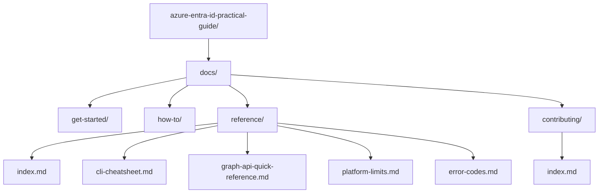

---
content_sources:
    - https://learn.microsoft.com/contribute/content/markdown-reference
    - https://learn.microsoft.com/contribute/content/docs-authoring/markdown-basics
    - https://learn.microsoft.com/entra/fundamentals/
---

# Contributing

Use this guide to contribute clear, technically accurate, and operationally useful content to the Azure Entra ID Practical Guide.

## Repository workflow

### Contribution goals

- Keep the guide practical, task-focused, and safe for real tenant operations.
- Prefer Microsoft Learn-backed guidance over opinion or undocumented behavior.
- Explain why a control, command, or design choice matters in production.
- Use examples that are reusable without exposing tenants, secrets, or personal data.

### Recommended contribution flow

1. Open an issue or outline the intended change scope.
2. Confirm the target audience and operational scenario.
3. Draft or update content in the correct section.
4. Validate command accuracy, placeholders, and source links.
5. Check Markdown formatting, diagrams, and internal navigation.
6. Submit a pull request with a focused summary and source notes.

### Repo structure

<!-- diagram-id: repo-structure -->


## Content standards

### Writing style

- Write in direct, instructional language.
- Prefer short sections with meaningful headings.
- Lead with outcomes, then show commands, tables, or procedures.
- Keep terminology consistent: use “Azure Entra ID,” “tenant,” “service principal,” and “Conditional Access” precisely.
- Avoid marketing language, vague claims, or unsupported best-practice statements.

### Command and placeholder rules

- Use long-form Azure CLI flags only.
- Use these placeholders consistently where applicable:

    - `$TENANT_ID`
    - `$USER_ID`
    - `$APP_ID`
    - `$OBJECT_ID`
    - `$UPN`
    - `$DISPLAY_NAME`

- Do not use real tenant IDs, email addresses, secrets, certificates, IP addresses tied to real organizations, or other PII.
- Prefer copy-paste-ready examples, but keep them generic and safe.
- When Azure CLI does not support the needed feature well, use `az rest` with Microsoft Graph.

### Reference page template

Reference content in `docs/reference/` should follow this shape:

1. `# Title`
2. Brief intro
3. `## Command Reference / Data Tables`
4. `###` category subsections
5. `## Usage Notes`
6. `## See Also`
7. `## Sources`

Reference pages may omit Mermaid diagrams when a table or command-oriented format is clearer.

### Frontmatter requirements

Every page must include YAML frontmatter with `content_sources`.

Example:

```yaml
---
content_sources:
    - https://learn.microsoft.com/entra/fundamentals/
    - https://learn.microsoft.com/graph/overview
---
```

## Technical accuracy checks

### Source quality

- Prefer Microsoft Learn URLs in the final `## Sources` section.
- Use current Microsoft Graph documentation instead of deprecated Azure AD Graph references.
- If behavior varies by SKU, license, or preview status, say so explicitly.
- If a published limit or workflow may change, word the content so it encourages revalidation.

### Validation checklist

Before submitting a contribution, verify that:

- Commands use long-form flags.
- Variables use the approved placeholders.
- Tables are readable and consistently formatted.
- Internal links point to the right relative paths.
- Each page includes `## See Also` and `## Sources`.
- Every source URL points to Microsoft Learn unless there is a strong reason otherwise.
- No secrets, customer names, or live identifiers appear in prose, commands, screenshots, or diagrams.

### Entra ID-specific review focus

Pay extra attention to content involving:

- Conditional Access policy effects and exclusions
- Microsoft Graph permissions and consent models
- Sign-in log interpretation and audit evidence
- App registration security and credential rotation
- Tenant-level settings that can affect production access
- Preview features or SKU-dependent capabilities

## Pull request expectations

### PR description

Keep pull requests focused and explain:

- What changed
- Why the change improves the guide
- Which scenarios or readers benefit
- Which Microsoft Learn pages were used as primary references

### Scope control

- Prefer small, reviewable PRs over broad rewrites.
- Separate structural refactors from content additions when possible.
- Do not mix unrelated documentation updates into the same PR.
- If a change introduces a new pattern, update nearby pages for consistency only when necessary.

### Review readiness

A PR is ready when:

- The content is complete, not a stub.
- Headings follow the expected structure.
- Mermaid diagrams render correctly when included.
- Terminology matches Azure Entra ID documentation.
- The contribution can be reviewed without hunting for missing context.

## Common mistakes to avoid

### Content issues

- Using short CLI flags
- Copying portal labels without explaining what they do
- Treating preview behavior as generally available
- Omitting source URLs
- Writing generic security advice without Entra-specific context
- Repeating the same explanation across multiple pages without adding value

### Safety issues

- Including real user principal names or email addresses
- Publishing secrets or certificate material
- Using screenshots that reveal tenant names or IDs
- Recommending broad admin permissions when narrower permissions work
- Suggesting production changes without rollback or validation notes

## Usage Notes

- Optimize for operators who need trustworthy guidance quickly.
- Favor examples that teach decision-making, not just syntax.
- If you are unsure whether a behavior is current, re-check Microsoft Learn before merging.
- Keep formatting clean and predictable so future contributors can extend pages without reworking structure.
- When adding new reference material, link it from `docs/reference/index.md` to preserve discoverability.

## See Also

- [Reference index](../reference/index.md)
- [CLI cheatsheet](../reference/cli-cheatsheet.md)
- [Graph API quick reference](../reference/graph-api-quick-reference.md)
- [Platform limits](../reference/platform-limits.md)
- [Error codes](../reference/error-codes.md)

## Sources

- https://learn.microsoft.com/contribute/content/markdown-reference
- https://learn.microsoft.com/contribute/content/docs-authoring/markdown-basics
- https://learn.microsoft.com/entra/fundamentals/
- https://learn.microsoft.com/graph/overview
