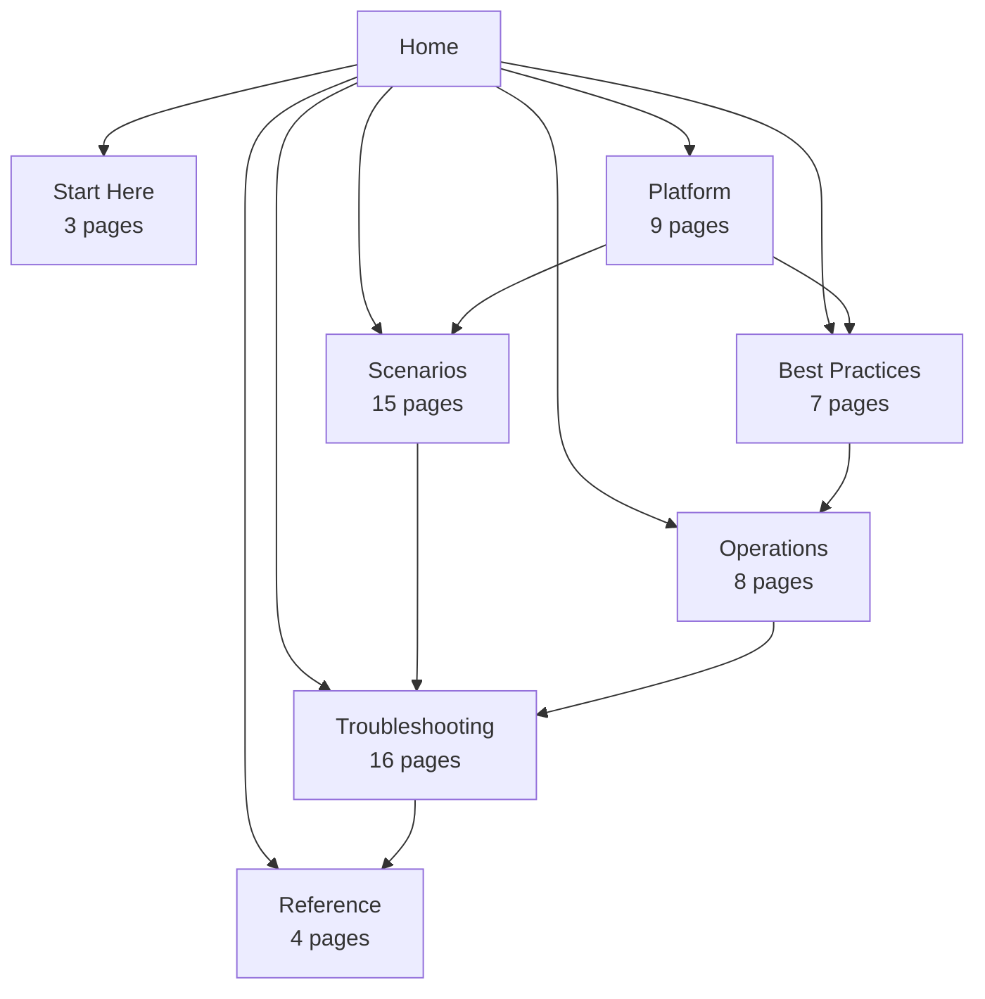

# Microsoft Entra ID Practical Guide

Microsoft Entra ID is the identity control plane behind Azure access, Microsoft 365 sign-in, SaaS federation, and modern application authentication. This guide explains the platform from an Azure practitioner's perspective so you can design, secure, operate, and troubleshoot identity-dependent workloads with confidence.

This site is organized to help you move from fundamentals to implementation:

- Start with orientation pages if you are new to the repository.
- Use the Platform section to understand core identity building blocks.
- Apply the Best Practices section before large-scale rollout.
- Jump into Scenarios and Operations when you need task-focused guidance.
- Use Troubleshooting and Reference when you are in the middle of incidents or delivery work.

<!-- diagram-id: home-site-navigation -->

## Site Structure at a Glance

| Section | Focus | Page Count | Typical Questions It Answers |
|---|---|---:|---|
| Start Here | Orientation and learning paths | 3 | Where should I begin and how is the repo organized? |
| Platform | Core Entra ID concepts and architecture | 9 | How do tenants, identities, apps, and tokens work? |
| Best Practices | Secure design and governance guidance | 7 | What should I standardize before scaling? |
| Scenarios | End-to-end implementation patterns | 15 | How do I solve common Azure identity use cases? |
| Operations | Day-2 administration and monitoring | 8 | How do I run identity services reliably? |
| Troubleshooting | Incident response and failure isolation | 16 | How do I diagnose authentication and access issues? |
| Reference | Quick lookup material | 4 | Where are the commands, limits, and codes? |

## Quick Start by Role

## Developer

Focus on application identities, sign-in flows, permissions, and token handling.

Recommended starting sequence:

1. Start Here Overview
2. Platform: App Registrations
3. Platform: OAuth 2.0 and OpenID Connect
4. Platform: Tokens
5. Scenarios: App Registration
6. Operations: Consent Management
7. Troubleshooting: Authentication Flow Playbooks

## IT Admin

Focus on tenant setup, users, groups, authentication methods, and operational controls.

Recommended starting sequence:

1. Start Here Overview
2. Platform: Tenants
3. Platform: Users and Groups
4. Platform: Authentication Methods
5. Best Practices: MFA
6. Operations: User Lifecycle
7. Operations: Group Management

## Security Engineer

Focus on conditional access, identity protection, privileged access, and log-driven investigation.

Recommended starting sequence:

1. Start Here Overview
2. Best Practices: Conditional Access
3. Best Practices: Identity Protection
4. Best Practices: RBAC
5. Operations: Sign-in and Audit Logs
6. Operations: Secure Score
7. Troubleshooting: Sign-in Failure Playbooks

## Architect

Focus on tenant topology, workload identity patterns, hybrid design, governance, and platform boundaries.

Recommended starting sequence:

1. Start Here Overview
2. Platform: Architecture
3. Platform: Tenants
4. Platform: Managed Identities
5. Best Practices: Tenant Design
6. Scenarios: Hybrid Identity
7. Scenarios: B2B and Governance

## How to Use This Guide

- If you are designing a new environment:
    - Start in Platform.
    - Read the matching Best Practices pages.
    - Validate your design against the relevant Scenarios pages.
- If you are operating an existing tenant:
    - Start in Operations.
    - Add Best Practices gaps to your backlog.
    - Keep Troubleshooting bookmarked for incidents.
- If you are investigating an outage or access issue:
    - Use Troubleshooting first.
    - Confirm expected behavior in Platform and Operations.
    - Use Reference for quick command and limits lookup.

## What This Guide Emphasizes

This repository prioritizes practical Azure outcomes:

- Identity as a platform dependency for Azure resources and applications.
- Clear distinctions between workforce identity, workload identity, and external collaboration.
- Operational readiness, including logs, access reviews, consent control, and incident response.
- Design choices that reduce tenant sprawl, privilege accumulation, and authentication drift.

## See Also

- [Start Here Overview](start-here/overview.md)
- [Learning Paths](start-here/learning-paths.md)
- [Repository Map](start-here/repository-map.md)

## Sources

- https://learn.microsoft.com/en-us/entra/fundamentals/whatis
- https://learn.microsoft.com/en-us/entra/fundamentals/entra-admin-center
- https://learn.microsoft.com/en-us/entra/identity-platform/v2-protocols

