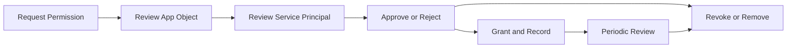

# App Consent Management

App consent management helps administrators control which permissions applications can use in the tenant and which service principals remain trusted. The operational goal is to approve only necessary access, review granted permissions regularly, and revoke consent when an application no longer needs it.

## Prerequisites

- Azure CLI authenticated with Application Administrator, Cloud Application Administrator, or Global Administrator rights.
- Variables defined for the target app and tenant.
- Familiarity with the difference between an application object and a service principal.

## When to Use

Use this workflow when you need to:

- review a new admin consent request;
- inspect permissions granted to an enterprise application;
- confirm whether app-only or delegated scopes are appropriate; or
- revoke consent and remove stale service principals.

## Procedure

### Step 1: Identify the application object

Find the application registration.

```bash
az ad app show --id "$APP_ID"
```

Expected output returns the application object, including the app ID, display name, and configured required resource access. This reveals what the application is requesting, not yet what the tenant has granted.

### Step 2: Identify the service principal

Review the enterprise application instance in the tenant.

```bash
az ad sp show --id "$APP_ID"
```

Expected output returns the service principal object. This is the tenant-local identity that stores assignments, consent grants, and sign-in behavior.

### Step 3: Review granted permissions

Query Graph for OAuth2 permission grants tied to the service principal.

```bash
az rest --method GET \
    --url "https://graph.microsoft.com/v1.0/oauth2PermissionGrants?$filter=clientId eq '$APP_ID'"
```

Expected output returns delegated grant records if they exist. Review the `scope` values carefully and compare them with business need.

### Step 4: Review app role assignments

Inspect application permissions that may have been granted to the service principal.

```bash
az rest --method GET \
    --url "https://graph.microsoft.com/v1.0/servicePrincipals(appId='$APP_ID')/appRoleAssignments"
```

Expected output returns app role assignment objects representing app-only permissions. These typically require higher scrutiny because they may allow broad unattended access.

### Step 5: Execute an admin consent workflow

Document the requested permission set, approval owner, justification, data sensitivity, and expiry review date before granting consent through your approved admin path.

```bash
az ad app permission list --id "$APP_ID"
```

Expected output lists configured permissions on the application registration. Use this list during approval to verify that requested permissions match the app design.

### Step 6: Revoke consent when needed

Delete delegated grants or remove app role assignments through Graph when the app is no longer approved.

```bash
az rest --method DELETE \
    --url "https://graph.microsoft.com/v1.0/oauth2PermissionGrants/<grant-id>"
```

Expected output is silent success or an HTTP success code. After deletion, the app should lose the delegated grant until new consent is provided.

### Step 7: Remove stale enterprise applications

If the application is decommissioned, remove the service principal after confirming no assignments or dependencies remain.

```bash
az ad sp delete --id "$APP_ID"
```

Expected output is silent success. Ensure the deletion is coordinated with owners because existing user workflows may break.

<!-- diagram-id: app-consent-review-cycle -->


## Verification

Run follow-up queries after any approval or revocation.

```bash
az ad app permission list --id "$APP_ID"
az ad sp show --id "$APP_ID"
az rest --method GET --url "https://graph.microsoft.com/v1.0/oauth2PermissionGrants?$filter=clientId eq '$APP_ID'"
```

Confirm that:

- permissions match the approved design;
- unneeded grants are absent;
- the service principal still exists only if the app remains in use; and
- a reviewer can trace who approved the permission set.

## Rollback / Troubleshooting

- If an app stops working after revocation, restore only the minimum approved permissions.
- If Graph queries return nothing, confirm whether the filter expects object ID versus app ID in that endpoint.
- If the app has multiple service principals across tenants, verify you are looking at the correct tenant-local object.
- If a deletion is blocked, check for active assignments or ownership dependencies.

!!! warning
    High-privilege app-only permissions can create significant blast radius. Use explicit approval gates and review intervals.

## Automation

- Export app grants on a schedule for review.
- Compare current grants with an approved baseline.
- Create alerts for new high-risk permissions.
- Trigger recertification tasks for apps without recent owner validation.

## See Also

- [Operations Overview](index.md)
- [Audit Log Analysis](audit-log-analysis.md)
- [Conditional Access Management](conditional-access-management.md)

## Sources

- Microsoft Learn: Enterprise applications and consent guidance
- Microsoft Graph permissions reference
- Microsoft Learn: Azure CLI `az ad app` and `az ad sp`
