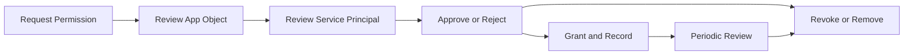

# App Consent Management

App consent management helps administrators control which permissions applications can use in the tenant and which service principals remain trusted. The operational goal is to approve only necessary access, review granted permissions regularly, and revoke consent when an application no longer needs it.

## Prerequisites

- Azure CLI authenticated with Application Administrator, Cloud Application Administrator, or Global Administrator rights.
- Variables defined for the target app and tenant.
- Familiarity with the difference between an application object and a service principal.

Recommended variables:

- `$TENANT_ID`
- `$APP_ID`
- `$SP_ID`
- `$RESOURCE_SP_ID`
- `$GRANT_ID`
- `$APP_ROLE_ASSIGNMENT_ID`

Before making changes, verify that the target service principal exists in the current tenant and that your operations record identifies the application owner, approval authority, and review date.

## When to Use

Use this workflow when you need to:

- review a new admin consent request;
- inspect permissions granted to an enterprise application;
- confirm whether app-only or delegated scopes are appropriate; or
- revoke consent and remove stale service principals.

This workflow is also useful after application onboarding, during quarterly access recertification, after an incident involving tokens or application credentials, and before deleting an enterprise application that may still hold assignments.

## Procedure

### Step 1: Identify the application object

Find the application registration.

```bash
az ad app show --id "$APP_ID"
```

Expected output returns the application object, including the app ID, display name, and configured required resource access. This reveals what the application is requesting, not yet what the tenant has granted.

If you need a narrower view for review notes, select only the permission definition fields.

```bash
az rest --method GET \
    --url "https://graph.microsoft.com/v1.0/applications(appId='$APP_ID')?$select=id,appId,displayName,requiredResourceAccess"
```

Compare the requested `requiredResourceAccess` entries with the solution design. Microsoft Learn guidance recommends granting only the minimum delegated scopes or app roles required for the application scenario.

### Step 2: Identify the service principal

Review the enterprise application instance in the tenant.

```bash
az ad sp show --id "$APP_ID"
```

Expected output returns the service principal object. This is the tenant-local identity that stores assignments, consent grants, and sign-in behavior.

Record the returned service principal object ID as `$SP_ID` because Microsoft Graph consent endpoints frequently use the service principal object ID rather than the application ID.

```bash
az rest --method GET \
    --url "https://graph.microsoft.com/v1.0/servicePrincipals(appId='$APP_ID')?$select=id,appId,displayName,accountEnabled,servicePrincipalType"
```

This query is useful when the tenant contains multiple similarly named applications and you need an authoritative object ID before proceeding.

### Step 3: Review granted permissions

Query Graph for OAuth2 permission grants tied to the service principal.

```bash
az rest --method GET \
    --url "https://graph.microsoft.com/v1.0/oauth2PermissionGrants?$filter=clientId eq '$SP_ID'"
```

Expected output returns delegated grant records if they exist. Review the `scope` values carefully and compare them with business need.

If the result set is large, request only the fields needed for a human review package.

```bash
az rest --method GET \
    --url "https://graph.microsoft.com/v1.0/oauth2PermissionGrants?$filter=clientId eq '$SP_ID'&$select=id,clientId,resourceId,scope,consentType,principalId"
```

Pay attention to `consentType`. `AllPrincipals` indicates tenant-wide delegated consent, while `Principal` indicates a user-scoped grant. Tenant-wide grants deserve additional scrutiny because they broaden exposure beyond a single operator.

### Step 4: Review app role assignments

Inspect application permissions that may have been granted to the service principal.

```bash
az rest --method GET \
    --url "https://graph.microsoft.com/v1.0/servicePrincipals(appId='$APP_ID')/appRoleAssignments"
```

Expected output returns app role assignment objects representing app-only permissions. These typically require higher scrutiny because they may allow broad unattended access.

To inspect the resource side of the relationship, query the API service principal that exposes the role definition.

```bash
az rest --method GET \
    --url "https://graph.microsoft.com/v1.0/servicePrincipals/$RESOURCE_SP_ID?$select=id,displayName,appRoles"
```

Match `appRoleId` values from the assignment output to `appRoles` on the resource service principal. This confirms exactly which application permission was granted.

### Step 5: Review owners and publisher context

Before approval or revocation, confirm that the enterprise application still has accountable owners.

```bash
az rest --method GET \
    --url "https://graph.microsoft.com/v1.0/servicePrincipals/$SP_ID/owners?$select=id,displayName,userPrincipalName"
```

Expected output returns current owners. Microsoft Learn app governance guidance emphasizes clear ownership because consent decisions and incident follow-up become difficult when service principals have no current business sponsor.

### Step 6: Execute an admin consent workflow

Document the requested permission set, approval owner, justification, data sensitivity, and expiry review date before granting consent through your approved admin path.

```bash
az ad app permission list --id "$APP_ID"
```

Expected output lists configured permissions on the application registration. Use this list during approval to verify that requested permissions match the app design.

For deeper analysis, review the service principal grant objects and verify whether the app is asking for Microsoft Graph high-impact permissions such as directory read, directory write, mail access, or application-level access without user context.

```bash
az rest --method GET \
    --url "https://graph.microsoft.com/v1.0/servicePrincipals/$SP_ID?$select=id,displayName,publisherName,appRoles"
```

Approval notes should capture whether the app is single-tenant or multi-tenant, whether the publisher is verified, and whether the requested permissions align with the documented integration pattern.

### Step 7: Revoke consent when needed

Delete delegated grants or remove app role assignments through Graph when the app is no longer approved.

```bash
az rest --method DELETE \
    --url "https://graph.microsoft.com/v1.0/oauth2PermissionGrants/$GRANT_ID"
```

Expected output is silent success or an HTTP success code. After deletion, the app should lose the delegated grant until new consent is provided.

If the application also has app-only permissions, remove the assignment separately.

```bash
az rest --method DELETE \
    --url "https://graph.microsoft.com/v1.0/servicePrincipals/$SP_ID/appRoleAssignments/$APP_ROLE_ASSIGNMENT_ID"
```

Removing both delegated grants and app role assignments prevents a partially decommissioned application from keeping residual access.

### Step 8: Remove stale enterprise applications

If the application is decommissioned, remove the service principal after confirming no assignments or dependencies remain.

```bash
az ad sp delete --id "$APP_ID"
```

Expected output is silent success. Ensure the deletion is coordinated with owners because existing user workflows may break.

If you need to verify assignments before deletion, inspect app role assignments made to users or groups.

```bash
az rest --method GET \
    --url "https://graph.microsoft.com/v1.0/servicePrincipals/$SP_ID/appRoleAssignedTo?$select=id,principalId,principalType,resourceDisplayName"
```

Do not delete the service principal until you have confirmed that access packages, enterprise app assignments, and automation jobs are not still dependent on it.

<!-- diagram-id: app-consent-review-cycle -->


## Verification

Run follow-up queries after any approval or revocation.

```bash
az ad app permission list --id "$APP_ID"
az ad sp show --id "$APP_ID"
az rest --method GET --url "https://graph.microsoft.com/v1.0/oauth2PermissionGrants?$filter=clientId eq '$SP_ID'"
az rest --method GET --url "https://graph.microsoft.com/v1.0/servicePrincipals/$SP_ID/appRoleAssignments?$select=id,appRoleId,resourceId"
```

Confirm that:

- permissions match the approved design;
- unneeded grants are absent;
- the service principal still exists only if the app remains in use; and
- a reviewer can trace who approved the permission set.

Also confirm that:

- service principal owners are still valid employees or service accounts with operational ownership;
- revoked grants no longer appear in Graph query results; and
- any app-only permission still present has explicit approval documented in the change record.

## Rollback / Troubleshooting

- If an app stops working after revocation, restore only the minimum approved permissions.
- If Graph queries return nothing, confirm whether the filter expects a service principal object ID versus an application ID in that endpoint.
- If the app has multiple service principals across tenants, verify you are looking at the correct tenant-local object.
- If a deletion is blocked, check for active assignments or ownership dependencies.

Common investigation checks:

- Re-run `az ad sp show --id "$APP_ID"` to confirm the service principal still exists.
- Re-run `az rest --method GET --url "https://graph.microsoft.com/v1.0/oauth2PermissionGrants?$filter=clientId eq '$SP_ID'"` to confirm the grant truly exists before attempting deletion.
- Validate whether failure is caused by missing directory role permissions for the operator rather than by the application object itself.
- If a multi-tenant application is widely used, coordinate revocation with workload owners because users may see immediate access failures across dependent SaaS applications.

!!! warning
    High-privilege app-only permissions can create significant blast radius. Use explicit approval gates and review intervals.

## Automation

- Export app grants on a schedule for review.
- Compare current grants with an approved baseline.
- Create alerts for new high-risk permissions.
- Trigger recertification tasks for apps without recent owner validation.

Example scheduled export pattern:

```bash
for CURRENT_SP_ID in $(az rest --method GET \
    --url "https://graph.microsoft.com/v1.0/servicePrincipals?$select=id" \
    --query "value[].id" \
    --output tsv); do
    az rest --method GET \
        --url "https://graph.microsoft.com/v1.0/oauth2PermissionGrants?$filter=clientId eq '$CURRENT_SP_ID'"
done
```

Use automation to flag grants containing broad scopes, enterprise applications without owners, and service principals that have not been reviewed within the approved recertification window.

## See Also

- [Operations Overview](index.md)
- [Audit Log Analysis](audit-log-analysis.md)
- [Conditional Access Management](conditional-access-management.md)

## Sources

- Microsoft Learn: Enterprise applications and consent guidance - https://learn.microsoft.com/entra/identity/enterprise-apps/
- Microsoft Graph permissions reference - https://learn.microsoft.com/graph/permissions-reference
- Microsoft Learn: Azure CLI `az ad app` - https://learn.microsoft.com/cli/azure/ad/app
- Microsoft Learn: Azure CLI `az ad sp` - https://learn.microsoft.com/cli/azure/ad/sp
