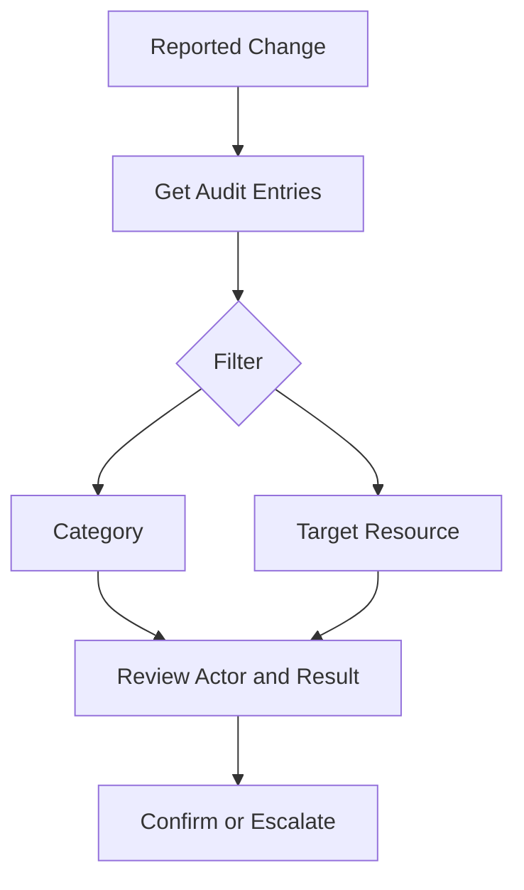

# Audit Log Analysis

Audit log analysis focuses on administrative and directory changes in Microsoft Entra ID, such as user updates, group membership changes, policy changes, and application management events. These records are essential for change validation, incident response, and compliance reporting.

## Prerequisites

- Azure CLI authenticated with permission to read audit logs.
- Understanding of the target change window and impacted object type.
- Variables defined for users, groups, and applications you want to investigate.

## When to Use

Use this workflow when you need to:

- validate that an admin action occurred;
- trace who changed a user, group, app, or policy;
- investigate unexpected membership changes;
- confirm app consent or service principal modifications; or
- support post-change or compliance evidence collection.

## Procedure

### Step 1: Retrieve recent audit entries

```bash
az rest --method GET \
    --url "https://graph.microsoft.com/v1.0/auditLogs/directoryAudits?$top=10"
```

Expected output returns recent directory audit events with category, activity display name, initiated-by data, and target resources. This forms the baseline for deeper filtering.

### Step 2: Filter by category

```bash
az rest --method GET \
    --url "https://graph.microsoft.com/v1.0/auditLogs/directoryAudits?$filter=category eq 'UserManagement'"
```

Expected output returns user-management-related changes only. Similar category filtering can be applied to groups, applications, or policy areas depending on the event you are tracking.

### Step 3: Track changes to a user or group

```bash
az rest --method GET \
    --url "https://graph.microsoft.com/v1.0/auditLogs/directoryAudits?$filter=targetResources/any(t:t/id eq '$USER_ID')"
```

Expected output returns entries where the specified user object appears as a target resource. Swap `$USER_ID` for `$GROUP_ID` to inspect group-centric changes.

### Step 4: Track application or consent activity

```bash
az rest --method GET \
    --url "https://graph.microsoft.com/v1.0/auditLogs/directoryAudits?$filter=targetResources/any(t:t/id eq '$APP_ID')"
```

Expected output returns entries linked to the target application or service principal object where applicable. Review the activity names for consent, credential, or ownership changes.

### Step 5: Interpret admin actions

For each relevant entry, review these fields:

- `activityDisplayName` for the change type;
- `category` for the operational domain;
- `initiatedBy` to identify the actor;
- `targetResources` to confirm the object changed; and
- `result` to see whether the action succeeded.

Interpreting these together helps distinguish intentional changes from unexpected or incomplete operations.

### Step 6: Preserve evidence

Export relevant entries to an investigation or change record.

```bash
az rest --method GET \
    --url "https://graph.microsoft.com/v1.0/auditLogs/directoryAudits?$top=25"
```

Expected output provides a larger dataset suitable for attachment or offline review. Preserve timestamps and query details so another operator can reproduce the result.

<!-- diagram-id: audit-log-investigation -->


## Verification

Use a final targeted query to validate your conclusion.

```bash
az rest --method GET --url "https://graph.microsoft.com/v1.0/auditLogs/directoryAudits?$top=5"
```

Confirm that:

- the returned events cover the correct time period;
- the target resource matches the object under review;
- the initiating actor is identified where expected; and
- the activity name supports the change narrative in your ticket.

## Rollback / Troubleshooting

- If the event is missing, expand the time window and re-check permissions.
- If the target object filter fails, verify whether the endpoint expects an object ID instead of an app ID.
- If you need business impact context, correlate with sign-in logs and workload owner records.
- If the action was unauthorized, escalate using the security incident process before making changes.

!!! warning
    Audit data confirms that a directory action occurred, but not always why it was approved. Pair audit review with change records and owner validation.

## Automation

- Export category-specific audit logs on a schedule.
- Flag high-risk admin actions for review.
- Correlate initiated-by data with privileged role assignments.
- Build searchable evidence packages for major incidents.

## See Also

- [Sign-in Log Analysis](sign-in-log-analysis.md)
- [App Consent Management](app-consent-management.md)
- [Operations Overview](index.md)

## Sources

- Microsoft Entra audit log documentation
- Microsoft Graph directory audit resource documentation
- Microsoft Graph query parameter documentation
