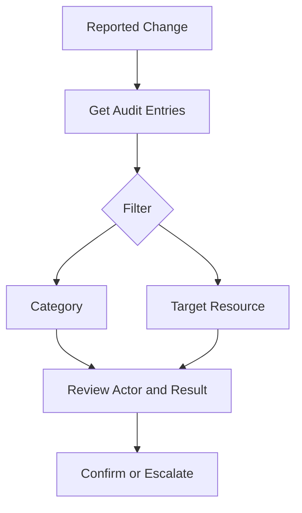

# Audit Log Analysis

Audit log analysis focuses on administrative and directory changes in Microsoft Entra ID, such as user updates, group membership changes, policy changes, and application management events. These records are essential for change validation, incident response, and compliance reporting.

## Prerequisites

- Azure CLI authenticated with permission to read audit logs.
- Understanding of the target change window and impacted object type.
- Variables defined for users, groups, and applications you want to investigate.

Recommended variables:

- `$START_TIME`
- `$END_TIME`
- `$USER_ID`
- `$GROUP_ID`
- `$APP_OBJECT_ID`
- `$ACTIVITY_NAME`

Audit events are most useful when paired with a change ticket, incident ID, or maintenance window reference so that the returned events can be compared with an expected operational action.

## When to Use

Use this workflow when you need to:

- validate that an admin action occurred;
- trace who changed a user, group, app, or policy;
- investigate unexpected membership changes;
- confirm app consent or service principal modifications; or
- support post-change or compliance evidence collection.

It is also appropriate when you need to validate privileged role changes, trace Conditional Access updates, or build evidence for a security review after a suspicious directory modification.

## Procedure

### Step 1: Retrieve recent audit entries

```bash
az rest --method GET \
    --url "https://graph.microsoft.com/v1.0/auditLogs/directoryAudits?$top=10"
```

Expected output returns recent directory audit events with category, activity display name, initiated-by data, and target resources. This forms the baseline for deeper filtering.

For an investigation window, add a time filter so the dataset stays small and reproducible.

```bash
az rest --method GET \
    --url "https://graph.microsoft.com/v1.0/auditLogs/directoryAudits?$filter=activityDateTime ge $START_TIME and activityDateTime le $END_TIME"
```

Microsoft Learn recommends narrowing Graph queries early because audit datasets can be large and paged.

### Step 2: Filter by category

```bash
az rest --method GET \
    --url "https://graph.microsoft.com/v1.0/auditLogs/directoryAudits?$filter=category eq 'UserManagement'"
```

Expected output returns user-management-related changes only. Similar category filtering can be applied to groups, applications, or policy areas depending on the event you are tracking.

Common categories to review include `UserManagement`, `GroupManagement`, `ApplicationManagement`, and `Policy`. The exact category helps you avoid misreading a user access issue as an application issue or vice versa.

### Step 3: Filter by activity name

When the category is still too broad, filter by the known operation.

```bash
az rest --method GET \
    --url "https://graph.microsoft.com/v1.0/auditLogs/directoryAudits?$filter=activityDisplayName eq '$ACTIVITY_NAME'"
```

Expected output returns events for the named activity only, such as adding a member to a group or updating a policy. This is useful during change validation when the operator knows the intended action.

### Step 4: Track changes to a user or group

```bash
az rest --method GET \
    --url "https://graph.microsoft.com/v1.0/auditLogs/directoryAudits?$filter=targetResources/any(t:t/id eq '$USER_ID')"
```

Expected output returns entries where the specified user object appears as a target resource. Swap `$USER_ID` for `$GROUP_ID` to inspect group-centric changes.

If you are tracking a group membership incident, inspect the `modifiedProperties` collection in each event so that you can see which member values changed rather than only seeing that the group object was touched.

### Step 5: Track application or consent activity

```bash
az rest --method GET \
    --url "https://graph.microsoft.com/v1.0/auditLogs/directoryAudits?$filter=targetResources/any(t:t/id eq '$APP_OBJECT_ID')"
```

Expected output returns entries linked to the target application or service principal object where applicable. Review the activity names for consent, credential, or ownership changes.

Application investigations often need both the application object ID and the service principal object ID because some operations are logged against one object while tenant-specific access changes are logged against the other.

### Step 6: Identify the initiating actor

Extract a narrower view for the operator and initiation context.

```bash
az rest --method GET \
    --url "https://graph.microsoft.com/v1.0/auditLogs/directoryAudits?$filter=activityDateTime ge $START_TIME and activityDateTime le $END_TIME&$select=id,activityDisplayName,activityDateTime,initiatedBy,result"
```

Expected output returns a compact evidence set. Use `initiatedBy` to distinguish human administrator actions from application-initiated changes or automated provisioning.

### Step 7: Interpret admin actions

For each relevant entry, review these fields:

- `activityDisplayName` for the change type;
- `category` for the operational domain;
- `initiatedBy` to identify the actor;
- `targetResources` to confirm the object changed; and
- `result` to see whether the action succeeded.

Interpreting these together helps distinguish intentional changes from unexpected or incomplete operations.

If the same object shows repeated changes across a short time period, compare timestamps and actors carefully. A failed action followed by a successful retry can look like conflicting evidence unless you review the sequence.

When available, compare audit events with the related support request or change record so you can distinguish approved bulk actions from suspicious ad hoc administrator activity.

### Step 8: Preserve evidence

Export relevant entries to an investigation or change record.

```bash
az rest --method GET \
    --url "https://graph.microsoft.com/v1.0/auditLogs/directoryAudits?$top=25"
```

Expected output provides a larger dataset suitable for attachment or offline review. Preserve timestamps and query details so another operator can reproduce the result.

For a targeted export package, include only the fields commonly used by reviewers.

```bash
az rest --method GET \
    --url "https://graph.microsoft.com/v1.0/auditLogs/directoryAudits?$filter=activityDateTime ge $START_TIME and activityDateTime le $END_TIME&$select=id,activityDateTime,activityDisplayName,category,result,initiatedBy,targetResources"
```

This produces a cleaner handoff artifact for incident response or compliance review than a raw unfiltered audit stream.

### Step 9: Correlate with current object state

After identifying the relevant event, compare it with the object's current live configuration.

```bash
az rest --method GET \
    --url "https://graph.microsoft.com/v1.0/users/$USER_ID?$select=id,displayName,accountEnabled"
```

Expected output returns the current object state for comparison. This helps answer whether the audit event reflects the condition that still exists now or whether a later change already reverted it.

<!-- diagram-id: audit-log-investigation -->


## Verification

Use a final targeted query to validate your conclusion.

```bash
az rest --method GET --url "https://graph.microsoft.com/v1.0/auditLogs/directoryAudits?$filter=activityDateTime ge $START_TIME and activityDateTime le $END_TIME&$top=5"
```

Confirm that:

- the returned events cover the correct time period;
- the target resource matches the object under review;
- the initiating actor is identified where expected; and
- the activity name supports the change narrative in your ticket.

Also confirm that:

- the event category aligns with the operational area you intended to investigate;
- any failed or incomplete actions are accounted for in the sequence; and
- the stored evidence includes enough fields for another operator to reproduce the conclusion.

For regulated change review, include the exact Graph query, query time, and operator identity in the evidence package.

If the investigation supports incident response, also record the case identifier and the reason this exact time window was selected.

## Rollback / Troubleshooting

- If the event is missing, expand the time window and re-check permissions.
- If the target object filter fails, verify whether the endpoint expects an object ID instead of an app ID.
- If you need business impact context, correlate with sign-in logs and workload owner records.
- If the action was unauthorized, escalate using the security incident process before making changes.

Additional troubleshooting guidance:

- If the query returns paging links, continue following `@odata.nextLink` until you have the full evidence set for the review period.
- If `initiatedBy` is empty or ambiguous, compare the event with privileged role assignment records and workload automation schedules.
- If the same display name exists for multiple groups or apps, use object IDs from `targetResources` rather than names in your case notes.
- If the event refers to policy changes, pair the audit evidence with the current policy definition so that reviewers can see both who changed it and what the live configuration is now.

!!! warning
    Audit data confirms that a directory action occurred, but not always why it was approved. Pair audit review with change records and owner validation.

## Automation

- Export category-specific audit logs on a schedule.
- Flag high-risk admin actions for review.
- Correlate initiated-by data with privileged role assignments.
- Build searchable evidence packages for major incidents.

Example export pattern:

```bash
az rest --method GET \
    --url "https://graph.microsoft.com/v1.0/auditLogs/directoryAudits?$filter=activityDateTime ge $START_TIME and activityDateTime le $END_TIME&$select=id,activityDisplayName,category,result,initiatedBy,targetResources"
```

Automation is most effective when queries are scoped by change window, category, and target object type instead of collecting every directory audit event without context.

Where possible, send exported evidence to a durable location with case identifiers so that future reviewers do not have to rerun broad directory audit queries without the original investigation context.

Periodic automation should focus on high-risk event categories such as policy changes, privileged role changes, and application consent changes before expanding to lower-risk noise.

Review automation output regularly so that important audit signals do not get lost in unattended exports.

## See Also

- [Sign-in Log Analysis](sign-in-log-analysis.md)
- [App Consent Management](app-consent-management.md)
- [Operations Overview](index.md)

## Sources

- Microsoft Entra audit logs - https://learn.microsoft.com/entra/identity/monitoring-health/concept-audit-logs
- Microsoft Graph directory audit resource - https://learn.microsoft.com/graph/api/resources/directoryaudit
- Microsoft Graph query parameters - https://learn.microsoft.com/graph/query-parameters
