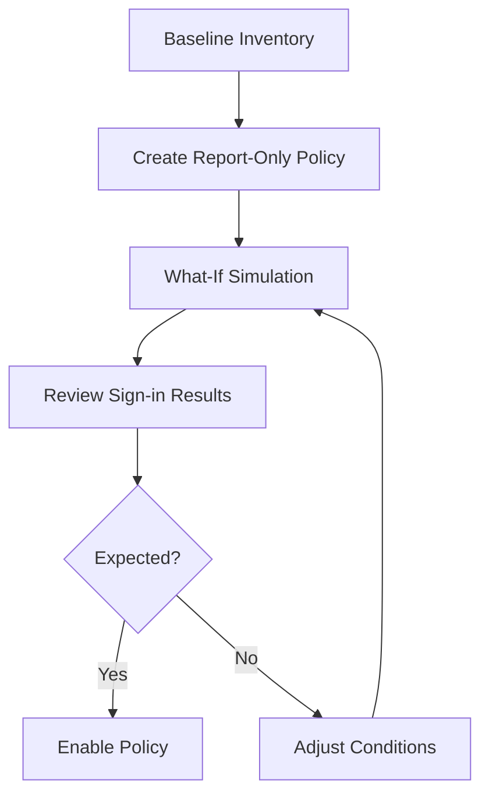

# Conditional Access Management

Conditional Access management is the operational process of creating, adjusting, validating, and enforcing access policies that balance security requirements with user productivity. Safe rollout depends on staged testing, report-only evaluation, and evidence from actual sign-in patterns.

## Prerequisites

- Azure CLI authenticated with Security Administrator or Conditional Access Administrator rights.
- Variables defined for tenant context and target groups or apps.
- Break-glass strategy documented before policy changes.

!!! warning
    Conditional Access changes can cause widespread sign-in disruption. Always preserve emergency access accounts outside ordinary policy scope.

## When to Use

Use this workflow when you need to:

- create a new Conditional Access policy;
- update users, groups, apps, or grant controls;
- test policy impact using report-only mode; or
- simulate outcomes with the what-if capability.

## Procedure

### Step 1: Inventory existing policies

```bash
az rest --method GET \
    --url "https://graph.microsoft.com/v1.0/identity/conditionalAccess/policies"
```

Expected output returns current policies with identifiers, state, conditions, and grant controls. Use this as the baseline before editing or adding new logic.

### Step 2: Create a report-only policy

```bash
az rest --method POST \
    --url "https://graph.microsoft.com/v1.0/identity/conditionalAccess/policies" \
    --headers "Content-Type=application/json" \
    --body '{"displayName":"Require MFA for pilot users","state":"enabledForReportingButNotEnforced","conditions":{"users":{"includeGroups":["'$GROUP_ID'"]},"applications":{"includeApplications":["All"]}},"grantControls":{"operator":"OR","builtInControls":["mfa"]}}'
```

Expected output returns the new policy object and its generated ID. Report-only mode lets you observe impact before enforcement.

### Step 3: Update policy conditions

Patch the policy when the pilot scope, target apps, or grant controls change.

```bash
az rest --method PATCH \
    --url "https://graph.microsoft.com/v1.0/identity/conditionalAccess/policies/<policy-id>" \
    --headers "Content-Type=application/json" \
    --body '{"displayName":"Require MFA for expanded pilot users"}'
```

Expected output is an HTTP success status. Changes should be visible in a follow-up GET request.

### Step 4: Test with the what-if tool

Simulate a sign-in scenario to understand expected policy evaluation.

```bash
az rest --method POST \
    --url "https://graph.microsoft.com/beta/identity/conditionalAccess/evaluate" \
    --headers "Content-Type=application/json" \
    --body '{"signInIdentity":{"userId":"'$USER_ID'"},"signInContext":{"applicationId":"'$APP_ID'"}}'
```

Expected output returns policies that would apply to the supplied identity and application context. Compare the simulated result with your intended design.

### Step 5: Review report-only results

Correlate policy behavior with sign-in telemetry.

```bash
az rest --method GET \
    --url "https://graph.microsoft.com/v1.0/auditLogs/signIns?$top=10"
```

Expected output includes recent sign-in records. Use policy-related fields in the returned data to identify whether report-only outcomes match expectations.

### Step 6: Enforce the policy

Once pilot validation is complete, move the policy to enforced state.

```bash
az rest --method PATCH \
    --url "https://graph.microsoft.com/v1.0/identity/conditionalAccess/policies/<policy-id>" \
    --headers "Content-Type=application/json" \
    --body '{"state":"enabled"}'
```

Expected output is an HTTP success status. Continue monitoring immediately after enforcement to catch exclusions, device dependencies, or unexpected app behavior.

<!-- diagram-id: conditional-access-rollout -->


## Verification

Run final checks after any policy creation or update.

```bash
az rest --method GET --url "https://graph.microsoft.com/v1.0/identity/conditionalAccess/policies/<policy-id>"
az rest --method GET --url "https://graph.microsoft.com/v1.0/auditLogs/signIns?$top=5"
```

Confirm that:

- the policy state matches report-only or enabled as intended;
- included and excluded scopes are correct;
- break-glass exclusions remain valid; and
- sign-in results show the anticipated control evaluation.

## Rollback / Troubleshooting

- Revert to `enabledForReportingButNotEnforced` if enforcement causes unexpected failures.
- If users are locked out, validate exclusions and emergency access coverage immediately.
- If evaluation data is unclear, narrow the pilot to a dedicated group and test again.
- If Graph beta what-if behavior changes, verify the endpoint contract before automating against it.

## Automation

- Store policy JSON in source control.
- Promote policies through environments with approval gates.
- Export sign-in evidence after report-only pilots.
- Compare live policy definitions with a known-good baseline.

## See Also

- [Operations Overview](index.md)
- [Sign-in Log Analysis](sign-in-log-analysis.md)
- [Audit Log Analysis](audit-log-analysis.md)

## Sources

- Microsoft Entra Conditional Access documentation
- Microsoft Graph Conditional Access policy resources
- Microsoft Graph what-if and evaluation guidance
