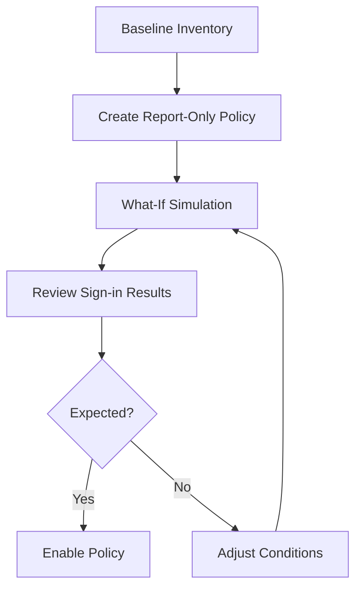

# Conditional Access Management

Conditional Access management is the operational process of creating, adjusting, validating, and enforcing access policies that balance security requirements with user productivity. Safe rollout depends on staged testing, report-only evaluation, and evidence from actual sign-in patterns.

## Prerequisites

- Azure CLI authenticated with Security Administrator or Conditional Access Administrator rights.
- Variables defined for tenant context and target groups or apps.
- Break-glass strategy documented before policy changes.

Recommended variables:

- `$POLICY_ID`
- `$GROUP_ID`
- `$USER_ID`
- `$APP_ID`
- `$LOCATION_ID`

Before changing production policy, confirm that the tenant still has at least two emergency access accounts excluded from Conditional Access, as recommended by Microsoft Learn.

!!! warning
    Conditional Access changes can cause widespread sign-in disruption. Always preserve emergency access accounts outside ordinary policy scope.

## When to Use

Use this workflow when you need to:

- create a new Conditional Access policy;
- update users, groups, apps, or grant controls;
- test policy impact using report-only mode; or
- simulate outcomes with the what-if capability.

Use this runbook during MFA rollouts, legacy authentication reduction, device compliance enforcement, and policy cleanup when duplicate or overlapping policies create user confusion.

## Procedure

### Step 1: Inventory existing policies

```bash
az rest --method GET \
    --url "https://graph.microsoft.com/v1.0/identity/conditionalAccess/policies"
```

Expected output returns current policies with identifiers, state, conditions, and grant controls. Use this as the baseline before editing or adding new logic.

Exporting a reduced field set is useful for before-and-after comparison.

```bash
az rest --method GET \
    --url "https://graph.microsoft.com/v1.0/identity/conditionalAccess/policies?$select=id,displayName,state,conditions,grantControls"
```

Review whether a new policy is truly necessary. Microsoft Learn guidance favors clear, scoped policies over redundant layers that are difficult to troubleshoot.

### Step 2: Create a report-only policy

```bash
az rest --method POST \
    --url "https://graph.microsoft.com/v1.0/identity/conditionalAccess/policies" \
    --headers "Content-Type=application/json" \
    --body '{"displayName":"Require MFA for pilot users","state":"enabledForReportingButNotEnforced","conditions":{"users":{"includeGroups":["'$GROUP_ID'"]},"applications":{"includeApplications":["All"]}},"grantControls":{"operator":"OR","builtInControls":["mfa"]}}'
```

Expected output returns the new policy object and its generated ID. Report-only mode lets you observe impact before enforcement.

After creation, store the returned ID as `$POLICY_ID` and record the intended exclusions, target apps, and rollback owner in the change ticket.

### Step 3: Update policy conditions

Patch the policy when the pilot scope, target apps, or grant controls change.

```bash
az rest --method PATCH \
    --url "https://graph.microsoft.com/v1.0/identity/conditionalAccess/policies/$POLICY_ID" \
    --headers "Content-Type=application/json" \
    --body '{"displayName":"Require MFA for expanded pilot users"}'
```

Expected output is an HTTP success status. Changes should be visible in a follow-up GET request.

Patch only one control set at a time when possible. Small, traceable changes reduce troubleshooting complexity if a sign-in regression appears after rollout.

### Step 4: Validate exclusions and named locations

Before enforcement, confirm the policy does not unexpectedly include emergency access users, service accounts, or trusted network exceptions that were intentionally designed.

```bash
az rest --method GET \
    --url "https://graph.microsoft.com/v1.0/identity/conditionalAccess/policies/$POLICY_ID?$select=id,displayName,state,conditions"
```

Expected output returns the policy conditions. Review included users, excluded users, target apps, client app conditions, and location references before testing.

### Step 5: Test with the what-if tool

Simulate a sign-in scenario to understand expected policy evaluation.

```bash
az rest --method POST \
    --url "https://graph.microsoft.com/beta/identity/conditionalAccess/evaluate" \
    --headers "Content-Type=application/json" \
    --body '{"signInIdentity":{"userId":"'$USER_ID'"},"signInContext":{"applicationId":"'$APP_ID'"}}'
```

Expected output returns policies that would apply to the supplied identity and application context. Compare the simulated result with your intended design.

Simulation is especially important when multiple policies overlap. It helps confirm whether the user would be blocked, prompted for MFA, required to meet device state conditions, or excluded entirely.

### Step 6: Review report-only results

Correlate policy behavior with sign-in telemetry.

```bash
az rest --method GET \
    --url "https://graph.microsoft.com/v1.0/auditLogs/signIns?$top=10"
```

Expected output includes recent sign-in records. Use policy-related fields in the returned data to identify whether report-only outcomes match expectations.

For a more focused validation, filter sign-ins for the pilot user and select Conditional Access result fields.

```bash
az rest --method GET \
    --url "https://graph.microsoft.com/v1.0/auditLogs/signIns?$filter=userId eq '$USER_ID'&$select=id,createdDateTime,appDisplayName,conditionalAccessStatus,appliedConditionalAccessPolicies"
```

This shows whether report-only evaluation is exercising the target policy rather than being bypassed by scoping errors.

### Step 7: Enforce the policy

Once pilot validation is complete, move the policy to enforced state.

```bash
az rest --method PATCH \
    --url "https://graph.microsoft.com/v1.0/identity/conditionalAccess/policies/$POLICY_ID" \
    --headers "Content-Type=application/json" \
    --body '{"state":"enabled"}'
```

Expected output is an HTTP success status. Continue monitoring immediately after enforcement to catch exclusions, device dependencies, or unexpected app behavior.

### Step 8: Capture the enforced baseline

After enforcement, export the live policy definition for records and future comparison.

```bash
az rest --method GET \
    --url "https://graph.microsoft.com/v1.0/identity/conditionalAccess/policies/$POLICY_ID"
```

Expected output returns the complete enforced policy JSON. Store it with the change record so future operators can compare current state with the approved baseline.

### Step 9: Review post-change audit evidence

After rollout, review audit records that show the policy creation or modification event.

```bash
az rest --method GET \
    --url "https://graph.microsoft.com/v1.0/auditLogs/directoryAudits?$filter=category eq 'Policy'&$top=10"
```

Expected output returns recent policy-related audit entries. Use this to confirm who changed the policy and when the change was committed.

<!-- diagram-id: conditional-access-rollout -->


## Verification

Run final checks after any policy creation or update.

```bash
az rest --method GET --url "https://graph.microsoft.com/v1.0/identity/conditionalAccess/policies/$POLICY_ID"
az rest --method GET --url "https://graph.microsoft.com/v1.0/auditLogs/signIns?$top=5"
```

Confirm that:

- the policy state matches report-only or enabled as intended;
- included and excluded scopes are correct;
- break-glass exclusions remain valid; and
- sign-in results show the anticipated control evaluation.

Also confirm that:

- no overlapping policy now creates a stronger control than planned;
- targeted users can still reach required production apps with the expected prompts; and
- the stored policy baseline matches what Graph currently returns.

Document a sample successful sign-in and, if applicable, a sample blocked sign-in so the team has proof that the enforced behavior matches design.

## Rollback / Troubleshooting

- Revert to `enabledForReportingButNotEnforced` if enforcement causes unexpected failures.
- If users are locked out, validate exclusions and emergency access coverage immediately.
- If evaluation data is unclear, narrow the pilot to a dedicated group and test again.
- If Graph beta what-if behavior changes, verify the endpoint contract before automating against it.

Operational rollback example:

```bash
az rest --method PATCH \
    --url "https://graph.microsoft.com/v1.0/identity/conditionalAccess/policies/$POLICY_ID" \
    --headers "Content-Type=application/json" \
    --body '{"state":"enabledForReportingButNotEnforced"}'
```

If a service account or legacy protocol fails after enforcement, investigate whether the policy should exclude that workload temporarily or whether the workload should be modernized before policy re-enablement.

If multiple policies changed in the same window, roll back one policy at a time so you can isolate the configuration responsible for the regression.

Maintain a tested rollback owner and communication path before every enforcement change window.

## Automation

- Store policy JSON in source control.
- Promote policies through environments with approval gates.
- Export sign-in evidence after report-only pilots.
- Compare live policy definitions with a known-good baseline.

Automation should include guardrails such as mandatory exclusion review, report-only validation evidence, and explicit approval before switching `state` from report-only to enabled.

If you manage policy as code, require pull request review for any changes to user scope, app scope, or grant controls because those fields are the most likely to produce tenant-wide impact.

## See Also

- [Operations Overview](index.md)
- [Sign-in Log Analysis](sign-in-log-analysis.md)
- [Audit Log Analysis](audit-log-analysis.md)

## Sources

- Microsoft Entra Conditional Access - https://learn.microsoft.com/entra/identity/conditional-access/
- Microsoft Graph Conditional Access policy resource - https://learn.microsoft.com/graph/api/resources/conditionalaccesspolicy
- Microsoft Graph what-if evaluation guidance - https://learn.microsoft.com/graph/api/resources/whatifanalysis
