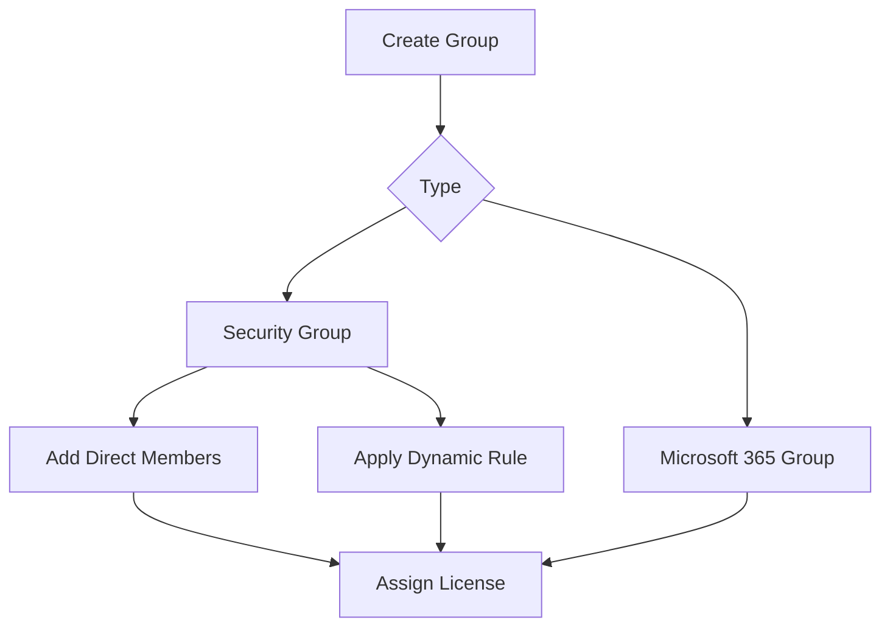

# Group Management

Group management in Microsoft Entra ID supports access assignment, app targeting, licensing, and administrative delegation. Operationally, the goal is to keep group purpose, membership, and ownership clear so that permissions remain intentional and supportable.

## Prerequisites

- Azure CLI authenticated to the correct tenant.
- Groups Administrator, User Administrator, or equivalent rights.
- Variables defined:
    - `TENANT_ID`
    - `GROUP_ID`
    - `USER_ID`
    - `DISPLAY_NAME`
    - `OWNER_ID`
    - `SKU_ID`

Before creating or editing a group, identify its operational purpose: access assignment, collaboration, licensing, or policy targeting. Microsoft Learn guidance is easiest to apply when each group has one clear function.

## When to Use

Use this workflow when you need to:

- create security groups;
- create Microsoft 365 groups;
- define dynamic membership rules;
- add nested groups where supported by workload design; or
- assign licenses using group-based licensing.

This runbook is also useful when you need to transfer group ownership, review transitive membership for a sensitive access boundary, or clean up unused groups that no longer have valid owners.

## Procedure

### Step 1: Create a security group

```bash
az ad group create \
    --display-name "$DISPLAY_NAME" \
    --mail-nickname "$DISPLAY_NAME"
```

Expected output includes a group object with its identifier, display name, and mail nickname. Save the group ID for later membership and licensing steps.

Security groups are commonly used for RBAC scoping, enterprise app assignments, and Conditional Access targeting.

If the group will be used in automation or policy, document the naming standard and business owner before adding members. Clear purpose reduces accidental reuse for unrelated access scenarios.

### Step 2: Create a Microsoft 365 group

Use Microsoft Graph through `az rest` when you need group types not fully exposed by the older `az ad group` surface.

```bash
az rest --method POST \
    --url "https://graph.microsoft.com/v1.0/groups" \
    --headers "Content-Type=application/json" \
    --body '{"displayName":"'$DISPLAY_NAME'","mailEnabled":true,"mailNickname":"'$DISPLAY_NAME'","securityEnabled":false,"groupTypes":["Unified"]}'
```

Expected output returns the new unified group object. This is appropriate when collaboration services need a Microsoft 365 group backing object.

Microsoft 365 groups are not interchangeable with security groups for every downstream service. Validate service compatibility before selecting the group type.

### Step 3: Assign group owners

Set at least one accountable owner for operational continuity.

```bash
az rest --method POST \
    --url "https://graph.microsoft.com/v1.0/groups/$GROUP_ID/owners/$ref" \
    --headers "Content-Type=application/json" \
    --body '{"@odata.id":"https://graph.microsoft.com/v1.0/directoryObjects/'$OWNER_ID'"}'
```

Expected output is an HTTP success status. Owners support delegated administration, access review, and support escalation.

### Step 4: Add direct membership

Add a user to the group.

```bash
az ad group member add \
    --group "$GROUP_ID" \
    --member-id "$USER_ID"
```

Expected output is usually silent success. Query membership afterward to verify the change.

Direct membership is best for tightly controlled admin or break-glass support groups.

For sensitive groups, add members only after the owner confirms need and the request is recorded in the access process.

### Step 5: Configure a dynamic membership rule

```bash
az rest --method PATCH \
    --url "https://graph.microsoft.com/v1.0/groups/$GROUP_ID" \
    --headers "Content-Type=application/json" \
    --body '{"groupTypes":["DynamicMembership"],"membershipRule":"user.userPrincipalName -contains \"@contoso.com\"","membershipRuleProcessingState":"On"}'
```

Expected output is an HTTP success status. Membership recalculation may take time, so do not assume instant convergence.

Dynamic groups reduce manual administration for common population logic, but they require careful rule testing.

To inspect the current rule and processing state after the patch, use a focused query.

```bash
az rest --method GET \
    --url "https://graph.microsoft.com/v1.0/groups/$GROUP_ID?$select=id,displayName,membershipRule,membershipRuleProcessingState,groupTypes"
```

This is helpful when a rule has been updated but members have not yet converged.

### Step 6: Review nested group design

Some workloads support nesting and others have limitations. Query current members before nesting a group inside another access boundary.

```bash
az ad group member list --group "$GROUP_ID"
```

Expected output returns current members. If you plan to nest groups, verify the target service supports transitive evaluation for the intended scenario.

For a broader check, inspect transitive membership through Graph.

```bash
az rest --method GET \
    --url "https://graph.microsoft.com/v1.0/groups/$GROUP_ID/transitiveMembers?$select=id,displayName"
```

Transitive membership queries help prevent surprises when access reviews or downstream services evaluate nested membership rather than only direct assignments.

### Step 7: Configure group-based licensing

Assign licenses through Graph by updating assigned licenses on the group.

```bash
az rest --method POST \
    --url "https://graph.microsoft.com/v1.0/groups/$GROUP_ID/assignLicense" \
    --headers "Content-Type=application/json" \
    --body '{"addLicenses":[{"skuId":"'$SKU_ID'"}],"removeLicenses":[]}'
```

Expected output returns the updated group object. License application to members is asynchronous and may surface conflicts for users with dependency issues.

### Step 8: Review license processing results

After assignment, inspect the group again and sample affected users if needed.

```bash
az rest --method GET \
    --url "https://graph.microsoft.com/v1.0/groups/$GROUP_ID?$select=id,displayName,assignedLicenses"
```

Expected output confirms the requested SKU is attached to the group. If users do not receive licenses, the issue may be user eligibility, conflicting plans, or lack of available licenses rather than failure of the group operation itself.

### Step 9: Review stale or unused groups

For operational hygiene, inspect groups that may no longer have valid owners or current business purpose.

```bash
az rest --method GET \
    --url "https://graph.microsoft.com/v1.0/groups/$GROUP_ID?$select=id,displayName,createdDateTime,renewedDateTime"
```

Expected output provides group lifecycle metadata. Review old groups periodically so that access targets do not accumulate without ownership.

<!-- diagram-id: group-operations-model -->


## Verification

Use both directory and membership checks.

```bash
az ad group show --group "$GROUP_ID"
az ad group member list --group "$GROUP_ID"
az rest --method GET --url "https://graph.microsoft.com/v1.0/groups/$GROUP_ID?$select=id,displayName,membershipRule,membershipRuleProcessingState"
az rest --method GET --url "https://graph.microsoft.com/v1.0/groups/$GROUP_ID/owners?$select=id,displayName,userPrincipalName"
```

Confirm that:

- the group type matches the intended use;
- owners and members are correct;
- dynamic rules are enabled and syntactically valid; and
- license assignment requests completed without unresolved conflicts.

Also confirm that:

- sensitive groups have accountable owners;
- nested or transitive membership does not exceed the intended access scope; and
- the display name and mail nickname align with your group catalog standard.

If the group is used for licensing or policy targeting, validate the downstream service result rather than assuming directory membership alone proves the full operation succeeded.

## Rollback / Troubleshooting

- Remove unintended members with `az ad group member remove`.
- Revert dynamic rules by patching the previous expression and processing state.
- If license assignment fails, inspect service plan conflicts and unavailable SKU capacity.
- If nesting does not work as expected, validate service-specific transitive membership support.

Owner removal or recovery examples:

```bash
az rest --method DELETE \
    --url "https://graph.microsoft.com/v1.0/groups/$GROUP_ID/owners/$OWNER_ID/$ref"
```

If a dynamic rule causes unexpected membership expansion, set `membershipRuleProcessingState` to `Paused`, restore the previous expression, and validate in a lower-risk group before turning processing back on.

!!! note
    Prefer smaller purpose-built groups over broad reusable groups when the access boundary is sensitive or highly regulated.

## Automation

- Generate groups from a controlled catalog.
- Validate dynamic rules in pre-production before rollout.
- Reconcile group membership with authoritative data sources.
- Export license assignment results and exception states on a schedule.

Automation can also flag groups without owners, groups that have not changed for a long time, and highly privileged groups whose direct membership changed outside the expected approval process.

## See Also

- [Operations Overview](index.md)
- [User Lifecycle Management](user-lifecycle-management.md)
- [Conditional Access Management](conditional-access-management.md)

## Sources

- Microsoft Learn: Azure CLI `az ad group` - https://learn.microsoft.com/cli/azure/ad/group
- Microsoft Graph groups overview - https://learn.microsoft.com/graph/api/resources/groups-overview
- Microsoft Entra dynamic membership rules - https://learn.microsoft.com/entra/identity/users/groups-create-rule
