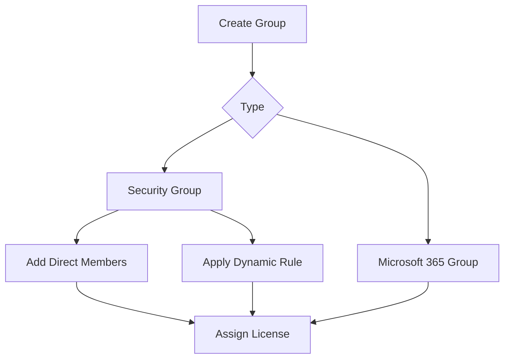

# Group Management

Group management in Microsoft Entra ID supports access assignment, app targeting, licensing, and administrative delegation. Operationally, the goal is to keep group purpose, membership, and ownership clear so that permissions remain intentional and supportable.

## Prerequisites

- Azure CLI authenticated to the correct tenant.
- Groups Administrator, User Administrator, or equivalent rights.
- Variables defined:
    - `TENANT_ID`
    - `GROUP_ID`
    - `USER_ID`
    - `DISPLAY_NAME`

## When to Use

Use this workflow when you need to:

- create security groups;
- create Microsoft 365 groups;
- define dynamic membership rules;
- add nested groups where supported by workload design; or
- assign licenses using group-based licensing.

## Procedure

### Step 1: Create a security group

```bash
az ad group create \
    --display-name "$DISPLAY_NAME" \
    --mail-nickname "$DISPLAY_NAME"
```

Expected output includes a group object with its identifier, display name, and mail nickname. Save the group ID for later membership and licensing steps.

Security groups are commonly used for RBAC scoping, enterprise app assignments, and Conditional Access targeting.

### Step 2: Create a Microsoft 365 group

Use Microsoft Graph through `az rest` when you need group types not fully exposed by the older `az ad group` surface.

```bash
az rest --method POST \
    --url "https://graph.microsoft.com/v1.0/groups" \
    --headers "Content-Type=application/json" \
    --body '{"displayName":"'$DISPLAY_NAME'","mailEnabled":true,"mailNickname":"'$DISPLAY_NAME'","securityEnabled":false,"groupTypes":["Unified"]}'
```

Expected output returns the new unified group object. This is appropriate when collaboration services need a Microsoft 365 group backing object.

### Step 3: Add direct membership

Add a user to the group.

```bash
az ad group member add \
    --group "$GROUP_ID" \
    --member-id "$USER_ID"
```

Expected output is usually silent success. Query membership afterward to verify the change.

Direct membership is best for tightly controlled admin or break-glass support groups.

### Step 4: Configure a dynamic membership rule

```bash
az rest --method PATCH \
    --url "https://graph.microsoft.com/v1.0/groups/$GROUP_ID" \
    --headers "Content-Type=application/json" \
    --body '{"groupTypes":["DynamicMembership"],"membershipRule":"user.userPrincipalName -contains \"@contoso.com\"","membershipRuleProcessingState":"On"}'
```

Expected output is an HTTP success status. Membership recalculation may take time, so do not assume instant convergence.

Dynamic groups reduce manual administration for common population logic, but they require careful rule testing.

### Step 5: Review nested group design

Some workloads support nesting and others have limitations. Query current members before nesting a group inside another access boundary.

```bash
az ad group member list --group "$GROUP_ID"
```

Expected output returns current members. If you plan to nest groups, verify the target service supports transitive evaluation for the intended scenario.

### Step 6: Configure group-based licensing

Assign licenses through Graph by updating assigned licenses on the group.

```bash
az rest --method POST \
    --url "https://graph.microsoft.com/v1.0/groups/$GROUP_ID/assignLicense" \
    --headers "Content-Type=application/json" \
    --body '{"addLicenses":[{"skuId":"<sku-guid>"}],"removeLicenses":[]}'
```

Expected output returns the updated group object. License application to members is asynchronous and may surface conflicts for users with dependency issues.

<!-- diagram-id: group-operations-model -->


## Verification

Use both directory and membership checks.

```bash
az ad group show --group "$GROUP_ID"
az ad group member list --group "$GROUP_ID"
az rest --method GET --url "https://graph.microsoft.com/v1.0/groups/$GROUP_ID?$select=id,displayName,membershipRule,membershipRuleProcessingState"
```

Confirm that:

- the group type matches the intended use;
- owners and members are correct;
- dynamic rules are enabled and syntactically valid; and
- license assignment requests completed without unresolved conflicts.

## Rollback / Troubleshooting

- Remove unintended members with `az ad group member remove`.
- Revert dynamic rules by patching the previous expression and processing state.
- If license assignment fails, inspect service plan conflicts and unavailable SKU capacity.
- If nesting does not work as expected, validate service-specific transitive membership support.

!!! note
    Prefer smaller purpose-built groups over broad reusable groups when the access boundary is sensitive or highly regulated.

## Automation

- Generate groups from a controlled catalog.
- Validate dynamic rules in pre-production before rollout.
- Reconcile group membership with authoritative data sources.
- Export license assignment results and exception states on a schedule.

## See Also

- [Operations Overview](index.md)
- [User Lifecycle Management](user-lifecycle-management.md)
- [Conditional Access Management](conditional-access-management.md)

## Sources

- Microsoft Learn: Azure CLI `az ad group`
- Microsoft Graph documentation for group resources
- Microsoft Entra dynamic membership documentation
