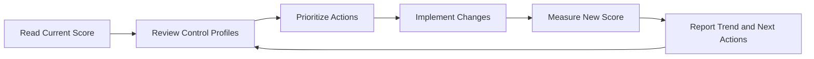

# Identity Secure Score

Identity Secure Score provides a measurable view of Microsoft Entra ID security posture by comparing implemented controls with recommended improvement actions. Operationally, it helps teams prioritize work, document progress, and explain posture changes over time.

## Prerequisites

- Azure CLI authenticated with permission to read security recommendations.
- Access to the security or identity governance process that will own remediation items.
- Variables defined for tenant context and related app or group scopes where needed.

Recommended variables:

- `$CONTROL_NAME`
- `$START_DATE`
- `$END_DATE`

Because secure score is a planning input rather than a direct enforcement tool, make sure the review meeting includes the teams that can actually implement the recommended identity improvements.

## When to Use

Use this workflow when you need to:

- understand the current identity score;
- review improvement actions;
- measure progress after operational changes; or
- brief stakeholders on identity posture trends.

Use it after major Conditional Access changes, MFA adoption campaigns, privileged access cleanup, or app consent reduction work so that posture changes can be tied to completed operational actions.

## Procedure

### Step 1: Retrieve the current secure score

```bash
az rest --method GET \
    --url "https://graph.microsoft.com/v1.0/security/secureScores"
```

Expected output returns current or recent secure score entries, including the overall score, max score, and timestamp. Use the latest record as the baseline for planning.

If you want only the most recent snapshot, query a smaller result set.

```bash
az rest --method GET \
    --url "https://graph.microsoft.com/v1.0/security/secureScores?$top=1"
```

Record the timestamp because score movement may lag behind the actual implementation of a security control.

### Step 2: Review control profiles

```bash
az rest --method GET \
    --url "https://graph.microsoft.com/v1.0/security/secureScoreControlProfiles"
```

Expected output returns control profiles with titles, descriptions, remediation guidance, and user impact. These controls explain how the score can improve.

Control profiles are most actionable when filtered into an operational backlog. Export the fields most useful for review.

```bash
az rest --method GET \
    --url "https://graph.microsoft.com/v1.0/security/secureScoreControlProfiles?$select=id,title,maxScore,implementationCost,userImpact,threats,remediation"
```

Microsoft Learn recommends considering implementation cost and user impact rather than chasing every recommendation equally.

### Step 3: Prioritize high-value actions

Sort recommended work by likely risk reduction, implementation effort, and service impact. Common identity-related actions often include MFA adoption, privileged access hygiene, legacy authentication reduction, and Conditional Access coverage.

```bash
az rest --method GET \
    --url "https://graph.microsoft.com/v1.0/security/secureScoreControlProfiles?$top=10"
```

Expected output provides a manageable subset for planning discussions. Use it to create a remediation backlog owned by identity and security stakeholders.

During prioritization, classify each recommendation into one of three states:

- ready for implementation;
- blocked by business or technical dependency; or
- accepted risk pending later review.

This makes later score reviews more credible because unresolved gaps have explicit owners and rationale.

### Step 4: Review a specific control profile

When a stakeholder asks why a recommendation matters, pull the detailed control entry.

```bash
az rest --method GET \
    --url "https://graph.microsoft.com/v1.0/security/secureScoreControlProfiles?$filter=title eq '$CONTROL_NAME'"
```

Expected output returns the matching control profile if present. Use the remediation text and user impact fields to explain the change effort in operational terms.

### Step 5: Track progress after improvements

Re-query secure scores after a validated change window.

```bash
az rest --method GET \
    --url "https://graph.microsoft.com/v1.0/security/secureScores?$top=5"
```

Expected output returns recent score snapshots. Compare dates and values to determine whether the improvement action has been reflected.

If a change has not yet moved the score, verify that the implemented control matches the recommendation criteria and allow time for telemetry refresh.

### Step 6: Link the score to operations work

Use score data to guide or validate operational priorities such as:

- enforcing MFA through Conditional Access;
- cleaning up stale app permissions;
- reducing guest or dormant account exposure;
- improving privileged identity controls; and
- increasing review cadence for sensitive groups.

The score should inform decisions, not replace risk-based judgment. Some recommendations may have prerequisites or business dependencies.

Tie each improvement item back to a specific runbook, such as Conditional Access management, app consent cleanup, or group hygiene, so the score discussion results in concrete operational work rather than abstract posture reporting.

### Step 7: Report trend and ownership

Document the baseline, target score, completed actions, blocked items, and expected review date. This turns secure score from a dashboard metric into an operational management tool.

Include both the current score and the maximum attainable score returned by Graph. A modest increase may still represent meaningful hardening if the remaining items are intentionally deferred or not applicable.

### Step 8: Build an implementation backlog

Translate high-value controls into discrete operational tasks.

- Map MFA-related recommendations to the Conditional Access runbook.
- Map stale permission and app governance items to the app consent runbook.
- Map privileged access and group hygiene items to group and user lifecycle processes.
- Assign one owner, one target date, and one validation method per control.

This step is important because secure score only improves sustainably when each recommendation is owned by a real operational workflow.

### Step 9: Reconcile recommendation status with reality

Before declaring a control complete, compare the recommendation with the tenant's live configuration.

```bash
az rest --method GET \
    --url "https://graph.microsoft.com/v1.0/identity/conditionalAccess/policies?$select=id,displayName,state"
```

Expected output gives a lightweight policy inventory that can be compared with control recommendations related to MFA, modern authentication, or privileged access restrictions.

For app-related controls, compare secure score findings with service principal and consent inventories rather than assuming the dashboard alone is a proof point.

<!-- diagram-id: secure-score-improvement-loop -->


## Verification

Run a final query after recording your findings.

```bash
az rest --method GET --url "https://graph.microsoft.com/v1.0/security/secureScores?$top=1"
```

Confirm that:

- the score timestamp is current enough for the reporting need;
- planned actions map to specific control profiles;
- completed operational changes are reflected where expected; and
- stakeholders can see both progress made and remaining gaps.

Also confirm that:

- every high-priority recommendation has a named owner or accepted-risk note;
- blocked items describe the dependency preventing implementation; and
- score reporting is not being mistaken for proof that a control was configured correctly without separate verification.

For leadership reporting, include one sentence explaining why the score changed, such as MFA coverage expansion, policy enforcement, or retirement of high-risk legacy access paths.

That short narrative prevents stakeholders from interpreting a number change without the underlying security context.

## Rollback / Troubleshooting

- If the score does not change immediately, wait for telemetry refresh and verify the control prerequisites.
- If a recommendation is not feasible, document the business or technical constraint instead of forcing an unsafe change.
- If the Graph endpoint returns no data, validate licensing, permissions, and API availability in the tenant.
- If a control improvement caused access issues, roll back the operational change using its specific runbook, then reassess the recommendation.

Helpful checks:

- Re-query `secureScoreControlProfiles` to confirm the recommendation still exists and has not been superseded.
- Compare the recommendation with the current Conditional Access, MFA, or privileged access configuration rather than assuming a generic control label is enough.
- If stakeholders dispute score value, focus discussion on the documented threats and remediation text rather than on the numeric increase alone.

If a recommendation appears incorrect for your tenant, capture the exact control profile, current configuration evidence, and review date before opening an internal exception or support discussion.

Documenting the exception path keeps the score review credible even when a recommendation cannot be implemented immediately.

!!! note
    A higher score is useful, but the objective is risk reduction with sustainable operations, not maximizing the number alone.

## Automation

- Export secure score snapshots on a schedule.
- Track control owners and due dates in a backlog system.
- Compare score trends with policy and consent changes.
- Publish a monthly identity posture summary for stakeholders.

Example reporting query:

```bash
az rest --method GET \
    --url "https://graph.microsoft.com/v1.0/security/secureScores?$filter=createdDateTime ge $START_DATE and createdDateTime le $END_DATE"
```

Automation should preserve historical snapshots so that teams can show trend lines, not just the current number.

You can also automate backlog enrichment by attaching control titles, remediation text, and user impact to a work item so implementers do not have to leave the operational workflow to gather context.

Keep the automation output lightweight and reviewable so security posture reporting stays actionable rather than becoming another unprioritized data feed.

Use monthly review cadence unless a major identity change requires earlier reassessment.

## See Also

- [Conditional Access Management](conditional-access-management.md)
- [App Consent Management](app-consent-management.md)
- [Operations Overview](index.md)

## Sources

- Microsoft Entra Identity Secure Score - https://learn.microsoft.com/entra/identity/monitoring-health/identity-secure-score
- Microsoft Graph secure score resource - https://learn.microsoft.com/graph/api/resources/securescore
- Microsoft Graph secure score control profile resource - https://learn.microsoft.com/graph/api/resources/securescorecontrolprofile
