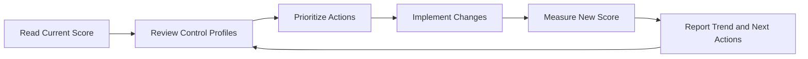

# Identity Secure Score

Identity Secure Score provides a measurable view of Microsoft Entra ID security posture by comparing implemented controls with recommended improvement actions. Operationally, it helps teams prioritize work, document progress, and explain posture changes over time.

## Prerequisites

- Azure CLI authenticated with permission to read security recommendations.
- Access to the security or identity governance process that will own remediation items.
- Variables defined for tenant context and related app or group scopes where needed.

## When to Use

Use this workflow when you need to:

- understand the current identity score;
- review improvement actions;
- measure progress after operational changes; or
- brief stakeholders on identity posture trends.

## Procedure

### Step 1: Retrieve the current secure score

```bash
az rest --method GET \
    --url "https://graph.microsoft.com/v1.0/security/secureScores"
```

Expected output returns current or recent secure score entries, including the overall score, max score, and timestamp. Use the latest record as the baseline for planning.

### Step 2: Review control profiles

```bash
az rest --method GET \
    --url "https://graph.microsoft.com/v1.0/security/secureScoreControlProfiles"
```

Expected output returns control profiles with titles, descriptions, remediation guidance, and user impact. These controls explain how the score can improve.

### Step 3: Prioritize high-value actions

Sort recommended work by likely risk reduction, implementation effort, and service impact. Common identity-related actions often include MFA adoption, privileged access hygiene, legacy authentication reduction, and Conditional Access coverage.

```bash
az rest --method GET \
    --url "https://graph.microsoft.com/v1.0/security/secureScoreControlProfiles?$top=10"
```

Expected output provides a manageable subset for planning discussions. Use it to create a remediation backlog owned by identity and security stakeholders.

### Step 4: Track progress after improvements

Re-query secure scores after a validated change window.

```bash
az rest --method GET \
    --url "https://graph.microsoft.com/v1.0/security/secureScores?$top=5"
```

Expected output returns recent score snapshots. Compare dates and values to determine whether the improvement action has been reflected.

### Step 5: Link the score to operations work

Use score data to guide or validate operational priorities such as:

- enforcing MFA through Conditional Access;
- cleaning up stale app permissions;
- reducing guest or dormant account exposure;
- improving privileged identity controls; and
- increasing review cadence for sensitive groups.

The score should inform decisions, not replace risk-based judgment. Some recommendations may have prerequisites or business dependencies.

### Step 6: Report trend and ownership

Document the baseline, target score, completed actions, blocked items, and expected review date. This turns secure score from a dashboard metric into an operational management tool.

<!-- diagram-id: secure-score-improvement-loop -->


## Verification

Run a final query after recording your findings.

```bash
az rest --method GET --url "https://graph.microsoft.com/v1.0/security/secureScores?$top=1"
```

Confirm that:

- the score timestamp is current enough for the reporting need;
- planned actions map to specific control profiles;
- completed operational changes are reflected where expected; and
- stakeholders can see both progress made and remaining gaps.

## Rollback / Troubleshooting

- If the score does not change immediately, wait for telemetry refresh and verify the control prerequisites.
- If a recommendation is not feasible, document the business or technical constraint instead of forcing an unsafe change.
- If the Graph endpoint returns no data, validate licensing, permissions, and API availability in the tenant.
- If a control improvement caused access issues, roll back the operational change using its specific runbook, then reassess the recommendation.

!!! note
    A higher score is useful, but the objective is risk reduction with sustainable operations, not maximizing the number alone.

## Automation

- Export secure score snapshots on a schedule.
- Track control owners and due dates in a backlog system.
- Compare score trends with policy and consent changes.
- Publish a monthly identity posture summary for stakeholders.

## See Also

- [Conditional Access Management](conditional-access-management.md)
- [App Consent Management](app-consent-management.md)
- [Operations Overview](index.md)

## Sources

- Microsoft Entra Identity Secure Score documentation
- Microsoft Graph secure score resource documentation
- Microsoft Graph secure score control profile documentation
