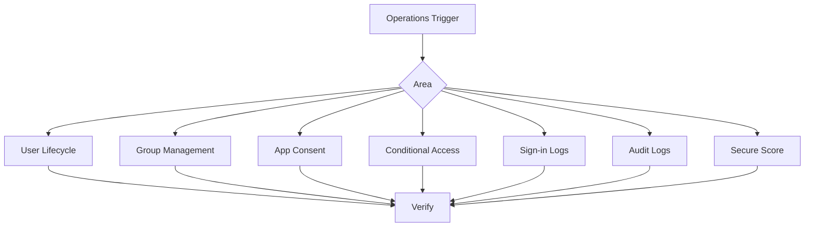

# Operations Overview

Day-2 operations in Microsoft Entra ID focus on keeping identities, groups, applications, policies, and monitoring data accurate after the initial deployment. This section covers repeatable operational workflows that help administrators manage lifecycle events, permissions, and identity telemetry without exposing personal data.

## Prerequisites

- Azure CLI installed and authenticated with tenant admin access.
- Permissions appropriate for the task, such as User Administrator, Groups Administrator, Application Administrator, or Security Administrator.
- Environment variables prepared before running examples:
    - `export TENANT_ID="<tenant-guid>"`
    - `export USER_ID="<user-object-id>"`
    - `export GROUP_ID="<group-object-id>"`
    - `export APP_ID="<app-object-id-or-client-id>"`
    - `export DISPLAY_NAME="<display-name>"`
    - `export UPN="<user-principal-name>"`

!!! note
    Replace placeholder values with tenant-safe test data. Use sandbox or pilot identities when validating new operational processes.

## When to Use

Use these operations articles when you need to:

- onboard or offboard users;
- maintain security and Microsoft 365 groups;
- review enterprise app consent and permissions;
- tune Conditional Access in a low-risk way;
- investigate sign-in failures or risky patterns;
- audit administrative changes; and
- track identity posture improvements over time.

## Procedure

### Step 1: Establish an operations baseline

Run a simple tenant-scoped Graph query to verify CLI access and confirm the tenant context.

```bash
az rest --method GET --url "https://graph.microsoft.com/v1.0/organization"
```

Expected output includes a tenant object with an `id`, verified domains, and display metadata for the organization. This confirms the session can query Microsoft Graph through Azure CLI.

This baseline matters because most operational procedures in this section rely on Graph-backed Entra ID data, even when the entry point is an `az ad` command.

### Step 2: Identify the operational area

Choose the article that matches the workflow you need to run:

- User lifecycle management for hiring, transfers, departures, and guest cleanup.
- Group management for access packaging, role assignment support, and license delivery.
- App consent management for enterprise application review and permission cleanup.
- Conditional Access management for rollout, report-only validation, and enforcement.
- Sign-in and audit log analysis for investigation and reporting.
- Identity Secure Score for improvement planning and trend tracking.

Expected output is a documented, role-appropriate runbook rather than a single command result. The goal is to reduce operator guesswork and create consistent handling of recurring tasks.

### Step 3: Standardize evidence collection

Use Graph queries to collect a minimum evidence set during investigations and change reviews.

```bash
az rest --method GET --url "https://graph.microsoft.com/v1.0/auditLogs/directoryAudits?$top=5"
az rest --method GET --url "https://graph.microsoft.com/v1.0/auditLogs/signIns?$top=5"
```

Expected output returns recent audit and sign-in entries in JSON. These records help you validate whether a change occurred and whether a user or workload was affected.

Collecting evidence first prevents accidental remediation based on assumptions. It also improves handoff quality between operations, security, and compliance teams.

<!-- diagram-id: operations-overview-map -->


## Verification

Confirm the section is being used correctly by checking that:

- the tenant context matches `$TENANT_ID`;
- the selected runbook maps to the change or incident type;
- evidence was captured before remediation; and
- expected outputs were recorded in the ticket or change request.

You can also re-run:

```bash
az rest --method GET --url "https://graph.microsoft.com/v1.0/organization?$select=id,displayName"
```

The returned tenant `id` should align with the target environment.

## Rollback / Troubleshooting

- If CLI commands fail with authorization errors, validate the signed-in account and its delegated roles.
- If Graph results are empty, confirm the URL path, permissions, and whether logs have propagated yet.
- If a workflow is risky, execute it first in report-only, pilot, or test scope before production rollout.

!!! warning
    Avoid making policy, consent, or lifecycle changes directly in production without a validation checkpoint and a documented rollback path.

## Automation

Common automation patterns for Entra ID operations include:

- scheduled `az rest` exports for log snapshots;
- shell scripts for bulk user and group updates;
- pipeline-based policy promotion with approvals; and
- periodic reporting on app permissions and Secure Score trends.

Use automation only after the manual workflow has been validated and documented.

## See Also

- [User Lifecycle Management](user-lifecycle-management.md)
- [Group Management](group-management.md)
- [App Consent Management](app-consent-management.md)
- [Conditional Access Management](conditional-access-management.md)
- [Sign-in Log Analysis](sign-in-log-analysis.md)
- [Audit Log Analysis](audit-log-analysis.md)
- [Identity Secure Score](identity-secure-score.md)

## Sources

- Microsoft Learn: Microsoft Entra documentation
- Microsoft Learn: Azure CLI `az ad` reference
- Microsoft Graph documentation for organization, sign-in logs, and directory audits
