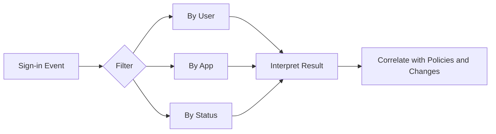

# Sign-in Log Analysis

Sign-in log analysis helps operations teams understand who attempted access, which application was involved, how Conditional Access behaved, and why a sign-in succeeded or failed. Consistent filtering and interpretation speed up troubleshooting and incident triage.

## Prerequisites

- Azure CLI authenticated with permission to read sign-in logs.
- Tenant licensing and retention appropriate for the needed log window.
- Variables defined for target identities and applications.

Recommended variables:

- `$START_TIME`
- `$END_TIME`
- `$USER_ID`
- `$APP_ID`
- `$CORRELATION_ID`

For incident response, also capture the user-reported timestamp, app name, device context, and any correlation ID from the client or workload logs before you query the sign-in dataset.

## When to Use

Use this workflow when you need to:

- investigate failed sign-ins;
- review access to a specific application;
- analyze a specific user account;
- inspect status patterns over time; or
- validate Conditional Access outcomes.

The same process is useful after certificate rollovers, app consent changes, proxy or federation changes, and emergency policy rollbacks where sign-in behavior must be confirmed quickly.

## Procedure

### Step 1: Retrieve recent sign-ins

```bash
az rest --method GET \
    --url "https://graph.microsoft.com/v1.0/auditLogs/signIns?$top=10"
```

Expected output returns recent sign-in records with timestamps, application names, conditional access data, and status objects. Use this baseline to confirm data is available before applying filters.

For a defined incident window, add a time-bound query.

```bash
az rest --method GET \
    --url "https://graph.microsoft.com/v1.0/auditLogs/signIns?$filter=createdDateTime ge $START_TIME and createdDateTime le $END_TIME"
```

This reduces noise and improves reproducibility when another operator needs to repeat the investigation.

### Step 2: Filter by user

```bash
az rest --method GET \
    --url "https://graph.microsoft.com/v1.0/auditLogs/signIns?$filter=userId eq '$USER_ID'"
```

Expected output returns sign-ins associated with the target user object. This is helpful when troubleshooting account-specific failures, MFA prompts, or lockout reports.

Use user-centric filtering first when the report came from one affected person, then widen to app-centric or status-centric filters if the issue appears broader.

### Step 3: Filter by application

```bash
az rest --method GET \
    --url "https://graph.microsoft.com/v1.0/auditLogs/signIns?$filter=appId eq '$APP_ID'"
```

Expected output returns sign-ins targeting the specified application. Compare results across time to detect spikes, failures, or changes after a policy rollout.

If several apps share a common authentication pattern, compare sign-ins for each affected app before changing tenant-wide controls.

### Step 4: Filter by status pattern

Use query parameters to reduce noisy results and focus on failed operations.

```bash
az rest --method GET \
    --url "https://graph.microsoft.com/v1.0/auditLogs/signIns?$filter=status/errorCode ne 0"
```

Expected output returns only events with non-zero error codes. Review status details alongside policy and application information to determine whether the issue is identity, policy, or workload related.

### Step 5: Filter by correlation ID

When the application or support team provides a correlation ID, use it directly.

```bash
az rest --method GET \
    --url "https://graph.microsoft.com/v1.0/auditLogs/signIns?$filter=correlationId eq '$CORRELATION_ID'"
```

Expected output returns the matching sign-in event when the identifier exists in the retained dataset. This is one of the fastest ways to connect user symptoms to a specific record.

### Step 6: Inspect Conditional Access behavior

Retrieve a small focused set and review the policy evaluation fields.

```bash
az rest --method GET \
    --url "https://graph.microsoft.com/v1.0/auditLogs/signIns?$top=5&$filter=userId eq '$USER_ID'"
```

Expected output includes Conditional Access result data for recent sign-ins. This is useful after report-only or enforced policy changes.

If you need a cleaner evidence set, select only the fields related to policy application.

```bash
az rest --method GET \
    --url "https://graph.microsoft.com/v1.0/auditLogs/signIns?$filter=userId eq '$USER_ID'&$select=id,createdDateTime,conditionalAccessStatus,appliedConditionalAccessPolicies,status"
```

This helps distinguish failures caused by Conditional Access from failures caused by invalid credentials, unsupported client apps, or downstream application authorization.

### Step 7: Review client app and device context

Inspect the sign-in record fields that often explain why one user or one app behaves differently from another.

```bash
az rest --method GET \
    --url "https://graph.microsoft.com/v1.0/auditLogs/signIns?$filter=userId eq '$USER_ID'&$select=id,createdDateTime,clientAppUsed,deviceDetail,location,status"
```

Expected output returns the client app type, device details, location, and status for matching events. These fields are especially useful for diagnosing legacy authentication, unmanaged device access, or geo-based policy outcomes.

### Step 8: Build investigation patterns

Common patterns to look for include:

- repeated failures from one app after consent removal;
- a successful sign-in immediately followed by access failure in the workload;
- report-only Conditional Access hits before enforcement;
- failures isolated to guest identities; and
- bursts of non-zero error codes after policy or certificate changes.

Treat sign-in data as one signal. Correlate with audit logs, app owner input, and recent change history before concluding root cause.

When a sign-in succeeds but the user still reports failure, investigate downstream authorization, token audience mismatch, or application session handling before making Entra ID changes.

If you observe repeated failures from the same source IP, app, or user, determine whether the pattern reflects user confusion, misconfiguration, or potentially malicious activity before attempting remediation.

### Step 9: Compare successful versus failed sign-ins

One of the fastest ways to isolate root cause is to compare a known-good sign-in with a failed one for the same app.

```bash
az rest --method GET \
    --url "https://graph.microsoft.com/v1.0/auditLogs/signIns?$filter=appId eq '$APP_ID'&$select=id,createdDateTime,userDisplayName,conditionalAccessStatus,clientAppUsed,status"
```

Expected output returns a comparison set across the same application. Differences in `clientAppUsed`, Conditional Access result, or status details often narrow the issue quickly.

<!-- diagram-id: sign-in-analysis-path -->


## Verification

Confirm the query and interpretation are valid.

```bash
az rest --method GET --url "https://graph.microsoft.com/v1.0/auditLogs/signIns?$top=1"
```

Verify that:

- timestamps align with the reported issue window;
- the correct user or app filter was used;
- status codes reflect the event you are investigating; and
- the dataset is sufficient to support your conclusion.

Also verify that:

- Conditional Access fields are present when policy behavior is part of the problem statement;
- the client app and location context are consistent with the reported scenario; and
- correlation IDs in the sign-in log match any IDs supplied by the application or support ticket.

Where possible, save one representative successful event and one representative failed event in the ticket so future reviewers can compare them without rebuilding the dataset.

This comparison record is especially useful when the issue recurs after a later policy or application change.

## Rollback / Troubleshooting

- If no logs appear, confirm retention, licensing, and permissions.
- If filters return empty data, re-check whether the endpoint expects object ID, app ID, or another property.
- If JSON payloads are large, export to a file for structured review.
- If analysis points to policy behavior, follow the Conditional Access runbook before editing production controls.

Additional troubleshooting guidance:

- If only one client app fails, compare `clientAppUsed` across successful and failed sign-ins.
- If the issue appears geo-specific, review named locations and recent network path changes before editing policy.
- If non-zero error codes surge after a certificate or federation change, correlate the sign-ins with audit entries for the related identity provider or application object.
- If a guest user is affected, compare home tenant versus resource tenant context because collaboration scenarios can add extra sign-in complexity.

!!! note
    A failed sign-in does not always mean the identity platform is at fault. Application-side token handling and downstream authorization can create similar user symptoms.

## Automation

- Schedule filtered exports for high-value apps.
- Create alerts for recurring non-zero error codes.
- Correlate sign-in results with change windows.
- Feed normalized log summaries into incident dashboards.

Example alert-oriented query:

```bash
az rest --method GET \
    --url "https://graph.microsoft.com/v1.0/auditLogs/signIns?$filter=createdDateTime ge $START_TIME and status/errorCode ne 0&$select=id,createdDateTime,userDisplayName,appDisplayName,status"
```

Automation should preserve the exact filter used so that analysts can reproduce the same result set during follow-up review.

For high-value applications, couple sign-in log summaries with application health metrics so investigators can quickly tell whether the issue stopped at authentication or continued into workload authorization and session establishment.

Keep alert thresholds narrow enough that operators can triage them, otherwise recurring low-value failures will obscure genuinely important sign-in regressions.

Review whether the same filters still match operational priorities as applications and policies evolve.

## See Also

- [Conditional Access Management](conditional-access-management.md)
- [Audit Log Analysis](audit-log-analysis.md)
- [Operations Overview](index.md)

## Sources

- Microsoft Entra sign-in logs - https://learn.microsoft.com/entra/identity/monitoring-health/concept-sign-ins
- Microsoft Graph sign-in resource - https://learn.microsoft.com/graph/api/resources/signin
- Microsoft Graph query parameters - https://learn.microsoft.com/graph/query-parameters
