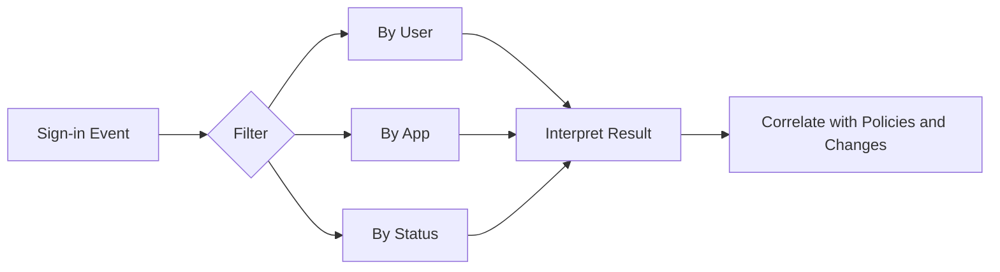

# Sign-in Log Analysis

Sign-in log analysis helps operations teams understand who attempted access, which application was involved, how Conditional Access behaved, and why a sign-in succeeded or failed. Consistent filtering and interpretation speed up troubleshooting and incident triage.

## Prerequisites

- Azure CLI authenticated with permission to read sign-in logs.
- Tenant licensing and retention appropriate for the needed log window.
- Variables defined for target identities and applications.

## When to Use

Use this workflow when you need to:

- investigate failed sign-ins;
- review access to a specific application;
- analyze a specific user account;
- inspect status patterns over time; or
- validate Conditional Access outcomes.

## Procedure

### Step 1: Retrieve recent sign-ins

```bash
az rest --method GET \
    --url "https://graph.microsoft.com/v1.0/auditLogs/signIns?$top=10"
```

Expected output returns recent sign-in records with timestamps, application names, conditional access data, and status objects. Use this baseline to confirm data is available before applying filters.

### Step 2: Filter by user

```bash
az rest --method GET \
    --url "https://graph.microsoft.com/v1.0/auditLogs/signIns?$filter=userId eq '$USER_ID'"
```

Expected output returns sign-ins associated with the target user object. This is helpful when troubleshooting account-specific failures, MFA prompts, or lockout reports.

### Step 3: Filter by application

```bash
az rest --method GET \
    --url "https://graph.microsoft.com/v1.0/auditLogs/signIns?$filter=appId eq '$APP_ID'"
```

Expected output returns sign-ins targeting the specified application. Compare results across time to detect spikes, failures, or changes after a policy rollout.

### Step 4: Filter by status pattern

Use query parameters to reduce noisy results and focus on failed operations.

```bash
az rest --method GET \
    --url "https://graph.microsoft.com/v1.0/auditLogs/signIns?$filter=status/errorCode ne 0"
```

Expected output returns only events with non-zero error codes. Review status details alongside policy and application information to determine whether the issue is identity, policy, or workload related.

### Step 5: Inspect Conditional Access behavior

Retrieve a small focused set and review the policy evaluation fields.

```bash
az rest --method GET \
    --url "https://graph.microsoft.com/v1.0/auditLogs/signIns?$top=5&$filter=userId eq '$USER_ID'"
```

Expected output includes Conditional Access result data for recent sign-ins. This is useful after report-only or enforced policy changes.

### Step 6: Build investigation patterns

Common patterns to look for include:

- repeated failures from one app after consent removal;
- a successful sign-in immediately followed by access failure in the workload;
- report-only Conditional Access hits before enforcement;
- failures isolated to guest identities; and
- bursts of non-zero error codes after policy or certificate changes.

Treat sign-in data as one signal. Correlate with audit logs, app owner input, and recent change history before concluding root cause.

<!-- diagram-id: sign-in-analysis-path -->


## Verification

Confirm the query and interpretation are valid.

```bash
az rest --method GET --url "https://graph.microsoft.com/v1.0/auditLogs/signIns?$top=1"
```

Verify that:

- timestamps align with the reported issue window;
- the correct user or app filter was used;
- status codes reflect the event you are investigating; and
- the dataset is sufficient to support your conclusion.

## Rollback / Troubleshooting

- If no logs appear, confirm retention, licensing, and permissions.
- If filters return empty data, re-check whether the endpoint expects object ID, app ID, or another property.
- If JSON payloads are large, export to a file for structured review.
- If analysis points to policy behavior, follow the Conditional Access runbook before editing production controls.

!!! note
    A failed sign-in does not always mean the identity platform is at fault. Application-side token handling and downstream authorization can create similar user symptoms.

## Automation

- Schedule filtered exports for high-value apps.
- Create alerts for recurring non-zero error codes.
- Correlate sign-in results with change windows.
- Feed normalized log summaries into incident dashboards.

## See Also

- [Conditional Access Management](conditional-access-management.md)
- [Audit Log Analysis](audit-log-analysis.md)
- [Operations Overview](index.md)

## Sources

- Microsoft Entra sign-in log documentation
- Microsoft Graph sign-in resource documentation
- Microsoft Graph query parameter documentation
