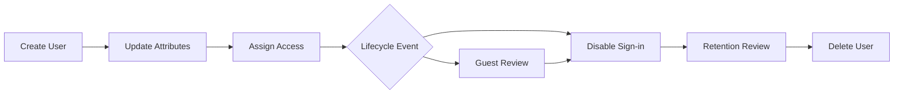

# User Lifecycle Management

User lifecycle management in Microsoft Entra ID covers creating accounts, updating profile attributes, disabling access, deleting objects, and managing guest users. A reliable lifecycle process reduces stale access, improves auditability, and keeps downstream applications aligned with identity changes.

## Prerequisites

- Azure CLI authenticated to the target tenant.
- User Administrator or higher delegated rights.
- Variables available for scripts:
    - `TENANT_ID`
    - `USER_ID`
    - `DISPLAY_NAME`
    - `UPN`
    - `MANAGER_ID`
    - `GROUP_ID`

Validate whether the account is cloud-only, synchronized from on-premises, or a guest account before acting. Microsoft Learn guidance differs for these object types, especially for authoritative source and restoration behavior.

!!! note
    Use generic examples and non-production test users during procedure validation. Do not place real personal data in command history or screenshots.

## When to Use

Use this workflow when you need to:

- create new cloud-only users;
- update names or usage details;
- disable accounts during leave or investigation;
- delete accounts after retention checks;
- process bulk lifecycle events; or
- govern guest invitations and removals.

This workflow is also appropriate after HR-driven joiner, mover, and leaver events, during emergency account disablement, and when stale guest users must be reviewed against sponsor or collaboration policy.

## Procedure

### Step 1: Create a new user

Create a user with explicit long flags.

```bash
az ad user create \
    --display-name "$DISPLAY_NAME" \
    --user-principal-name "$UPN" \
    --password "TemporaryPassword123!" \
    --force-change-password-next-login true
```

Expected output includes the new user's object metadata such as `objectId` or `id`, display name, and user principal name. Record the resulting identifier in your change log.

This step establishes the identity record used by later license, group, and access assignment workflows.

If you need a minimal Graph-based verification immediately after creation, query the user object directly.

```bash
az rest --method GET \
    --url "https://graph.microsoft.com/v1.0/users/$UPN?$select=id,displayName,userPrincipalName,accountEnabled"
```

This is helpful in scripts that need the object ID for subsequent group or license steps.

### Step 2: Update user attributes

Update the user when the display name or other profile values change.

```bash
az ad user update \
    --id "$USER_ID" \
    --display-name "$DISPLAY_NAME"
```

Expected output is typically silent success or a returned user object depending on CLI version. Verify the new value afterward.

Updating attributes promptly helps preserve directory accuracy, especially for access reviews, approvals, and email-address-based workflows.

Common mover updates also include manager and usage location changes.

```bash
az rest --method PATCH \
    --url "https://graph.microsoft.com/v1.0/users/$USER_ID/manager/$ref" \
    --headers "Content-Type=application/json" \
    --body '{"@odata.id":"https://graph.microsoft.com/v1.0/users/'$MANAGER_ID'"}'
```

Manager updates matter for approval workflows, entitlement reviews, and routing of ownership during offboarding.

### Step 3: Add the user to required groups

After account creation or role change, add the user only to the approved groups needed for job function.

```bash
az ad group member add \
    --group "$GROUP_ID" \
    --member-id "$USER_ID"
```

Expected output is usually silent success. Confirm that the selected group aligns with least-privilege access rather than broad convenience-based membership.

### Step 4: Disable sign-in access

Block sign-in without deleting the user so that memberships, ownership, and audit history remain intact.

```bash
az rest --method PATCH \
    --url "https://graph.microsoft.com/v1.0/users/$USER_ID" \
    --headers "Content-Type=application/json" \
    --body '{"accountEnabled":false}'
```

Expected output is an HTTP success status with no large payload. The user object should reflect `accountEnabled` as `false` when queried.

This is the preferred immediate offboarding action when legal hold, manager approval, or workload transfer is still pending.

### Step 5: Review before deletion

Before deletion, confirm the user no longer needs direct group membership, application assignments, or ownership responsibilities.

```bash
az rest --method GET \
    --url "https://graph.microsoft.com/v1.0/users/$USER_ID/memberOf?$select=id,displayName"
```

Expected output returns directory objects of which the user is a member. Use this to identify access that should be transferred, removed, or documented before deletion.

### Step 6: Delete a user after retention checks

Delete only after mailbox, file ownership, device, and application dependencies have been reviewed.

```bash
az ad user delete --id "$USER_ID"
```

Expected output is silent success. The object moves into soft-delete behavior managed by Microsoft Entra and related workloads, subject to service retention rules.

Deletion should be the final lifecycle stage, not the first response to a departure.

If you need to prove the user left the active directory, follow deletion with a targeted lookup and record the result in the case notes.

### Step 7: Perform bulk updates

For bulk operations, iterate through a prepared CSV or JSON list and call the same long-flag commands per record.

```bash
while IFS=',' read -r UPN DISPLAY_NAME; do
    az ad user create \
        --display-name "$DISPLAY_NAME" \
        --user-principal-name "$UPN" \
        --password "TemporaryPassword123!" \
        --force-change-password-next-login true
done < users.csv
```

Expected output is one result per input row. Capture failures separately so that retries do not duplicate successful records.

Bulk processing should include input validation, duplicate detection, and an exception report.

For bulk disablement during an urgent response, switch the operation body instead of deleting accounts immediately.

```bash
while IFS=',' read -r CURRENT_USER_ID; do
    az rest --method PATCH \
        --url "https://graph.microsoft.com/v1.0/users/$CURRENT_USER_ID" \
        --headers "Content-Type=application/json" \
        --body '{"accountEnabled":false}'
done < disabled-users.csv
```

This preserves objects for forensics and recovery while containing access rapidly.

### Step 8: Manage guest lifecycle

List guest accounts, review usage, then disable or delete guests that no longer require access.

```bash
az rest --method GET \
    --url "https://graph.microsoft.com/v1.0/users?$filter=userType eq 'Guest'&$select=id,displayName,userPrincipalName,accountEnabled"
```

Expected output is a guest user list with identifiers and status. Use it to decide whether to disable access first or proceed to deletion.

Guest lifecycle should align with sponsor review, expiration, and external collaboration policy.

To create or revalidate a guest invitation workflow, use the invitations endpoint.

```bash
az rest --method POST \
    --url "https://graph.microsoft.com/v1.0/invitations" \
    --headers "Content-Type=application/json" \
    --body '{"invitedUserEmailAddress":"user@example.com","inviteRedirectUrl":"https://myapplications.microsoft.com","sendInvitationMessage":false}'
```

This is appropriate when collaboration must be re-established in a controlled way rather than by reactivating an old guest without review.

<!-- diagram-id: user-lifecycle-flow -->


## Verification

Run targeted checks after each operation.

```bash
az ad user show --id "$USER_ID"
az rest --method GET --url "https://graph.microsoft.com/v1.0/users/$USER_ID?$select=id,displayName,userPrincipalName,accountEnabled"
az rest --method GET --url "https://graph.microsoft.com/v1.0/users/$USER_ID/memberOf?$select=id,displayName"
```

Confirm that:

- created users exist with the expected UPN;
- updated attributes are visible;
- disabled users show `accountEnabled` as `false`; and
- deleted users no longer appear in active user queries.

Also confirm that:

- group membership aligns with the approved role or offboarding state;
- manager or sponsor relationships were updated where required; and
- guest accounts still in the tenant have a current business need and sponsor path.

## Rollback / Troubleshooting

- If user creation fails, confirm domain verification and password complexity requirements.
- If update commands fail, verify the object ID and delegated role scope.
- If deletion was premature, recover using the appropriate restore workflow from deleted users if still available.
- If guest cleanup is blocked, review sponsorship, access package, or app assignment dependencies.

Helpful recovery examples:

```bash
az rest --method GET \
    --url "https://graph.microsoft.com/v1.0/directory/deletedItems/microsoft.graph.user?$filter=id eq '$USER_ID'"
```

Use deleted item checks before deciding whether you must recreate the user or can restore the soft-deleted object through the documented Entra recovery workflow.

!!! warning
    Disabling accounts is safer than immediate deletion during incident response because it preserves the user object for investigation and handoff.

## Automation

- Use scripted bulk import jobs for onboarding waves.
- Trigger disable actions from HR departure events.
- Export guest inventories on a schedule for sponsor review.
- Store lifecycle evidence in a ticketing system with timestamps and operator IDs.

Automation is strongest when it separates joiner, mover, leaver, and guest review flows, because each stage has different approval evidence and rollback expectations.

## See Also

- [Operations Overview](index.md)
- [Group Management](group-management.md)
- [Audit Log Analysis](audit-log-analysis.md)
- [Sign-in Log Analysis](sign-in-log-analysis.md)

## Sources

- Microsoft Learn: Azure CLI `az ad user` - https://learn.microsoft.com/cli/azure/ad/user
- Microsoft Graph user resource - https://learn.microsoft.com/graph/api/resources/users
- Microsoft Entra fundamentals - https://learn.microsoft.com/entra/fundamentals/
- Microsoft Graph invitations resource - https://learn.microsoft.com/graph/api/resources/invitation
