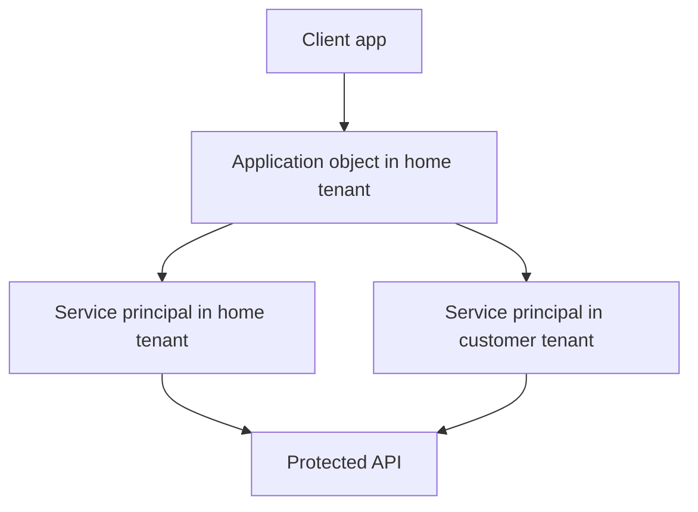
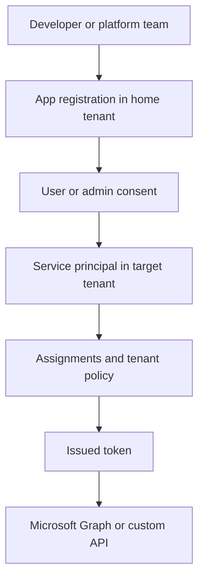
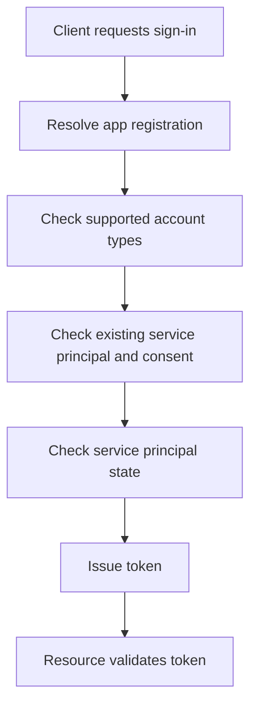

---
content_sources:
  diagrams:
    - id: app-sp-relationship
      type: flowchart
      source: mslearn-adapted
      mslearn_url: https://learn.microsoft.com/en-us/entra/identity-platform/app-objects-and-service-principals
    - id: consent-expansion-path
      type: flowchart
      source: self-generated
      justification: "Synthesized from Microsoft Learn guidance on consent, multi-tenant apps, and enterprise applications."
      based_on:
        - https://learn.microsoft.com/en-us/entra/identity-platform/app-objects-and-service-principals
        - https://learn.microsoft.com/en-us/entra/identity-platform/quickstart-register-app
        - https://learn.microsoft.com/en-us/entra/identity/enterprise-apps/what-is-enterprise-app-management
    - id: app-credential-token-flow
      type: flowchart
      source: self-generated
      justification: "Synthesized from Microsoft Learn app registration and service principal documentation."
      based_on:
        - https://learn.microsoft.com/en-us/entra/identity-platform/app-objects-and-service-principals
---

# App Registrations and Service Principals

App registrations define an application's identity blueprint, while service principals are the tenant-local security instances used during access control. Understanding the distinction is essential for multi-tenant design, consent, automation, and troubleshooting.

## Architecture Overview

<!-- diagram-id: app-sp-relationship -->


An application object exists once in its home tenant. A service principal exists in each tenant where that application is used. Most consent and assignment issues happen on the service principal side, not the application object side.

The separation matters because Microsoft Entra ID stores developer intent and tenant enforcement in different places:

- The **application object** is the template for protocol settings, redirect URIs, exposed scopes, app roles, and credentials.
- The **service principal** is the security principal that administrators assign, monitor, and govern inside a specific tenant.
- The **enterprise application** experience in the portal is primarily the operational view of the service principal.
- The **home tenant** owns the app registration lifecycle, but consuming tenants decide whether to trust and grant access.

<!-- diagram-id: consent-expansion-path -->


This model explains a common operational truth: an application can be configured correctly by the developer but still fail in a customer tenant because the target service principal is disabled, unassigned, restricted by consent policy, or missing required assignments.

## Core Concepts

### Application object vs service principal

- The application object stores global app metadata.
- The service principal stores tenant-specific presence, assignments, and policy context.
- Multi-tenant apps create service principals in other tenants after consent.

```bash
az rest --method GET --url "https://graph.microsoft.com/v1.0/applications"
az rest --method GET --url "https://graph.microsoft.com/v1.0/servicePrincipals"
mgc applications list --top 5 --output table
```

Typical interpretation:

- If you need to change redirect URIs, permissions requested, or credentials, you usually change the **application object**.
- If you need to assign users, review sign-ins, or disable access in one tenant, you usually change the **service principal**.
- If a SaaS integration works in one tenant but not another, compare the service principal state in each tenant.

Example query with filtered output:

```bash
az ad app list --display-name "$DISPLAY_NAME" --query "[].{appId:appId, displayName:displayName}" --output table
az ad sp list --display-name "$DISPLAY_NAME" --query "[].{appId:appId, objectId:id, accountEnabled:accountEnabled}" --output table
```

Expected output:

```text
AppId                                 DisplayName
------------------------------------  -----------------
<app-id>                              demo-app-001

AppId                                 ObjectId        AccountEnabled
------------------------------------  --------------  --------------
<app-id>                              <object-id>     True
```

### Home tenant ownership

Every app registration has a home tenant. That tenant owns the original application object, publisher metadata, and default credential lifecycle.

Why this matters:

- Single-tenant apps only issue tokens in the home tenant context.
- Multi-tenant apps can accept identities from other tenants, but only after those tenants create a local service principal through consent.
- Deleting the application object in the home tenant breaks trust for all dependent service principals.

Operational guidance:

1. Decide early whether the app is workforce-only or multi-tenant.
2. Keep ownership with a controlled tenant and a limited set of administrators.
3. Document who owns certificate renewal and who owns consent governance.

### Redirect URIs and client platforms

Redirect URIs must match the client type and sign-in flow. Web apps, single-page apps, mobile apps, and public clients have different registration settings and security expectations.

```bash
az rest --method GET --url "https://graph.microsoft.com/v1.0/applications/$OBJECT_ID"
mgc applications get --application-id "$OBJECT_ID"
az ad app show --id "$APP_ID" --query "{appId:appId, web:web, spa:spa, publicClient:publicClient}" --output json
```

Common design rules:

- Web apps should use HTTPS redirect URIs and authorization code flow.
- Single-page applications should use SPA redirect settings and PKCE-capable libraries.
- Native or public clients need special review because they cannot securely hold a client secret.
- Reply URL mismatches almost always produce sign-in failures before token issuance.

Expected output pattern:

```json
{
  "appId": "<app-id>",
  "publicClient": null,
  "spa": {
    "redirectUris": [
      "https://example.com/auth/callback"
    ]
  },
  "web": {
    "redirectUris": [
      "https://example.com/signin-oidc"
    ]
  }
}
```

### Credentials: secrets and certificates

Client secrets are easy to start with but harder to secure at scale. Certificates are preferred for confidential clients when managed lifecycle and secure storage are available. Managed identities avoid direct credential handling for Azure-hosted workloads.

```bash
az ad app credential reset --id "$APP_ID" --append
az rest --method GET --url "https://graph.microsoft.com/v1.0/applications/$OBJECT_ID/passwordCredentials"
az rest --method GET --url "https://graph.microsoft.com/v1.0/applications/$OBJECT_ID/keyCredentials"
```

Expected output pattern:

```json
{
  "value": [
    {
      "displayName": "docs-secret",
      "endDateTime": "2027-04-17T00:00:00Z",
      "keyId": "<object-id>"
    }
  ]
}
```

Recommended lifecycle posture:

- Prefer certificates over shared secrets for confidential apps.
- Prefer managed identities over certificates when the workload runs on supported Azure hosts.
- Keep credential expiration visible in inventory and alerting.
- Treat emergency secret creation as a temporary recovery step, not as the default steady state.

### Permission and consent model

Applications request delegated or application permissions. Tenant administrators then grant consent depending on policy and privilege boundaries. The permission request is defined on the app registration, but effective access is realized through the service principal and issued tokens.

Key distinctions:

- **Delegated permissions** depend on a signed-in user and are constrained by both user privilege and granted scopes.
- **Application permissions** run without a user and therefore demand stricter administrative review.
- **User consent** can be limited or disabled by tenant policy.
- **Admin consent** is often required for high-impact Microsoft Graph permissions.

```bash
az rest --method GET --url "https://graph.microsoft.com/v1.0/oauth2PermissionGrants?$filter=clientId eq '$SP_ID'"
az rest --method GET --url "https://graph.microsoft.com/v1.0/servicePrincipals/$SP_ID/appRoleAssignments"
```

Expected output pattern:

```json
{
  "value": [
    {
      "clientId": "<object-id>",
      "consentType": "AllPrincipals",
      "resourceId": "<object-id>",
      "scope": "User.Read Group.Read.All"
    }
  ]
}
```

### Enterprise applications as the operational layer

In portal language, enterprise applications represent the service principal view. This is where operations teams usually work when they need to:

- Enable or disable sign-in.
- Require user assignment.
- Review provisioning state.
- Inspect sign-in activity.
- Remove obsolete tenant-local instances.

This split is useful organizationally:

- Developers own the application object.
- Identity or platform administrators own the service principal posture in each tenant.
- Security teams review consent, assignments, and sign-in telemetry.

### Assignment requirements and access control

Some enterprise applications require explicit user or group assignment before sign-in. That setting is enforced on the service principal, not the application object.

When user assignment is required:

- Tokens are not issued to unassigned users.
- Group-based assignment becomes the scalable pattern.
- Guest users often need extra review because collaboration settings and assignments both influence access.

```bash
az rest --method PATCH --url "https://graph.microsoft.com/v1.0/servicePrincipals/$SP_ID" --headers "Content-Type=application/json" --body '{"appRoleAssignmentRequired":true}'
az rest --method GET --url "https://graph.microsoft.com/v1.0/servicePrincipals/$SP_ID" --query "{appRoleAssignmentRequired:appRoleAssignmentRequired, accountEnabled:accountEnabled}"
```

## Data Flow

1. An app registration is created in the home tenant.
2. The app defines redirect URIs, permissions, and credentials.
3. A user or admin initiates consent.
4. Entra creates or updates the service principal in the target tenant.
5. Tokens are issued based on app configuration, consent, and policy.

Expanded request path:

1. The client sends the user to an Entra authorization endpoint.
2. Entra resolves the application object and confirms the sign-in audience.
3. Entra evaluates whether the current tenant already has a matching service principal.
4. If not, the user is redirected through consent or blocked by policy.
5. The target tenant creates the enterprise application instance.
6. The target tenant applies local restrictions such as assignments or disabled sign-in.
7. Entra issues tokens containing tenant-specific issuer and authorization claims.
8. The resource validates the token and applies its own app role or scope logic.

Troubleshooting implications:

- `AADSTS65001`-style consent problems usually point to missing or denied consent.
- Assignment failures are often visible only after the service principal exists.
- A token can be minted successfully for one API but still fail for another API if scopes or app roles differ.

<!-- diagram-id: app-credential-token-flow -->


## Integration Points

- Microsoft Graph and custom APIs through delegated or application permissions
- Enterprise applications blade for service principal management
- Key Vault or certificate stores for credential protection
- Azure workloads using managed identities as an alternative to app secrets

```bash
az rest --method GET --url "https://graph.microsoft.com/v1.0/servicePrincipals?$filter=appId eq '$APP_ID'"
mgc service-principals list --filter "appId eq '$APP_ID'" --output json
```

Important integration boundaries:

| Integration area | Uses application object | Uses service principal | Notes |
|---|---|---|---|
| Microsoft Graph permissions | Yes | Yes | Requested on app, realized through consented principal |
| SSO assignment | No | Yes | Tenant-local access decision |
| Secret or certificate storage | Yes | Indirectly | Credential metadata lives with app registration |
| Sign-in logs | Indirectly | Yes | Enterprise application activity is tenant-local |
| Azure RBAC for app workloads | Indirectly | Yes | Role assignment targets principal object IDs |

Integration design patterns:

- For internal line-of-business apps, keep the app single-tenant unless cross-tenant access is a real requirement.
- For SaaS products, prepare operational guidance for customer admins who must review service principal settings.
- For Azure-hosted automation, compare app registrations against managed identities before accepting long-lived secrets.

## Configuration Options

Representative creation and query examples:

```bash
az ad app create --display-name "$DISPLAY_NAME" --sign-in-audience "AzureADMyOrg"
az ad sp create --id "$APP_ID"
az ad app show --id "$APP_ID"
az rest --method PATCH --url "https://graph.microsoft.com/v1.0/applications/$OBJECT_ID" --headers "Content-Type=application/json" --body '{"web":{"redirectUris":["https://example.com/signin-oidc"]}}'
mgc applications add-password --application-id "$OBJECT_ID" --body '{"passwordCredential":{"displayName":"docs-secret"}}'
```

Scenario-based configuration choices:

### Single-tenant internal web app

- Use `AzureADMyOrg` as the sign-in audience.
- Register only internal redirect URIs.
- Favor group assignment and Conditional Access over broad user access.

```bash
az ad app create --display-name "$DISPLAY_NAME" --sign-in-audience "AzureADMyOrg" --web-redirect-uris "https://example.com/signin-oidc"
az ad sp create --id "$APP_ID"
```

Expected output:

```json
{
  "appId": "<app-id>",
  "displayName": "demo-app-001"
}
```

### Multi-tenant SaaS API

- Use `AzureADMultipleOrgs` as the sign-in audience.
- Expose scopes or app roles clearly.
- Document customer consent requirements and least-privilege permission use.

```bash
az rest --method PATCH --url "https://graph.microsoft.com/v1.0/applications/$OBJECT_ID" --headers "Content-Type=application/json" --body '{"signInAudience":"AzureADMultipleOrgs"}'
az rest --method GET --url "https://graph.microsoft.com/v1.0/applications/$OBJECT_ID" --query "{signInAudience:signInAudience, appId:appId}" --output json
```

### Certificate-based confidential client

- Import a certificate-backed credential.
- Track expiration separately from application deployment.
- Prefer Azure Key Vault for private key storage and access control.

```bash
az ad app credential list --id "$APP_ID"
az rest --method GET --url "https://graph.microsoft.com/v1.0/applications/$OBJECT_ID/keyCredentials"
```

!!! warning
    Prefer certificates or managed identities for production workloads. Long-lived shared secrets create unnecessary rotation and exposure risk.

Operational checklist:

- Standardize naming for app registrations and corresponding service principals.
- Record app owner, business owner, and credential renewal owner.
- Review unused service principals and stale app registrations regularly.
- Remove unused redirect URIs and obsolete exposed scopes.

## Pricing Considerations

App registration basics are available without premium licensing. Costs usually come from related controls such as Conditional Access, workload identity governance, audit retention, or certificate lifecycle tooling rather than from the registration itself.

Licensing and cost planning usually show up indirectly:

- Multi-tenant SaaS support increases operational overhead even if the registration itself is free.
- Strong governance for app consent, access reviews, and workload identities may require premium capabilities.
- Certificate and secret inventory often depends on external tooling or broader security platforms.
- Large enterprise estates often spend more on process and governance than on the technical registration objects themselves.

## Limitations and Quotas

- Redirect URIs must be exact and platform-appropriate.
- Multi-tenant apps require customer-tenant consent and can be blocked by policy.
- Secret sprawl becomes a significant operational issue at scale.
- Some legacy reply URL or implicit grant patterns should be treated as transition-only.

Additional constraints to plan for:

- Cross-tenant support does not bypass customer security policy.
- App role design can become hard to manage if role names or meanings drift over time.
- Group claims and assignment patterns can create downstream authorization complexity.
- Deleting and recreating objects can change object IDs and break hard-coded automation.

## Advanced Topics

### Multi-tenant app onboarding model

For SaaS applications, document the tenant onboarding sequence explicitly:

1. Customer admin reviews requested permissions.
2. Customer admin grants consent.
3. Service principal is created in the customer tenant.
4. Customer admin applies assignments or disables user self-service.
5. The application verifies the tenant and stores tenant-specific configuration.

### Workload identities vs classic app registrations

Use a classic app registration when:

- The workload runs outside Azure-hosted managed identity support.
- The app needs cross-cloud or customer-tenant onboarding.
- You need protocol features like exposed scopes and redirect URIs.

Use a managed identity when:

- The workload runs on a supported Azure resource.
- Azure RBAC or Entra-issued access tokens are sufficient.
- You want to eliminate customer-managed secrets.

### Decommissioning guidance

When retiring an application:

1. Remove user and group assignments from service principals.
2. Revoke unnecessary grants and app role assignments.
3. Delete secrets and certificates before deleting the app.
4. Remove unused service principals from customer or sandbox tenants.
5. Update downstream documentation and monitoring alerts.

## See Also

- [Managed identities](managed-identities.md)
- [OAuth 2.0 and OIDC](oauth2-and-oidc.md)
- [Tokens and claims](tokens-and-claims.md)
- [Best practices: app registration hygiene](../best-practices/app-registration-hygiene.md)
- [Operations: app consent management](../operations/app-consent-management.md)

## Sources

- https://learn.microsoft.com/en-us/entra/identity-platform/app-objects-and-service-principals
- https://learn.microsoft.com/en-us/entra/identity-platform/quickstart-register-app
- https://learn.microsoft.com/en-us/entra/identity-platform/how-to-add-credentials
- https://learn.microsoft.com/en-us/graph/api/resources/application
- https://learn.microsoft.com/en-us/entra/identity/enterprise-apps/what-is-enterprise-app-management
