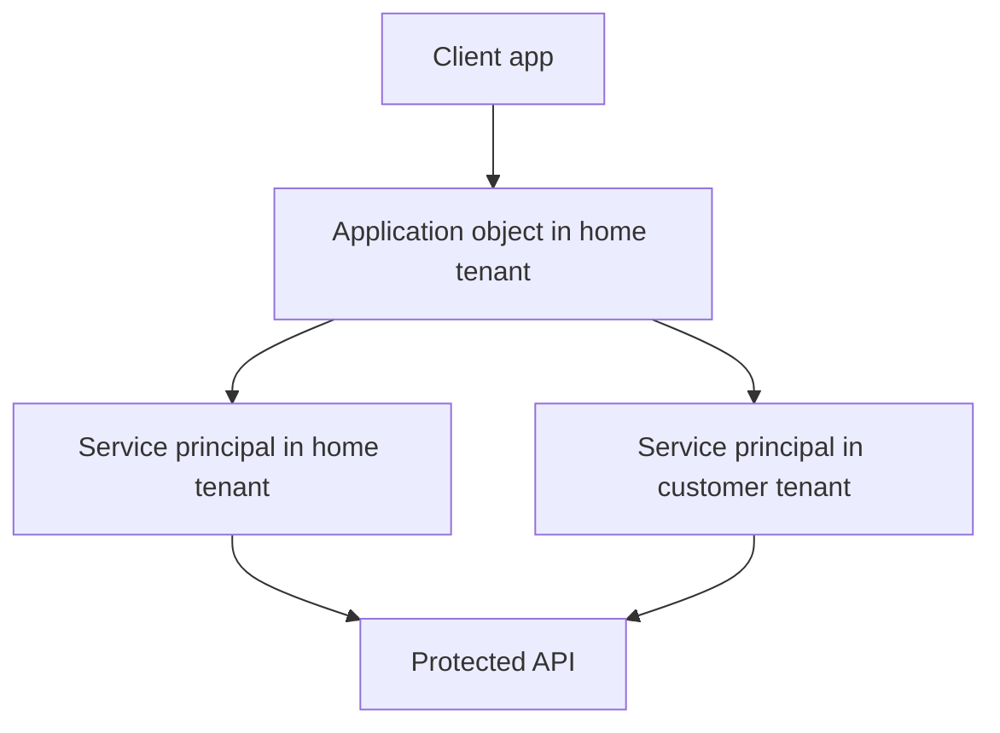

---
content_sources:
  diagrams:
    - id: app-sp-relationship
      type: flowchart
      source: mslearn-adapted
      mslearn_url: https://learn.microsoft.com/en-us/entra/identity-platform/app-objects-and-service-principals
---

# App Registrations and Service Principals

App registrations define an application's identity blueprint, while service principals are the tenant-local security instances used during access control. Understanding the distinction is essential for multi-tenant design, consent, automation, and troubleshooting.

## Architecture Overview

<!-- diagram-id: app-sp-relationship -->


An application object exists once in its home tenant. A service principal exists in each tenant where that application is used. Most consent and assignment issues happen on the service principal side, not the application object side.

## Core Concepts

### Application object vs service principal

- The application object stores global app metadata.
- The service principal stores tenant-specific presence, assignments, and policy context.
- Multi-tenant apps create service principals in other tenants after consent.

```bash
az rest --method GET --url "https://graph.microsoft.com/v1.0/applications"
az rest --method GET --url "https://graph.microsoft.com/v1.0/servicePrincipals"
mgc applications list --top 5 --output table
```

### Redirect URIs and client platforms

Redirect URIs must match the client type and sign-in flow. Web apps, single-page apps, mobile apps, and public clients have different registration settings and security expectations.

```bash
az rest --method GET --url "https://graph.microsoft.com/v1.0/applications/$OBJECT_ID"
mgc applications get --application-id "$OBJECT_ID"
```

### Credentials: secrets and certificates

Client secrets are easy to start with but harder to secure at scale. Certificates are preferred for confidential clients when managed lifecycle and secure storage are available. Managed identities avoid direct credential handling for Azure-hosted workloads.

```bash
az ad app credential reset --id "$APP_ID" --append
az rest --method GET --url "https://graph.microsoft.com/v1.0/applications/$OBJECT_ID/passwordCredentials"
```

### Permission and consent model

Applications request delegated or application permissions. Tenant administrators then grant consent depending on policy and privilege boundaries. The permission request is defined on the app registration, but effective access is realized through the service principal and issued tokens.

## Data Flow

1. An app registration is created in the home tenant.
2. The app defines redirect URIs, permissions, and credentials.
3. A user or admin initiates consent.
4. Entra creates or updates the service principal in the target tenant.
5. Tokens are issued based on app configuration, consent, and policy.

## Integration Points

- Microsoft Graph and custom APIs through delegated or application permissions
- Enterprise applications blade for service principal management
- Key Vault or certificate stores for credential protection
- Azure workloads using managed identities as an alternative to app secrets

```bash
az rest --method GET --url "https://graph.microsoft.com/v1.0/servicePrincipals?$filter=appId eq '$APP_ID'"
mgc service-principals list --filter "appId eq '$APP_ID'" --output json
```

## Configuration Options

Representative creation and query examples:

```bash
az ad app create --display-name "$DISPLAY_NAME" --sign-in-audience "AzureADMyOrg"
az ad sp create --id "$APP_ID"
az ad app show --id "$APP_ID"
az rest --method PATCH --url "https://graph.microsoft.com/v1.0/applications/$OBJECT_ID" --headers "Content-Type=application/json" --body '{"web":{"redirectUris":["https://example.com/signin-oidc"]}}'
mgc applications add-password --application-id "$OBJECT_ID" --body '{"passwordCredential":{"displayName":"docs-secret"}}'
```

!!! warning
    Prefer certificates or managed identities for production workloads. Long-lived shared secrets create unnecessary rotation and exposure risk.

## Pricing Considerations

App registration basics are available without premium licensing. Costs usually come from related controls such as Conditional Access, workload identity governance, audit retention, or certificate lifecycle tooling rather than from the registration itself.

## Limitations and Quotas

- Redirect URIs must be exact and platform-appropriate.
- Multi-tenant apps require customer-tenant consent and can be blocked by policy.
- Secret sprawl becomes a significant operational issue at scale.
- Some legacy reply URL or implicit grant patterns should be treated as transition-only.

## See Also

- [Managed identities](managed-identities.md)
- [OAuth 2.0 and OIDC](oauth2-and-oidc.md)
- [Tokens and claims](tokens-and-claims.md)
- [Best practices: app registration hygiene](../best-practices/app-registration-hygiene.md)
- [Operations: app consent management](../operations/app-consent-management.md)

## Sources

- https://learn.microsoft.com/en-us/entra/identity-platform/app-objects-and-service-principals
- https://learn.microsoft.com/en-us/entra/identity-platform/quickstart-register-app
- https://learn.microsoft.com/en-us/entra/identity-platform/how-to-add-credentials
- https://learn.microsoft.com/en-us/graph/api/resources/application
