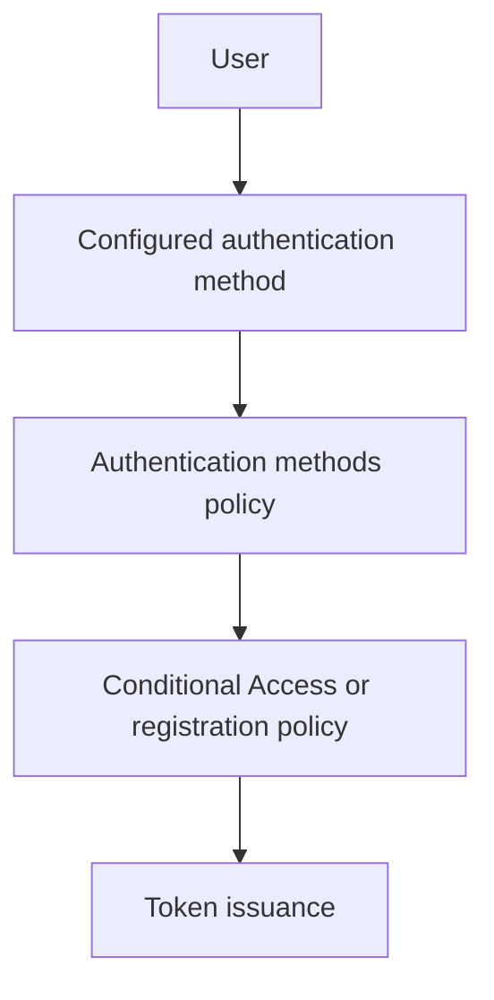

---
content_sources:
  diagrams:
    - id: authentication-method-evaluation
      type: flowchart
      source: mslearn-adapted
      mslearn_url: https://learn.microsoft.com/en-us/entra/identity/authentication/concept-authentication-methods
---

# Authentication Methods

Authentication methods determine how users prove their identity to Microsoft Entra ID. The method choice directly affects security posture, user experience, phishing resistance, and which policy controls are available for sign-in enforcement.

## Architecture Overview

<!-- diagram-id: authentication-method-evaluation -->


The user experience may differ, but every method ultimately feeds into the same identity pipeline: registration, policy validation, sign-in challenge, and token issuance.

## Core Concepts

### Password-based authentication

Passwords remain common, but they are the least phishing-resistant option. In modern Entra design, passwords are often paired with stronger second factors or replaced with passwordless methods where possible.

```bash
az rest --method GET --url "https://graph.microsoft.com/v1.0/policies/authenticationMethodsPolicy"
mgc policies authentication-methods-policy get --output json
```

### Microsoft Authenticator

Microsoft Authenticator supports push notifications, number matching, and passwordless phone sign-in scenarios. It is broadly supported and often becomes the practical baseline MFA method for workforce users.

### FIDO2 security keys

FIDO2 provides strong phishing-resistant authentication with hardware-backed credentials. It is a strategic method for privileged accounts, frontline workers, and shared workstation environments.

### Certificate-based authentication

Certificate-based authentication is common in regulated or device-managed environments. It shifts trust to PKI operations and certificate issuance hygiene.

### Phone, SMS, and voice methods

Phone-based methods can support broad user populations, but they are generally weaker than phishing-resistant options. Use them intentionally and review regulatory or fraud considerations.

### Email one-time passcode

Email OTP is commonly used for guest and external collaboration scenarios where the user does not need a fully managed identity in the resource tenant.

## Data Flow

1. A user attempts sign-in to an application.
2. Entra identifies tenant, user state, and available authentication methods.
3. Authentication methods policy determines whether the method is enabled.
4. Registration campaigns, Conditional Access, and risk policies influence the challenge.
5. If the challenge succeeds, Entra issues tokens.

## Integration Points

- Authentication methods policy for allowed methods
- Conditional Access for MFA and strength requirements
- Registration campaigns and combined registration experiences
- External identities for guest and B2B access patterns

```bash
az rest --method GET --url "https://graph.microsoft.com/v1.0/policies/authenticationMethodsPolicy"
az rest --method GET --url "https://graph.microsoft.com/beta/policies/authenticationStrengthPolicies"
```

## Configuration Options

Representative administrative actions include enabling method policies and reviewing registration readiness.

```bash
az rest --method PATCH --url "https://graph.microsoft.com/v1.0/policies/authenticationMethodsPolicy" --headers "Content-Type=application/json" --body '{"policyMigrationState":"migrationComplete"}'
az rest --method GET --url "https://graph.microsoft.com/v1.0/reports/authenticationMethods/userRegistrationDetails"
mgc reports authentication-methods user-registration-details list --output table
```

!!! note
    Method availability is only part of the design. Also decide which methods are acceptable for standard users, privileged admins, guests, and break-glass accounts.

## Pricing Considerations

Basic MFA capabilities vary by subscription and workload context. Advanced Conditional Access, authentication strengths, and richer reporting typically require Microsoft Entra ID P1 or P2.

## Limitations and Quotas

- Not every method is supported in every cloud or client scenario.
- Legacy authentication can bypass modern method controls if it is not blocked.
- Recovery and registration processes need strong governance to avoid help desk-driven weakening.
- Method rollout often depends on device readiness, PKI maturity, and user communication.

## See Also

- [How Entra ID works](how-entra-id-works.md)
- [Users and groups](users-and-groups.md)
- [OAuth 2.0 and OIDC](oauth2-and-oidc.md)
- [Best practices: security defaults and MFA](../best-practices/security-defaults-and-mfa.md)
- [Best practices: identity protection](../best-practices/identity-protection.md)

## Sources

- https://learn.microsoft.com/en-us/entra/identity/authentication/concept-authentication-methods
- https://learn.microsoft.com/en-us/entra/identity/authentication/howto-authentication-passwordless-security-key
- https://learn.microsoft.com/en-us/entra/identity/authentication/concept-authentication-oath-tokens
- https://learn.microsoft.com/en-us/entra/external-id/one-time-passcode
