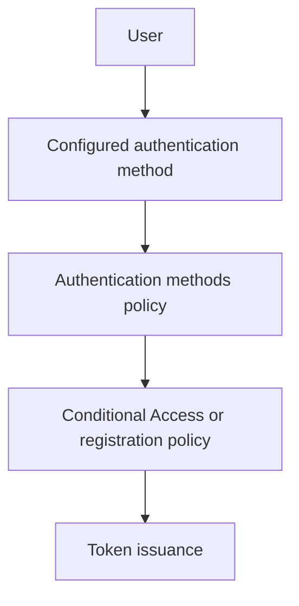
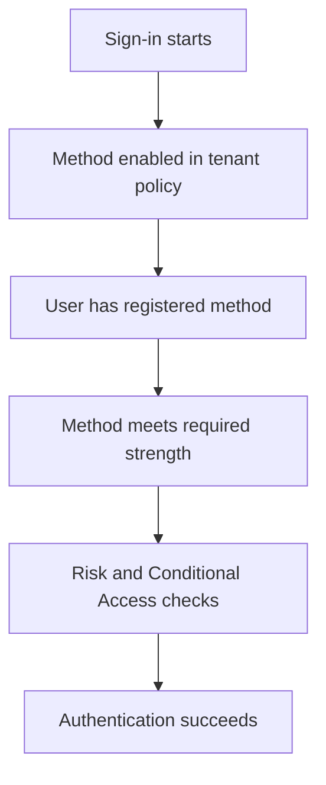
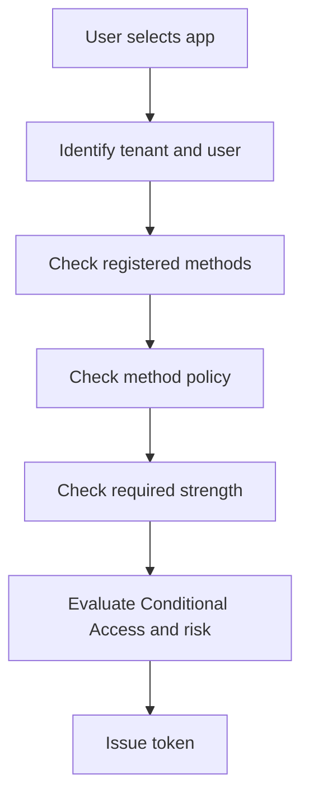

---
content_sources:
  diagrams:
    - id: authentication-method-evaluation
      type: flowchart
      source: mslearn-adapted
      mslearn_url: https://learn.microsoft.com/en-us/entra/identity/authentication/concept-authentication-methods
    - id: method-strength-decision
      type: flowchart
      source: self-generated
      justification: "Synthesized from Microsoft Learn guidance on authentication methods, strengths, registration, and passwordless deployment."
      based_on:
        - https://learn.microsoft.com/en-us/entra/identity/authentication/concept-authentication-methods
        - https://learn.microsoft.com/en-us/entra/identity/authentication/concept-authentication-strengths
        - https://learn.microsoft.com/en-us/entra/identity/authentication/howto-authentication-passwordless-security-key
    - id: auth-method-registration-flow
      type: flowchart
      source: self-generated
      justification: "Synthesized from Microsoft Learn authentication methods and strengths documentation."
      based_on:
        - https://learn.microsoft.com/en-us/entra/identity/authentication/concept-authentication-methods
---

# Authentication Methods

Authentication methods determine how users prove their identity to Microsoft Entra ID. The method choice directly affects security posture, user experience, phishing resistance, and which policy controls are available for sign-in enforcement.

## Architecture Overview

<!-- diagram-id: authentication-method-evaluation -->


The user experience may differ, but every method ultimately feeds into the same identity pipeline: registration, policy validation, sign-in challenge, and token issuance.

Authentication methods are not just UI choices. They are part of a layered control model:

- Tenant policy decides whether a method is available at all.
- Registration experience determines whether users can enroll the method.
- Authentication strengths and Conditional Access decide whether the method is strong enough for a workload.
- Application and protocol context determine whether the method can actually complete the sign-in.

<!-- diagram-id: method-strength-decision -->


This explains why a user can have a method registered and still fail access: the tenant might allow it, but the target workload might require a stronger or different method.

## Core Concepts

### Password-based authentication

Passwords remain common, but they are the least phishing-resistant option. In modern Entra design, passwords are often paired with stronger second factors or replaced with passwordless methods where possible.

```bash
az rest --method GET --url "https://graph.microsoft.com/v1.0/policies/authenticationMethodsPolicy"
mgc policies authentication-methods-policy get --output json
```

Operational position:

- Passwords still exist for compatibility and recovery.
- They should not be treated as sufficient assurance for privileged or sensitive access by themselves.
- Password spray, reuse, and phishing risk make them a poor steady-state anchor for modern access design.

### Microsoft Authenticator

Microsoft Authenticator supports push notifications, number matching, and passwordless phone sign-in scenarios. It is broadly supported and often becomes the practical baseline MFA method for workforce users.

Benefits:

- Familiar mobile experience.
- Stronger phishing resistance than SMS or voice.
- Compatible with combined registration and broad workforce rollout.

Typical rollout considerations:

- Require user communication and device readiness.
- Plan for users without managed smartphones.
- Define alternatives for break-glass and workforce edge cases.

### FIDO2 security keys

FIDO2 provides strong phishing-resistant authentication with hardware-backed credentials. It is a strategic method for privileged accounts, frontline workers, and shared workstation environments.

Why security teams prefer it:

- The credential is scoped to the relying party.
- Users are resistant to credential theft via replay.
- Hardware possession plus local unlock factors create strong assurance.

```bash
az rest --method GET --url "https://graph.microsoft.com/v1.0/policies/authenticationMethodsPolicy/fido2MethodsPolicy"
az rest --method PATCH --url "https://graph.microsoft.com/v1.0/policies/authenticationMethodsPolicy/fido2MethodsPolicy" --headers "Content-Type=application/json" --body '{"isAttestationEnforced":true}'
```

Expected output pattern:

```json
{
  "id": "Fido2",
  "isAttestationEnforced": true,
  "state": "enabled"
}
```

### Certificate-based authentication

Certificate-based authentication is common in regulated or device-managed environments. It shifts trust to PKI operations and certificate issuance hygiene.

Key architectural dependencies:

- A functioning PKI and certificate lifecycle.
- Clear mapping between certificate subject or SAN data and Entra identities.
- Device management or smart card operational maturity.

This method can be strong, but it also makes PKI quality part of the identity assurance model.

### Phone, SMS, and voice methods

Phone-based methods can support broad user populations, but they are generally weaker than phishing-resistant options. Use them intentionally and review regulatory or fraud considerations.

Use cases that still appear:

- Transitional MFA deployments.
- Populations without smartphone app adoption.
- Backup methods for low-risk scenarios.

Risks to acknowledge:

- SIM swap and telecom fraud.
- Lower assurance under modern threat models.
- Inconsistent user experience across regions and carriers.

### Email one-time passcode

Email OTP is commonly used for guest and external collaboration scenarios where the user does not need a fully managed identity in the resource tenant.

Important boundary:

- It supports collaboration and invitation scenarios.
- It is not a workforce replacement for strong tenant-managed authentication.
- It depends on the security of the external user's mailbox provider.

### Authentication strengths

Authentication methods answer **what can the user use**. Authentication strengths answer **what level of assurance is acceptable for this access attempt**.

This distinction matters because:

- A tenant may allow both password + SMS and FIDO2.
- A standard collaboration app may allow broad MFA.
- A privileged admin portal can require phishing-resistant authentication strength.

```bash
az rest --method GET --url "https://graph.microsoft.com/beta/policies/authenticationStrengthPolicies"
az rest --method GET --url "https://graph.microsoft.com/beta/policies/authenticationStrengthPolicies?$filter=policyType eq 'builtIn'"
```

### Registration campaigns and lifecycle

Method rollout is not complete when the policy is enabled. Users still need to register the method, understand when it is required, and recover safely when devices change.

Good rollout planning includes:

- Registration campaigns for high-priority populations.
- Recovery guidance for lost phones or broken keys.
- Break-glass exclusions and emergency access handling.
- Metrics that show which users still rely on weaker methods.

```bash
az rest --method GET --url "https://graph.microsoft.com/v1.0/reports/authenticationMethods/userRegistrationDetails"
mgc reports authentication-methods user-registration-details list --output table
```

Expected output pattern:

```text
Id            UserPrincipalName   IsMfaCapable   MethodsRegistered
------------  ------------------  ------------   -------------------------------
<object-id>   user@example.com    True           microsoftAuthenticatorPasswordless
```

## Data Flow

1. A user attempts sign-in to an application.
2. Entra identifies tenant, user state, and available authentication methods.
3. Authentication methods policy determines whether the method is enabled.
4. Registration campaigns, Conditional Access, and risk policies influence the challenge.
5. If the challenge succeeds, Entra issues tokens.

Expanded sequence:

1. The application redirects the user to Entra.
2. Entra determines the tenant and the user identity.
3. Entra checks the methods the user has registered.
4. Entra checks whether tenant policy allows those methods.
5. Conditional Access evaluates whether MFA or a specific strength is required.
6. Risk signals can change the challenge or block the sign-in.
7. The user completes the interactive or device-backed method.
8. Token issuance proceeds only after method and policy requirements both pass.

What to troubleshoot in sequence:

- Method not registered.
- Method disabled in policy.
- Method allowed but not strong enough for required access.
- Legacy client cannot support the required challenge.
- User targeted by risk-based or registration controls.

<!-- diagram-id: auth-method-registration-flow -->


## Integration Points

- Authentication methods policy for allowed methods
- Conditional Access for MFA and strength requirements
- Registration campaigns and combined registration experiences
- External identities for guest and B2B access patterns

```bash
az rest --method GET --url "https://graph.microsoft.com/v1.0/policies/authenticationMethodsPolicy"
az rest --method GET --url "https://graph.microsoft.com/beta/policies/authenticationStrengthPolicies"
```

Key integration relationships:

| Component | Role in authentication | Common operational question |
|---|---|---|
| Authentication methods policy | Enables or disables method types | Is the method available at all? |
| User registration data | Shows whether the user can complete the challenge | Has the user enrolled correctly? |
| Conditional Access | Requires MFA or a stronger method | Is the method sufficient for this resource? |
| Identity Protection | Raises assurance needs based on risk | Is risk increasing the challenge? |
| External Identities | Changes what methods are realistic for guests | Is the user internal, guest, or external? |

## Configuration Options

Representative administrative actions include enabling method policies and reviewing registration readiness.

```bash
az rest --method PATCH --url "https://graph.microsoft.com/v1.0/policies/authenticationMethodsPolicy" --headers "Content-Type=application/json" --body '{"policyMigrationState":"migrationComplete"}'
az rest --method GET --url "https://graph.microsoft.com/v1.0/reports/authenticationMethods/userRegistrationDetails"
mgc reports authentication-methods user-registration-details list --output table
```

Useful tenant review commands:

```bash
az rest --method GET --url "https://graph.microsoft.com/v1.0/policies/authenticationMethodsPolicy/microsoftAuthenticatorMethodsPolicy"
az rest --method GET --url "https://graph.microsoft.com/v1.0/policies/authenticationMethodsPolicy/softwareOathMethodsPolicy"
az rest --method GET --url "https://graph.microsoft.com/v1.0/policies/authenticationMethodsPolicy/smsAuthenticationMethodConfiguration"
```

Expected output pattern:

```json
{
  "id": "MicrosoftAuthenticator",
  "state": "enabled"
}
```

Recommended configuration approach:

### Baseline workforce rollout

- Enable Microsoft Authenticator.
- Keep password present only as a compatibility factor.
- Use registration campaigns to drive adoption.
- Track completion with registration reports.

### Privileged access rollout

- Require phishing-resistant methods such as FIDO2 where supported.
- Keep break-glass accounts outside ordinary rollout but under strict protection.
- Validate admin workstation readiness before enforcing stronger methods.

### Guest and external access

- Decide whether email OTP is sufficient.
- Avoid assuming external users can register tenant-managed methods.
- Align collaboration design with cross-tenant trust and business risk.

!!! note
    Method availability is only part of the design. Also decide which methods are acceptable for standard users, privileged admins, guests, and break-glass accounts.

## Pricing Considerations

Basic MFA capabilities vary by subscription and workload context. Advanced Conditional Access, authentication strengths, and richer reporting typically require Microsoft Entra ID P1 or P2.

Practical cost drivers usually come from:

- Premium licensing for Conditional Access and stronger enforcement controls.
- Operational support for help desk recovery and enrollment guidance.
- Hardware security keys for privileged or shared-device populations.
- Device management and PKI investment for certificate-based programs.

## Limitations and Quotas

- Not every method is supported in every cloud or client scenario.
- Legacy authentication can bypass modern method controls if it is not blocked.
- Recovery and registration processes need strong governance to avoid help desk-driven weakening.
- Method rollout often depends on device readiness, PKI maturity, and user communication.

Additional planning limits:

- Phone-based methods are not equivalent to phishing-resistant methods.
- Some external collaboration scenarios support fewer method choices than internal workforce scenarios.
- Shared device and frontline environments need deliberate sign-in method design.
- Method enablement without user education tends to increase lockouts and support load.

## Advanced Topics

### Passwordless strategy

Passwordless programs usually mature in stages:

1. Enforce MFA for broad risk reduction.
2. Move high-risk groups to stronger factors.
3. Expand passwordless options where device and user readiness exist.
4. Reserve weaker methods for recovery or narrow exception cases.

### Break-glass and emergency access

Emergency access accounts should not follow the same rollout path as ordinary users. They need:

- Strong monitoring.
- Minimal standing usage.
- Documented recovery processes.
- Authentication choices that remain available during broad outages.

### Method selection by persona

| Persona | Preferred methods | Design note |
|---|---|---|
| Standard workforce user | Microsoft Authenticator, FIDO2 where practical | Balance usability and rollout speed |
| Privileged admin | FIDO2, certificate-based where applicable | Favor phishing resistance |
| Frontline or kiosk user | FIDO2 or device-backed patterns | Avoid fragile shared secrets |
| Guest collaborator | Email OTP or home-tenant auth | Keep trust boundary clear |

## See Also

- [How Entra ID works](how-entra-id-works.md)
- [Users and groups](users-and-groups.md)
- [OAuth 2.0 and OIDC](oauth2-and-oidc.md)
- [Best practices: security defaults and MFA](../best-practices/security-defaults-and-mfa.md)
- [Best practices: identity protection](../best-practices/identity-protection.md)

## Sources

- https://learn.microsoft.com/en-us/entra/identity/authentication/concept-authentication-methods
- https://learn.microsoft.com/en-us/entra/identity/authentication/howto-authentication-passwordless-security-key
- https://learn.microsoft.com/en-us/entra/identity/authentication/concept-authentication-oath-tokens
- https://learn.microsoft.com/en-us/entra/external-id/one-time-passcode
- https://learn.microsoft.com/en-us/entra/identity/authentication/concept-authentication-strengths
