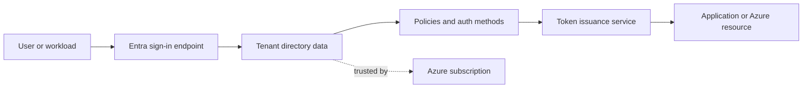
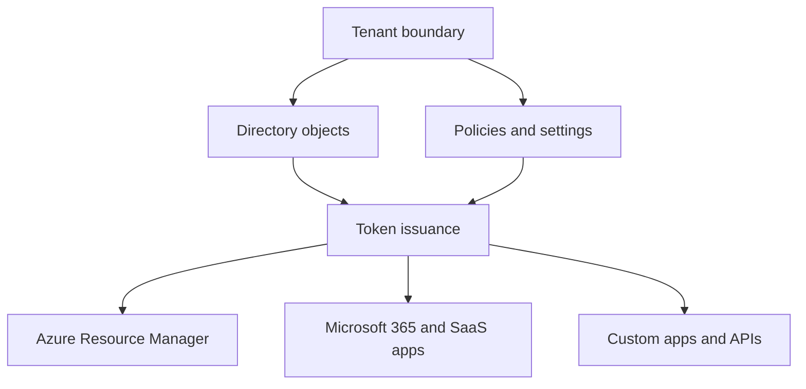
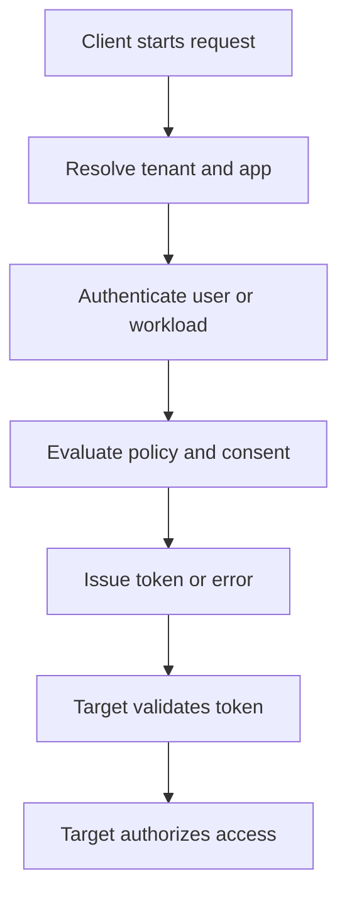

---
content_sources:
  diagrams:
    - id: entra-control-plane-flow
      type: flowchart
      source: mslearn-adapted
      mslearn_url: https://learn.microsoft.com/en-us/entra/fundamentals/how-default-directory-works
    - id: tenant-to-resource-trust
      type: flowchart
      source: self-generated
      justification: "Synthesized from Microsoft Learn guidance on tenant boundaries, subscriptions, applications, and Microsoft Graph."
      based_on:
        - https://learn.microsoft.com/en-us/entra/fundamentals/how-default-directory-works
        - https://learn.microsoft.com/en-us/entra/fundamentals/whatis
        - https://learn.microsoft.com/en-us/azure/role-based-access-control/overview
    - id: entra-request-evaluation-path
      type: flowchart
      source: self-generated
      justification: "Synthesized from Microsoft Learn Entra ID fundamentals and sign-in documentation."
      based_on:
        - https://learn.microsoft.com/en-us/entra/fundamentals/whatis
---

# How Entra ID Works

Microsoft Entra ID is a cloud identity platform that stores directory objects, evaluates access policies, and issues tokens for Microsoft and custom applications. Understanding the separation between directory, subscription, and workload layers is the foundation for every later design choice.

## Architecture Overview

<!-- diagram-id: entra-control-plane-flow -->


Entra ID acts as the identity authority. Azure subscriptions trust the tenant for authentication, but the subscription itself does not store identities. That distinction explains why changing tenant configuration can affect many subscriptions and applications at once.

At a high level, the platform has three major responsibilities:

- Store directory objects such as users, groups, devices, applications, and service principals.
- Evaluate identity context such as tenant, method, policy, and consent.
- Issue tokens that applications and Azure services can validate.

<!-- diagram-id: tenant-to-resource-trust -->


Thinking in layers helps:

- The **tenant layer** defines the security boundary.
- The **directory layer** holds identity objects.
- The **policy layer** changes how and when access is allowed.
- The **token layer** carries the final decision to workloads.

## Core Concepts

### Tenant, directory, and objects

A tenant contains directory objects such as users, groups, devices, enterprise applications, and service principals. A directory is the data store; a tenant is the administrative and security boundary around that store.

```bash
az rest --method GET --url "https://graph.microsoft.com/v1.0/organization"
mgc organization list --output table
```

Why this matters:

- Most identity changes are tenant-scoped.
- Object IDs are unique within the tenant context.
- Policies usually target users, groups, apps, or workloads inside that tenant.

Expected output pattern:

```json
{
  "value": [
    {
      "displayName": "Contoso",
      "id": "<tenant-id>",
      "verifiedDomains": [
        {
          "name": "example.com"
        }
      ]
    }
  ]
}
```

### Relationship to Azure subscriptions

An Azure subscription is associated with one tenant at a time for identity and access control. The subscription owns resource billing and deployment scope, while the tenant provides identities for sign-in and authorization.

```bash
az account show --output json
az account tenant list --output table
```

Important separation:

- Azure Resource Manager stores resources and role assignments.
- Entra stores the principals referenced in those assignments.
- Changing tenant association affects who can administer and automate the subscription.

### Identity objects vs resource objects

Directory objects live in Entra ID. Azure resources live in Azure Resource Manager. When you assign Azure RBAC, Azure stores the role assignment on the resource scope but references a principal from Entra ID.

```bash
az rest --method GET --url "https://management.azure.com/subscriptions?api-version=2020-01-01"
az rest --method GET --url "https://graph.microsoft.com/v1.0/directoryObjects/$OBJECT_ID"
```

This split is why identity troubleshooting often needs two control planes:

- Microsoft Graph for identity objects.
- Azure Resource Manager for resource scope and RBAC.

### Authentication and authorization path

Entra ID first verifies identity using password, certificate, FIDO2, or another method. It then evaluates policy, creates a token, and passes claims to the application or Azure control plane for final authorization decisions.

Key idea:

- Authentication proves who the subject is.
- Token issuance packages the security context.
- Authorization is the target application's or Azure resource's final decision.

### Directory replication and eventual consistency

Entra is a cloud service with distributed control-plane behavior. Many reads are fast, but not every change is immediately reflected everywhere.

What operators should expect:

- New objects may take time to appear in every downstream view.
- Group changes may not instantly change every token or every workload decision.
- Automation should retry when it depends on newly created identity objects.

### Endpoints and protocols

Entra provides tenant-specific and shared endpoints for modern identity protocols. Applications choose endpoints based on who can sign in and which protocol they use.

Examples include:

- Tenant-specific endpoints for single-tenant apps.
- `common` or organization-wide patterns for some multi-tenant flows.
- OpenID Connect and OAuth 2.0 endpoints for modern app sign-in and API access.

### Microsoft Graph as the management API

Microsoft Graph is the primary API surface for reading and changing Entra objects. Azure CLI often acts as a convenience layer over Microsoft Graph or Azure Resource Manager.

```bash
az rest --method GET --url "https://graph.microsoft.com/v1.0/servicePrincipals?$top=5"
mgc applications list --top 5 --output json
```

## Data Flow

1. A client determines the tenant or home realm to contact.
2. The client sends the user or workload to the Entra authorization or token endpoint.
3. Entra looks up tenant configuration, supported methods, and application metadata.
4. Conditional Access, sign-in risk, and registration state can influence the request.
5. Entra issues an ID token, access token, refresh token, or an error.
6. The target application or Azure control plane checks audience, issuer, and claims.

Detailed request lifecycle:

1. The client identifies the authority and target resource.
2. Entra resolves the tenant and application metadata.
3. The user or workload completes authentication.
4. Entra evaluates policies such as method requirements and consent state.
5. Entra signs and issues the appropriate token set.
6. The application or Azure service validates token signature and claims.
7. The target workload performs local authorization using scopes, roles, groups, or RBAC.

This is why sign-in troubleshooting usually requires both Entra logs and application-side validation details.

<!-- diagram-id: entra-request-evaluation-path -->


## Integration Points

- Azure Resource Manager for portal, CLI, and API access
- Microsoft 365 applications such as Exchange Online and Teams
- SaaS enterprise applications using SAML, OIDC, or OAuth 2.0
- Custom APIs and clients registered in the tenant
- Microsoft Graph for reading and changing directory data

```bash
az rest --method GET --url "https://graph.microsoft.com/v1.0/servicePrincipals?$top=5"
mgc applications list --top 5 --output json
```

Integration map:

| System | Entra dependency | Typical identity artifact |
|---|---|---|
| Azure subscription | Tenant trust and RBAC principal lookup | User, group, service principal, managed identity |
| Microsoft 365 | User sign-in and licensing context | User object and issued token |
| Enterprise SaaS app | Federated or app-based trust | Service principal and tokens |
| Custom API | Protocol and token validation | App registration and access token |
| Automation | Non-interactive identity and authorization | Service principal or managed identity |

## Configuration Options

Important configuration layers include:

- Tenant properties such as custom domains and external identities settings
- User and group lifecycle settings
- Application registration metadata and credentials
- Authentication method policies and registration campaigns
- Cross-tenant access settings for B2B collaboration

```bash
az rest --method GET --url "https://graph.microsoft.com/v1.0/domains"
az rest --method GET --url "https://graph.microsoft.com/v1.0/policies/authenticationMethodsPolicy"
mgc domains list --output table
```

Useful inspection commands:

```bash
az rest --method GET --url "https://graph.microsoft.com/v1.0/organization"
az rest --method GET --url "https://graph.microsoft.com/v1.0/policies/crossTenantAccessPolicy"
az rest --method GET --url "https://graph.microsoft.com/v1.0/applications?$top=5"
```

Expected output pattern:

```text
Id            IsVerified  Name
------------  ----------  ----------------
<object-id>   True        example.com
```

Practical design choices:

### Keep tenant-wide settings intentionally small

- Tenant changes affect many workloads at once.
- Prefer testing in a lab tenant before production rollout.
- Document ownership for tenant-level settings.

### Separate identity architecture from workload architecture

- One tenant can support many workloads.
- One workload can depend on many Entra objects.
- Avoid tying identity design too tightly to a single application team.

## Pricing Considerations

The architecture is the same across free, P1, and P2 tiers, but features such as Conditional Access, Identity Protection, and advanced governance depend on licensing. When documenting a production design, always separate platform behavior from license-gated enforcement features.

Cost patterns to remember:

- Core objects and sign-in behavior exist without premium tiers.
- Security depth, governance, and advanced reporting often require P1 or P2.
- Multi-tenant and cross-tenant designs increase operational complexity even if licensing stays similar.

## Limitations and Quotas

- A subscription can trust only one tenant at a time.
- Some tenant settings replicate globally and are not instantaneous.
- National clouds can have different endpoints and feature timelines.
- Legacy protocols may work, but they reduce security posture and policy coverage.

Additional operational limits:

- Some properties are writable only through specific APIs or roles.
- Eventual consistency can affect automation immediately after object creation.
- Older guidance based on Azure AD Graph should be avoided for new designs.

## Advanced Topics

### Why the tenant boundary matters

The tenant is the unit of trust for:

- Authentication policy.
- External collaboration.
- App registration ownership.
- Directory lifecycle and governance.

If a design problem feels ambiguous, first ask: **which tenant owns the identity and which tenant owns the resource?**

### Common design mistakes

- Assuming subscriptions contain identities.
- Treating the portal as the source of truth instead of understanding Graph and ARM boundaries.
- Mixing authorization failures with authentication failures.
- Forgetting that the same user can exist as member, guest, or external identity in different contexts.

### Mental model summary

Think of Entra ID as:

1. A tenant-bound directory.
2. A policy engine.
3. A token issuer.
4. A trust provider for many Microsoft and custom workloads.

## See Also

- [Platform landing page](index.md)
- [Tenants and directories](tenants-and-directories.md)
- [Users and groups](users-and-groups.md)
- [OAuth 2.0 and OIDC](oauth2-and-oidc.md)
- [Tokens and claims](tokens-and-claims.md)

## Sources

- https://learn.microsoft.com/en-us/entra/fundamentals/how-default-directory-works
- https://learn.microsoft.com/en-us/entra/fundamentals/whatis
- https://learn.microsoft.com/en-us/azure/role-based-access-control/overview
- https://learn.microsoft.com/en-us/graph/overview
