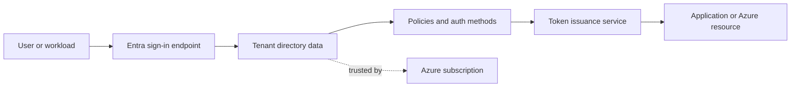

---
content_sources:
  diagrams:
    - id: entra-control-plane-flow
      type: flowchart
      source: mslearn-adapted
      mslearn_url: https://learn.microsoft.com/en-us/entra/fundamentals/how-default-directory-works
---

# How Entra ID Works

Microsoft Entra ID is a cloud identity platform that stores directory objects, evaluates access policies, and issues tokens for Microsoft and custom applications. Understanding the separation between directory, subscription, and workload layers is the foundation for every later design choice.

## Architecture Overview

<!-- diagram-id: entra-control-plane-flow -->


Entra ID acts as the identity authority. Azure subscriptions trust the tenant for authentication, but the subscription itself does not store identities. That distinction explains why changing tenant configuration can affect many subscriptions and applications at once.

## Core Concepts

### Tenant, directory, and objects

A tenant contains directory objects such as users, groups, devices, enterprise applications, and service principals. A directory is the data store; a tenant is the administrative and security boundary around that store.

```bash
az rest --method GET --url "https://graph.microsoft.com/v1.0/organization"
mgc organization list --output table
```

### Relationship to Azure subscriptions

An Azure subscription is associated with one tenant at a time for identity and access control. The subscription owns resource billing and deployment scope, while the tenant provides identities for sign-in and authorization.

```bash
az account show --output json
az account tenant list --output table
```

### Identity objects vs resource objects

Directory objects live in Entra ID. Azure resources live in Azure Resource Manager. When you assign Azure RBAC, Azure stores the role assignment on the resource scope but references a principal from Entra ID.

```bash
az rest --method GET --url "https://management.azure.com/subscriptions?api-version=2020-01-01"
az rest --method GET --url "https://graph.microsoft.com/v1.0/directoryObjects/$OBJECT_ID"
```

### Authentication and authorization path

Entra ID first verifies identity using password, certificate, FIDO2, or another method. It then evaluates policy, creates a token, and passes claims to the application or Azure control plane for final authorization decisions.

## Data Flow

1. A client determines the tenant or home realm to contact.
2. The client sends the user or workload to the Entra authorization or token endpoint.
3. Entra looks up tenant configuration, supported methods, and application metadata.
4. Conditional Access, sign-in risk, and registration state can influence the request.
5. Entra issues an ID token, access token, refresh token, or an error.
6. The target application or Azure control plane checks audience, issuer, and claims.

This is why sign-in troubleshooting usually requires both Entra logs and application-side validation details.

## Integration Points

- Azure Resource Manager for portal, CLI, and API access
- Microsoft 365 applications such as Exchange Online and Teams
- SaaS enterprise applications using SAML, OIDC, or OAuth 2.0
- Custom APIs and clients registered in the tenant
- Microsoft Graph for reading and changing directory data

```bash
az rest --method GET --url "https://graph.microsoft.com/v1.0/servicePrincipals?$top=5"
mgc applications list --top 5 --output json
```

## Configuration Options

Important configuration layers include:

- Tenant properties such as custom domains and external identities settings
- User and group lifecycle settings
- Application registration metadata and credentials
- Authentication method policies and registration campaigns
- Cross-tenant access settings for B2B collaboration

```bash
az rest --method GET --url "https://graph.microsoft.com/v1.0/domains"
az rest --method GET --url "https://graph.microsoft.com/v1.0/policies/authenticationMethodsPolicy"
mgc domains list --output table
```

## Pricing Considerations

The architecture is the same across free, P1, and P2 tiers, but features such as Conditional Access, Identity Protection, and advanced governance depend on licensing. When documenting a production design, always separate platform behavior from license-gated enforcement features.

## Limitations and Quotas

- A subscription can trust only one tenant at a time.
- Some tenant settings replicate globally and are not instantaneous.
- National clouds can have different endpoints and feature timelines.
- Legacy protocols may work, but they reduce security posture and policy coverage.

## See Also

- [Platform landing page](index.md)
- [Tenants and directories](tenants-and-directories.md)
- [Users and groups](users-and-groups.md)
- [OAuth 2.0 and OIDC](oauth2-and-oidc.md)
- [Tokens and claims](tokens-and-claims.md)

## Sources

- https://learn.microsoft.com/en-us/entra/fundamentals/how-default-directory-works
- https://learn.microsoft.com/en-us/entra/fundamentals/whatis
- https://learn.microsoft.com/en-us/azure/role-based-access-control/overview
- https://learn.microsoft.com/en-us/graph/overview
