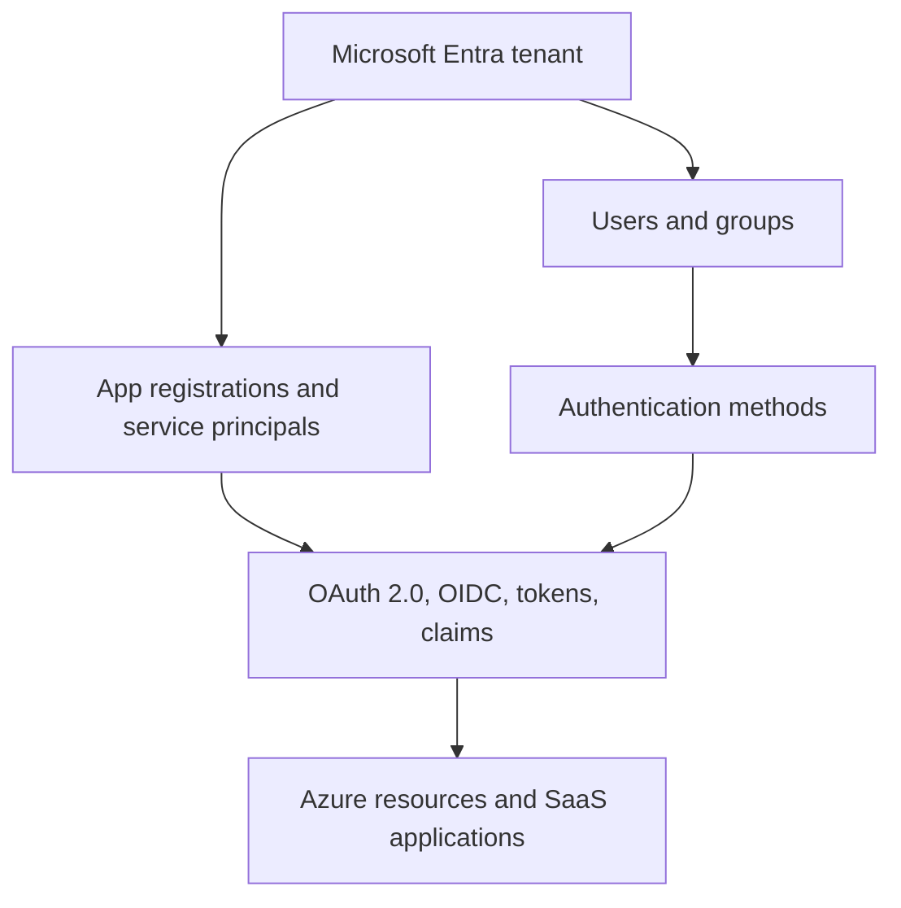

---
content_sources:
  diagrams:
    - id: platform-overview-map
      type: flowchart
      source: mslearn-adapted
      mslearn_url: https://learn.microsoft.com/en-us/entra/fundamentals/whatis
---

# Platform

Microsoft Entra ID is the identity control plane for Microsoft cloud services, custom applications, and external collaboration. This section explains the core platform building blocks before you move into design, operations, and troubleshooting topics.

## Architecture Overview

<!-- diagram-id: platform-overview-map -->


The Platform section starts with the tenant boundary, then moves through identities, applications, and token issuance. Read the pages in order if you want a progressive mental model.

## Core Concepts

### Tenant as the security boundary

A tenant stores directory objects such as users, groups, devices, applications, and policies. Azure subscriptions can trust the tenant for authentication, but subscriptions are billing and resource containers rather than identity stores.

```bash
az rest --method GET --url "https://graph.microsoft.com/v1.0/organization"
mgc organization list --output json
```

### Directory objects and relationships

Most Entra administration involves linking objects together:

- Users join groups.
- Groups receive app access or Azure RBAC assignments.
- App registrations define identity metadata.
- Service principals represent apps inside a tenant.
- Managed identities create service principals for Azure workloads.

```bash
az ad user list --filter "startsWith(displayName,'$DISPLAY_NAME')"
az ad group list --filter "startsWith(displayName,'$DISPLAY_NAME')"
```

### Protocols and tokens

Authentication methods validate a user or workload. OAuth 2.0 and OpenID Connect then issue tokens containing claims that applications and APIs evaluate.

```bash
az rest --method GET --url "https://graph.microsoft.com/v1.0/applications"
az rest --method GET --url "https://graph.microsoft.com/v1.0/servicePrincipals"
```

## Data Flow

The usual control flow across the platform is:

1. A user, device, or workload contacts an Entra endpoint.
2. Entra validates tenant context and authentication factors.
3. Policies and application configuration are evaluated.
4. A token is issued with audience, subject, and authorization claims.
5. The target application or API grants or denies access.

This flow appears repeatedly across web apps, APIs, automation accounts, container workloads, and administrator sign-ins.

## Integration Points

- Azure subscriptions and management groups for Azure RBAC
- Microsoft 365 workloads for collaboration and licensing
- Custom web, mobile, daemon, and API applications
- External identity scenarios such as B2B collaboration
- Microsoft Graph for programmatic administration

```bash
az rest --method GET --url "https://management.azure.com/tenants?api-version=2022-12-01"
mgc service-principals list --top 5 --output json
```

## Configuration Options

Use the Platform pages to understand which object you should configure before changing settings.

```bash
az account tenant list
az rest --method GET --url "https://graph.microsoft.com/v1.0/domains"
mgc applications list --top 5 --output table
```

Key configuration areas include:

- Tenant-wide settings such as domains and external collaboration
- Identity objects such as users, groups, and devices
- Application identity settings such as redirect URIs and credentials
- Authentication method availability and registration policies
- Token-related settings such as optional claims and app roles

## Pricing Considerations

Core directory capabilities exist in the free tier, but advanced security and governance features often require Microsoft Entra ID P1 or P2. Platform concepts in this section apply across tiers, but the enforcement and reporting depth changes with licensing.

## Limitations and Quotas

- Tenant-wide settings can affect every application and user in scope.
- Some Microsoft Graph properties are read-only or require elevated roles.
- Legacy Azure AD Graph guidance should be avoided in new designs.
- Feature availability can differ between public cloud and sovereign clouds.

## See Also

- [How Entra ID works](how-entra-id-works.md)
- [Tenants and directories](tenants-and-directories.md)
- [Users and groups](users-and-groups.md)
- [App registrations and service principals](app-registrations-and-service-principals.md)
- [Managed identities](managed-identities.md)
- [Authentication methods](authentication-methods.md)
- [OAuth 2.0 and OIDC](oauth2-and-oidc.md)
- [Tokens and claims](tokens-and-claims.md)

## Sources

- https://learn.microsoft.com/en-us/entra/fundamentals/whatis
- https://learn.microsoft.com/en-us/graph/overview
- https://learn.microsoft.com/en-us/cli/azure/ad
