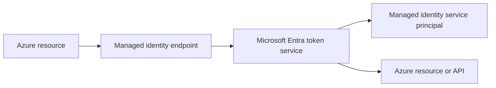
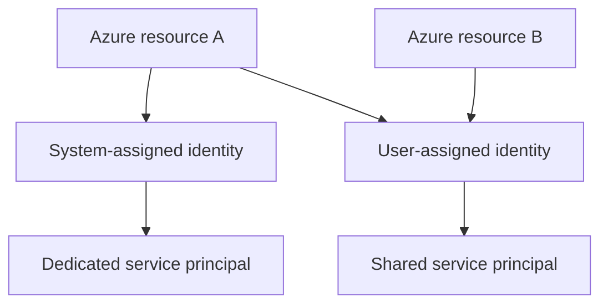
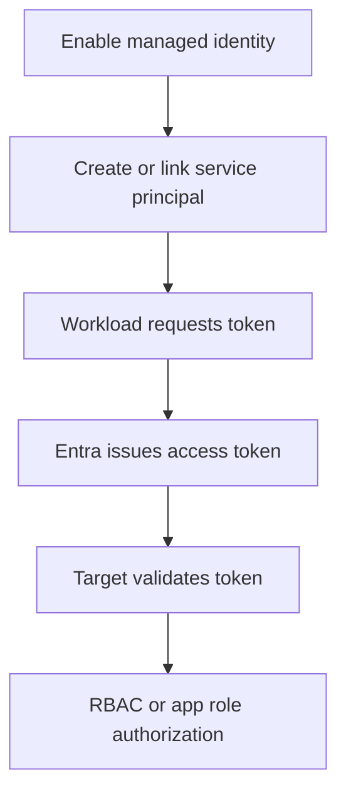

---
content_sources:
  diagrams:
    - id: managed-identity-token-path
      type: flowchart
      source: mslearn-adapted
      mslearn_url: https://learn.microsoft.com/en-us/entra/identity/managed-identities-azure-resources/overview
    - id: system-vs-user-assigned
      type: flowchart
      source: self-generated
      justification: "Synthesized from Microsoft Learn guidance on system-assigned and user-assigned managed identities."
      based_on:
        - https://learn.microsoft.com/en-us/entra/identity/managed-identities-azure-resources/overview
        - https://learn.microsoft.com/en-us/entra/identity/managed-identities-azure-resources/how-managed-identities-work-vm
    - id: managed-identity-token-acquisition
      type: flowchart
      source: self-generated
      justification: "Synthesized from Microsoft Learn managed identity token flow documentation."
      based_on:
        - https://learn.microsoft.com/en-us/entra/identity/managed-identities-azure-resources/overview
---

# Managed Identities

Managed identities let Azure resources obtain Microsoft Entra tokens without storing application credentials in code or configuration. They are the preferred identity pattern for Azure-hosted workloads that access Azure services or Entra-protected APIs.

## Architecture Overview

<!-- diagram-id: managed-identity-token-path -->


Azure hosts the credential lifecycle and exposes a local token endpoint to the workload. The application asks for a token, and Azure plus Entra handle the signing keys and service principal trust behind the scenes.

Managed identities reduce several common failure modes at once:

- No embedded client secret in source code.
- No developer-managed certificate rotation for supported Azure workloads.
- Easier role assignment using a stable principal object.
- Better alignment with least-privilege RBAC patterns.

<!-- diagram-id: system-vs-user-assigned -->


The central design question is lifecycle ownership:

- Use **system-assigned** when identity lifecycle should match one resource.
- Use **user-assigned** when multiple resources need the same trust boundary.

## Core Concepts

### System-assigned managed identity

A system-assigned managed identity is tied to one Azure resource. If the resource is deleted, the identity is deleted too. This model is simple and ideal when the resource lifecycle and identity lifecycle should match.

Key characteristics:

- One identity per resource instance.
- Automatic cleanup with resource deletion.
- Lower risk of identity reuse across unrelated workloads.

### User-assigned managed identity

A user-assigned managed identity is an independent Azure resource that can be attached to multiple supported workloads. This is useful when several resources need the same permissions or when identity lifecycle should outlive one compute instance.

```bash
az identity create --name "$DISPLAY_NAME" --resource-group "$RG" --location "$LOCATION"
az identity show --name "$DISPLAY_NAME" --resource-group "$RG"
```

Expected output pattern:

```json
{
  "clientId": "<app-id>",
  "id": "/subscriptions/<subscription-id>/resourceGroups/rg-identity-demo/providers/Microsoft.ManagedIdentity/userAssignedIdentities/demo-app-001",
  "name": "demo-app-001",
  "principalId": "<object-id>"
}
```

### Service principal backing object

Every managed identity maps to a service principal in the tenant. You usually manage permissions through Azure RBAC or API permissions, but you do not rotate secrets because Azure owns the credential lifecycle.

```bash
az rest --method GET --url "https://graph.microsoft.com/v1.0/servicePrincipals?$filter=displayName eq '$DISPLAY_NAME'"
mgc service-principals list --filter "displayName eq '$DISPLAY_NAME'" --output json
```

What operators need to remember:

- The identity is still a principal in Entra.
- It can be assigned roles like any other service principal.
- The absence of secrets does not remove the need for access review.

### Token acquisition behavior

The workload calls the local managed identity endpoint with a target resource or scope. Azure validates the request context and obtains a token from Entra on behalf of that identity.

Design implications:

- Tokens are requested at runtime, not stored statically.
- A mis-scoped request still fails even if the identity exists.
- The resource being called must trust Entra-issued tokens for that audience.

### Supported Azure hosts

Managed identities are available on supported Azure services such as virtual machines, App Service, Functions, Container Apps, and other integrated resource types.

Use managed identities when:

- The workload runs on Azure.
- The target service supports Entra-based authorization.
- You want Azure-managed credential lifecycle.

### RBAC and application authorization

Managed identities commonly use Azure RBAC for Azure resources, but they can also call Entra-protected custom APIs or Microsoft Graph where the workload and permission model support it.

Typical patterns:

- Data-plane access to Key Vault, Storage, SQL, or Cosmos DB.
- Control-plane access through Azure RBAC.
- App role assignment or custom API trust in application scenarios.

```bash
az role assignment create --assignee-object-id "$OBJECT_ID" --role "Reader" --scope "/subscriptions/$SUBSCRIPTION_ID/resourceGroups/$RG"
az role assignment list --assignee "$OBJECT_ID" --scope "/subscriptions/$SUBSCRIPTION_ID/resourceGroups/$RG" --output table
```

Expected output:

```text
Principal                             Role    Scope
------------------------------------  ------  ---------------------------------------------------------------
<object-id>                           Reader  /subscriptions/<subscription-id>/resourceGroups/rg-identity-demo
```

### Lifecycle and deletion behavior

Lifecycle determines cleanup risk:

- Deleting a system-assigned identity's resource removes the identity.
- Deleting a user-assigned identity affects every resource attached to it.
- Re-creating a resource or identity typically creates a new principal ID.

This is why automation should never assume that a newly re-created identity has the same object ID as the old one.

## Data Flow

1. An administrator enables a managed identity on an Azure resource.
2. Azure creates or links the backing service principal.
3. The workload calls the local endpoint for a target resource.
4. Entra issues an access token for the managed identity.
5. The target service authorizes the request based on RBAC or application roles.

Expanded flow:

1. The resource starts with managed identity enabled.
2. Azure makes the local token endpoint available to the workload.
3. The workload requests a token for a specific audience.
4. Azure validates that the calling resource is entitled to use the identity.
5. Entra issues an access token for that identity.
6. The target service validates token audience and claims.
7. Authorization succeeds or fails based on role assignment or app role logic.

Common breakpoints:

- Identity exists, but no RBAC or app role assignment is present.
- The token request targets the wrong resource or scope.
- A user-assigned identity is attached incorrectly or not selected.
- The target service supports only certain token audiences.

<!-- diagram-id: managed-identity-token-acquisition -->


## Integration Points

- Azure RBAC for control-plane and data-plane authorization
- Azure Key Vault, Storage, SQL, and other Azure services
- Custom APIs that trust Entra access tokens
- VM, App Service, Functions, Container Apps, and other supported hosts

```bash
az rest --method GET --url "https://management.azure.com/subscriptions/$SUBSCRIPTION_ID/resourceGroups/$RG/providers/Microsoft.ManagedIdentity/userAssignedIdentities?api-version=2023-01-31"
az role assignment list --assignee "$OBJECT_ID" --output table
```

Integration table:

| Integration target | How managed identity is used | Main control |
|---|---|---|
| Azure Resource Manager | Control-plane automation | Azure RBAC |
| Key Vault | Secretless retrieval of secrets or certificates | Key Vault RBAC or access model |
| Storage | Blob, queue, and other service access | Data-plane RBAC |
| SQL and databases | Database auth where supported | Database and Entra auth integration |
| Custom API | API trusts Entra tokens | App roles or API authorization |

## Configuration Options

Use system-assigned identity when one workload needs its own isolated permissions. Use user-assigned identity when multiple workloads need the same access boundary.

```bash
az identity create --name "$DISPLAY_NAME" --resource-group "$RG" --location "$LOCATION"
az rest --method GET --url "https://graph.microsoft.com/v1.0/servicePrincipals/$OBJECT_ID"
mgc service-principals get --service-principal-id "$OBJECT_ID"
```

More configuration examples:

```bash
az identity list --resource-group "$RG" --output table
az role assignment create --assignee-object-id "$OBJECT_ID" --role "Key Vault Secrets User" --scope "/subscriptions/$SUBSCRIPTION_ID/resourceGroups/$RG"
az role assignment create --assignee-object-id "$OBJECT_ID" --role "Storage Blob Data Reader" --scope "/subscriptions/$SUBSCRIPTION_ID/resourceGroups/$RG"
```

Recommended selection logic:

### Choose system-assigned when

- One workload has one isolated permission set.
- You want cleanup to happen automatically with the resource.
- You want to reduce accidental identity sharing.

### Choose user-assigned when

- Blue-green or scale-out resources need the same identity.
- Several resources must share the same RBAC boundary.
- Identity lifecycle should survive resource replacement.

!!! note
    Managed identities remove secret management, but they do not remove authorization design. The important question becomes which scopes, roles, or resource permissions the identity should have.

## Pricing Considerations

Managed identities do not carry a separate Entra charge by themselves. Costs usually come from the Azure resources hosting the workload, premium security controls, or operational tooling around permission review and observability.

Cost-related observations:

- Managed identities often reduce operational cost by avoiding secret rotation.
- Shared identities can reduce sprawl, but too much sharing can increase blast radius.
- Governance and monitoring still matter, especially in large estates.

## Limitations and Quotas

- Only supported Azure resource types can use managed identities.
- Managed identities are designed for Azure-hosted workloads, not arbitrary on-premises hosts.
- Permissions still need least-privilege review; secretless does not mean risk-free.
- Some application permission scenarios still require app registrations instead of managed identities.

Additional operational limits:

- Principal IDs can change after deletion and recreation.
- Cross-tenant application scenarios usually need classic app registration patterns instead.
- Some services need specific RBAC roles or audience values that operators must discover early.

## Advanced Topics

### Managed identity vs app registration

Use a managed identity when the workload is Azure-hosted and only needs runtime tokens. Use an app registration when you need broader protocol configuration such as redirect URIs, multi-tenant sign-in, or customer-owned consent flows.

### Shared identity blast radius

User-assigned identities can simplify rollout, but overuse creates a shared trust boundary. If one identity is attached to many apps, all of them inherit the same downstream permissions unless you split the design.

### Migration guidance

When moving from client secrets to managed identities:

1. Identify workloads already running on supported Azure services.
2. Create RBAC and API permission parity for the managed identity.
3. Validate token acquisition and downstream authorization.
4. Remove secrets only after the new path is confirmed.

## See Also

- [App registrations and service principals](app-registrations-and-service-principals.md)
- [OAuth 2.0 and OIDC](oauth2-and-oidc.md)
- [Tokens and claims](tokens-and-claims.md)
- [Best practices: least privilege RBAC](../best-practices/least-privilege-rbac.md)

## Sources

- https://learn.microsoft.com/en-us/entra/identity/managed-identities-azure-resources/overview
- https://learn.microsoft.com/en-us/entra/identity/managed-identities-azure-resources/how-managed-identities-work-vm
- https://learn.microsoft.com/en-us/azure/active-directory/managed-identities-azure-resources/tutorial-vm-managed-identities-cosmos
- https://learn.microsoft.com/en-us/azure/role-based-access-control/overview
