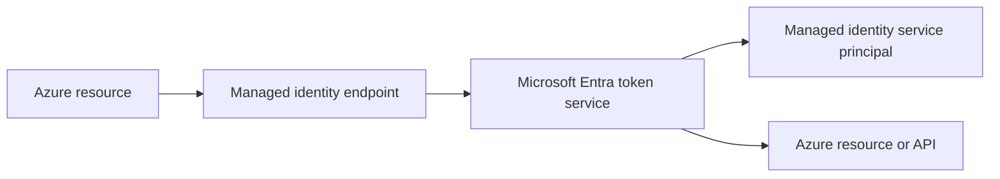

---
content_sources:
  diagrams:
    - id: managed-identity-token-path
      type: flowchart
      source: mslearn-adapted
      mslearn_url: https://learn.microsoft.com/en-us/entra/identity/managed-identities-azure-resources/overview
---

# Managed Identities

Managed identities let Azure resources obtain Microsoft Entra tokens without storing application credentials in code or configuration. They are the preferred identity pattern for Azure-hosted workloads that access Azure services or Entra-protected APIs.

## Architecture Overview

<!-- diagram-id: managed-identity-token-path -->


Azure hosts the credential lifecycle and exposes a local token endpoint to the workload. The application asks for a token, and Azure plus Entra handle the signing keys and service principal trust behind the scenes.

## Core Concepts

### System-assigned managed identity

A system-assigned managed identity is tied to one Azure resource. If the resource is deleted, the identity is deleted too. This model is simple and ideal when the resource lifecycle and identity lifecycle should match.

```bash
az rest --method PUT --url "https://management.azure.com/subscriptions/$TENANT_ID/resourceGroups/$RG/providers/Microsoft.ManagedIdentity/userAssignedIdentities/$DISPLAY_NAME?api-version=2023-01-31"
az rest --method GET --url "https://graph.microsoft.com/v1.0/servicePrincipals?$filter=displayName eq '$DISPLAY_NAME'"
```

### User-assigned managed identity

A user-assigned managed identity is an independent Azure resource that can be attached to multiple supported workloads. This is useful when several resources need the same permissions or when identity lifecycle should outlive one compute instance.

```bash
az identity create --name "$DISPLAY_NAME" --resource-group "$RG" --location "$LOCATION"
az identity show --name "$DISPLAY_NAME" --resource-group "$RG"
```

### Service principal backing object

Every managed identity maps to a service principal in the tenant. You usually manage permissions through Azure RBAC or API permissions, but you do not rotate secrets because Azure owns the credential lifecycle.

```bash
az rest --method GET --url "https://graph.microsoft.com/v1.0/servicePrincipals?$filter=displayName eq '$DISPLAY_NAME'"
mgc service-principals list --filter "displayName eq '$DISPLAY_NAME'" --output json
```

### Token acquisition behavior

The workload calls the local managed identity endpoint with a target resource or scope. Azure validates the request context and obtains a token from Entra on behalf of that identity.

## Data Flow

1. An administrator enables a managed identity on an Azure resource.
2. Azure creates or links the backing service principal.
3. The workload calls the local endpoint for a target resource.
4. Entra issues an access token for the managed identity.
5. The target service authorizes the request based on RBAC or application roles.

## Integration Points

- Azure RBAC for control-plane and data-plane authorization
- Azure Key Vault, Storage, SQL, and other Azure services
- Custom APIs that trust Entra access tokens
- VM, App Service, Functions, Container Apps, and other supported hosts

```bash
az role assignment create --assignee-object-id "$OBJECT_ID" --role "Reader" --scope "/subscriptions/$TENANT_ID/resourceGroups/$RG"
az rest --method GET --url "https://management.azure.com/subscriptions/$TENANT_ID/resourceGroups/$RG/providers/Microsoft.ManagedIdentity/userAssignedIdentities?api-version=2023-01-31"
```

## Configuration Options

Use system-assigned identity when one workload needs its own isolated permissions. Use user-assigned identity when multiple workloads need the same access boundary.

```bash
az identity create --name "$DISPLAY_NAME" --resource-group "$RG" --location "$LOCATION"
az rest --method GET --url "https://graph.microsoft.com/v1.0/servicePrincipals/$OBJECT_ID"
mgc service-principals get --service-principal-id "$OBJECT_ID"
```

## Pricing Considerations

Managed identities do not carry a separate Entra charge by themselves. Costs usually come from the Azure resources hosting the workload, premium security controls, or operational tooling around permission review and observability.

## Limitations and Quotas

- Only supported Azure resource types can use managed identities.
- Managed identities are designed for Azure-hosted workloads, not arbitrary on-premises hosts.
- Permissions still need least-privilege review; secretless does not mean risk-free.
- Some application permission scenarios still require app registrations instead of managed identities.

## See Also

- [App registrations and service principals](app-registrations-and-service-principals.md)
- [OAuth 2.0 and OIDC](oauth2-and-oidc.md)
- [Tokens and claims](tokens-and-claims.md)
- [Best practices: least privilege RBAC](../best-practices/least-privilege-rbac.md)

## Sources

- https://learn.microsoft.com/en-us/entra/identity/managed-identities-azure-resources/overview
- https://learn.microsoft.com/en-us/entra/identity/managed-identities-azure-resources/how-managed-identities-work-vm
- https://learn.microsoft.com/en-us/azure/active-directory/managed-identities-azure-resources/tutorial-vm-managed-identities-cosmos
- https://learn.microsoft.com/en-us/azure/role-based-access-control/overview
