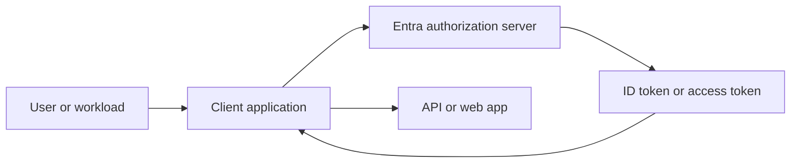
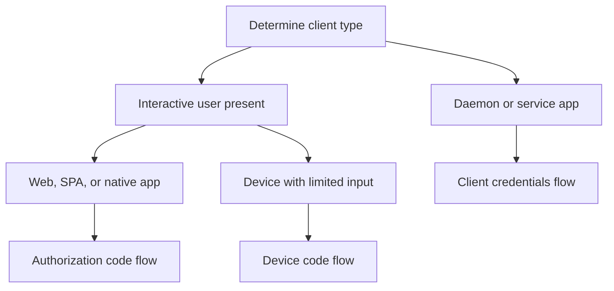
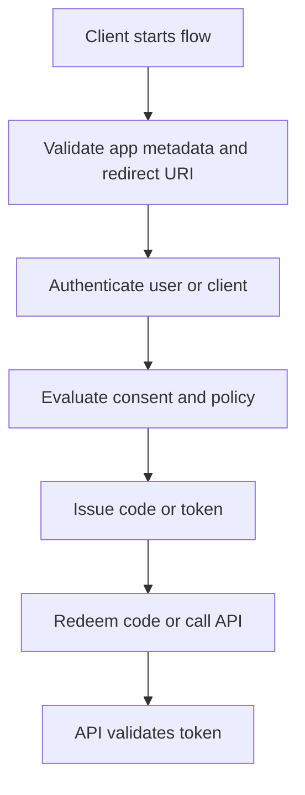

---
content_sources:
  diagrams:
    - id: oauth-oidc-flow-map
      type: flowchart
      source: mslearn-adapted
      mslearn_url: https://learn.microsoft.com/en-us/entra/identity-platform/v2-oauth2-auth-code-flow
    - id: client-flow-selection
      type: flowchart
      source: self-generated
      justification: "Synthesized from Microsoft Learn guidance on OAuth 2.0, OIDC, authorization code flow, client credentials, and device code flow."
      based_on:
        - https://learn.microsoft.com/en-us/entra/identity-platform/v2-oauth2-auth-code-flow
        - https://learn.microsoft.com/en-us/entra/identity-platform/v2-oauth2-client-creds-grant-flow
        - https://learn.microsoft.com/en-us/entra/identity-platform/v2-oauth2-device-code
    - id: oauth-token-exchange-detail
      type: flowchart
      source: self-generated
      justification: "Synthesized from Microsoft Learn OAuth 2.0 flow documentation."
      based_on:
        - https://learn.microsoft.com/en-us/entra/identity-platform/v2-oauth2-auth-code-flow
---

# OAuth 2.0 and OIDC

OAuth 2.0 and OpenID Connect are the main protocols Microsoft Entra ID uses for modern application sign-in and API access. A solid flow selection prevents insecure legacy patterns, simplifies consent, and makes token validation predictable.

## Architecture Overview

<!-- diagram-id: oauth-oidc-flow-map -->


OpenID Connect extends OAuth 2.0 to add sign-in identity information through ID tokens. OAuth 2.0 itself focuses on delegated or application access to resources.

These protocols solve different but related problems:

- **OpenID Connect** answers "who signed in?"
- **OAuth 2.0** answers "what access was granted to the client?"
- **Application registration settings** answer "which clients, redirects, and permissions are valid?"
- **Tokens and claims** carry the protocol result to the application or API.

<!-- diagram-id: client-flow-selection -->


Flow selection is not just a developer preference. It is how you map trust boundaries, user presence, and credential type to a secure sign-in pattern.

## Core Concepts

### Authorization code flow

Authorization code flow is the preferred interactive sign-in pattern for web apps, native clients, and SPAs when implemented with current guidance such as PKCE where appropriate.

```bash
az rest --method GET --url "https://graph.microsoft.com/v1.0/applications/$OBJECT_ID"
mgc applications get --application-id "$OBJECT_ID"
```

Why it is preferred:

- Tokens are not returned directly to the browser in legacy implicit style.
- Redirect URI validation provides a predictable trust check.
- PKCE protects public clients against code interception risks.

### Client credentials flow

Client credentials flow is used by daemon apps, automation, and service-to-service integrations. No user is present, so authorization depends on application permissions or app roles.

```bash
az ad app credential reset --id "$APP_ID" --append
az rest --method GET --url "https://graph.microsoft.com/v1.0/servicePrincipals?$filter=appId eq '$APP_ID'"
```

Key design point:

- The app acts as itself.
- There is no delegated user context.
- Over-permissioning has high impact because it bypasses user presence.

### Device code flow

Device code flow is practical for devices or tools with limited input capability. The user completes the sign-in step on another device while the client polls for token completion.

When it fits best:

- Command-line tools.
- Kiosk or shared device scenarios with limited keyboards.
- Devices that cannot host a full browser-based redirect flow.

### ROPC and implicit flow

ROPC is discouraged because it requires direct password handling and does not support modern security expectations well. Implicit flow is a legacy browser pattern that should generally be avoided for new applications.

Use them only when Microsoft Learn guidance explicitly frames them as legacy compatibility or transition-only scenarios.

### Scopes, audiences, and consent

Scopes describe delegated permissions. Audiences identify the intended resource. Consent determines whether a user or administrator has approved the requested access.

Keep these separate mentally:

- **Scope** describes requested delegated access.
- **Audience** tells the API whether the token was meant for it.
- **Consent** determines whether the access can be granted.

### Tenant and account type boundaries

Protocol correctness depends on sign-in audience and tenant context:

- Single-tenant apps restrict sign-in to one tenant.
- Multi-tenant apps allow users from other organizations after consent.
- Consumer account support changes the authority and audience design.

```bash
az rest --method GET --url "https://graph.microsoft.com/v1.0/applications/$OBJECT_ID" --query "{appId:appId, signInAudience:signInAudience}" --output json
az ad app show --id "$APP_ID" --query "{appId:appId, signInAudience:signInAudience}" --output json
```

Expected output pattern:

```json
{
  "appId": "<app-id>",
  "signInAudience": "AzureADMyOrg"
}
```

### Redirect URIs and public clients

Protocol choice is tightly coupled to redirect URI configuration and whether the client can safely hold credentials.

Typical rules:

- Confidential web apps can use certificates or secrets.
- SPAs and mobile apps should avoid confidential assumptions and rely on current platform guidance.
- Public client enablement should be explicit and limited to valid scenarios.

## Data Flow

1. The client redirects the user or calls a token endpoint.
2. Entra validates application metadata, redirect URI, and tenant context.
3. The user authenticates if needed.
4. Consent and policy checks are performed.
5. Entra returns an authorization code or tokens.
6. The client redeems the code or uses the token against the target API.

Expanded flow by protocol stage:

1. The client identifies the authority and requested scopes or resource.
2. Entra resolves the app registration and validates the endpoint usage.
3. The user authenticates or the workload proves client identity.
4. Entra evaluates consent, tenant policy, and any Conditional Access requirements.
5. Entra issues an authorization code, ID token, access token, refresh token, or an error depending on the flow.
6. The client stores and uses only the tokens appropriate for its role.
7. The API validates signature, issuer, audience, and permission claims before authorization.

<!-- diagram-id: oauth-token-exchange-detail -->


## Integration Points

- App registrations for redirect URIs, permissions, and supported account types
- Microsoft Graph and custom APIs for delegated or application access
- Conditional Access and MFA for interactive flows
- Managed identities for Azure-hosted non-interactive alternatives

```bash
az rest --method GET --url "https://graph.microsoft.com/v1.0/applications/$OBJECT_ID"
az rest --method GET --url "https://graph.microsoft.com/v1.0/oauth2PermissionGrants"
mgc oauth2-permission-grants list --output json
```

Integration table:

| Protocol element | Entra object or control | Typical failure mode |
|---|---|---|
| Redirect URI | Application object | Mismatch or wrong platform type |
| Delegated scope | API exposure and consent | Missing consent or wrong scope |
| App role / application permission | Service principal and admin consent | Over-privilege or admin consent missing |
| Interactive challenge | Authentication methods and Conditional Access | Method insufficient or policy blocks sign-in |
| API validation | Token validation middleware | Wrong audience, issuer, or signature handling |

## Configuration Options

Key registration settings that affect protocol behavior include supported account types, redirect URIs, public client enablement, and exposed scopes or app roles.

```bash
az ad app update --id "$APP_ID" --web-redirect-uris "https://example.com/signin-oidc"
az rest --method PATCH --url "https://graph.microsoft.com/v1.0/applications/$OBJECT_ID" --headers "Content-Type=application/json" --body '{"signInAudience":"AzureADMultipleOrgs"}'
mgc applications update --application-id "$OBJECT_ID" --body '{"isFallbackPublicClient":false}'
```

More useful examples:

```bash
az ad app show --id "$APP_ID" --output json
az rest --method PATCH --url "https://graph.microsoft.com/v1.0/applications/$OBJECT_ID" --headers "Content-Type=application/json" --body '{"web":{"redirectUris":["https://example.com/signin-oidc"]}}'
az rest --method GET --url "https://graph.microsoft.com/v1.0/applications/$OBJECT_ID" --query "{signInAudience:signInAudience, web:web, spa:spa}" --output json
```

Expected output pattern:

```json
{
  "signInAudience": "AzureADMultipleOrgs",
  "web": {
    "redirectUris": [
      "https://example.com/signin-oidc"
    ]
  }
}
```

Recommended flow selection:

### Web app with signed-in users

- Use authorization code flow.
- Protect redirect URIs carefully.
- Validate ID token and session handling separately from API access tokens.

### Background job or daemon

- Use client credentials flow.
- Minimize app permissions.
- Prefer certificates or managed identities over shared secrets.

### CLI or constrained device

- Use device code flow when browser redirect is not practical.
- Communicate user expectations clearly because the sign-in happens on another device.

!!! warning
    Choose the flow based on client type and trust boundary. Do not keep ROPC or implicit enabled as a convenience setting after moving to modern clients.

## Pricing Considerations

The protocols themselves do not add direct cost, but premium controls around token issuance, Conditional Access, sign-in risk, and access governance can change the effective security model and license requirements.

Practical cost drivers usually come from:

- Premium enforcement and sign-in controls.
- Certificate management for confidential clients.
- Operational reviews for consent and application permissions.
- Developer effort when migrating away from legacy flows.

## Limitations and Quotas

- Redirect URI mismatches are a common sign-in failure source.
- Application permissions should be tightly controlled because they bypass user presence.
- Some legacy clients cannot support current best-practice flows.
- Cross-tenant sign-in requires compatible supported account type and consent behavior.

Additional protocol limits:

- Public clients cannot safely protect secrets.
- Not every target API uses the same permission model.
- Tokens are audience-specific and not interchangeable between APIs.

## Advanced Topics

### Why OIDC and OAuth 2.0 are often confused

They share endpoints and tokens, but the consuming party is different:

- OIDC gives the client app a way to establish user identity.
- OAuth 2.0 gives a resource server a way to trust granted access.

### Secure migration from legacy flows

1. Inventory apps using implicit or ROPC.
2. Confirm client type and redirect capabilities.
3. Update registration settings and libraries.
4. Validate token contents and API authorization behavior.
5. Remove legacy flow enablement after successful testing.

### Consent design principles

- Request the minimum scopes necessary.
- Avoid app permissions when delegated permissions are sufficient.
- Separate operational admin consent processes from developer convenience.

## See Also

- [App registrations and service principals](app-registrations-and-service-principals.md)
- [Authentication methods](authentication-methods.md)
- [Tokens and claims](tokens-and-claims.md)
- [Managed identities](managed-identities.md)

## Sources

- https://learn.microsoft.com/en-us/entra/identity-platform/v2-oauth2-auth-code-flow
- https://learn.microsoft.com/en-us/entra/identity-platform/v2-oauth2-client-creds-grant-flow
- https://learn.microsoft.com/en-us/entra/identity-platform/v2-oauth2-device-code
- https://learn.microsoft.com/en-us/entra/identity-platform/v2-oauth-ropc
