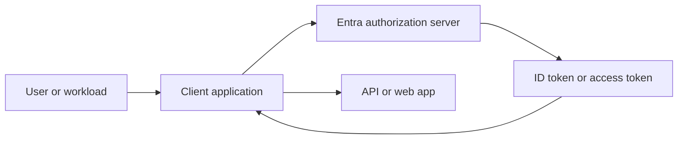

---
content_sources:
  diagrams:
    - id: oauth-oidc-flow-map
      type: flowchart
      source: mslearn-adapted
      mslearn_url: https://learn.microsoft.com/en-us/entra/identity-platform/v2-oauth2-auth-code-flow
---

# OAuth 2.0 and OIDC

OAuth 2.0 and OpenID Connect are the main protocols Microsoft Entra ID uses for modern application sign-in and API access. A solid flow selection prevents insecure legacy patterns, simplifies consent, and makes token validation predictable.

## Architecture Overview

<!-- diagram-id: oauth-oidc-flow-map -->


OpenID Connect extends OAuth 2.0 to add sign-in identity information through ID tokens. OAuth 2.0 itself focuses on delegated or application access to resources.

## Core Concepts

### Authorization code flow

Authorization code flow is the preferred interactive sign-in pattern for web apps, native clients, and SPAs when implemented with current guidance such as PKCE where appropriate.

```bash
az rest --method GET --url "https://graph.microsoft.com/v1.0/applications/$OBJECT_ID"
mgc applications get --application-id "$OBJECT_ID"
```

### Client credentials flow

Client credentials flow is used by daemon apps, automation, and service-to-service integrations. No user is present, so authorization depends on application permissions or app roles.

```bash
az ad app credential reset --id "$APP_ID" --append
az rest --method GET --url "https://graph.microsoft.com/v1.0/servicePrincipals?$filter=appId eq '$APP_ID'"
```

### Device code flow

Device code flow is practical for devices or tools with limited input capability. The user completes the sign-in step on another device while the client polls for token completion.

### ROPC and implicit flow

ROPC is discouraged because it requires direct password handling and does not support modern security expectations well. Implicit flow is a legacy browser pattern that should generally be avoided for new applications.

### Scopes, audiences, and consent

Scopes describe delegated permissions. Audiences identify the intended resource. Consent determines whether a user or administrator has approved the requested access.

## Data Flow

1. The client redirects the user or calls a token endpoint.
2. Entra validates application metadata, redirect URI, and tenant context.
3. The user authenticates if needed.
4. Consent and policy checks are performed.
5. Entra returns an authorization code or tokens.
6. The client redeems the code or uses the token against the target API.

## Integration Points

- App registrations for redirect URIs, permissions, and supported account types
- Microsoft Graph and custom APIs for delegated or application access
- Conditional Access and MFA for interactive flows
- Managed identities for Azure-hosted non-interactive alternatives

```bash
az rest --method GET --url "https://graph.microsoft.com/v1.0/applications/$OBJECT_ID"
az rest --method GET --url "https://graph.microsoft.com/v1.0/oauth2PermissionGrants"
mgc oauth2-permission-grants list --output json
```

## Configuration Options

Key registration settings that affect protocol behavior include supported account types, redirect URIs, public client enablement, and exposed scopes or app roles.

```bash
az ad app update --id "$APP_ID" --web-redirect-uris "https://example.com/signin-oidc"
az rest --method PATCH --url "https://graph.microsoft.com/v1.0/applications/$OBJECT_ID" --headers "Content-Type=application/json" --body '{"signInAudience":"AzureADMultipleOrgs"}'
mgc applications update --application-id "$OBJECT_ID" --body '{"isFallbackPublicClient":false}'
```

!!! warning
    Choose the flow based on client type and trust boundary. Do not keep ROPC or implicit enabled as a convenience setting after moving to modern clients.

## Pricing Considerations

The protocols themselves do not add direct cost, but premium controls around token issuance, Conditional Access, sign-in risk, and access governance can change the effective security model and license requirements.

## Limitations and Quotas

- Redirect URI mismatches are a common sign-in failure source.
- Application permissions should be tightly controlled because they bypass user presence.
- Some legacy clients cannot support current best-practice flows.
- Cross-tenant sign-in requires compatible supported account type and consent behavior.

## See Also

- [App registrations and service principals](app-registrations-and-service-principals.md)
- [Authentication methods](authentication-methods.md)
- [Tokens and claims](tokens-and-claims.md)
- [Managed identities](managed-identities.md)

## Sources

- https://learn.microsoft.com/en-us/entra/identity-platform/v2-oauth2-auth-code-flow
- https://learn.microsoft.com/en-us/entra/identity-platform/v2-oauth2-client-creds-grant-flow
- https://learn.microsoft.com/en-us/entra/identity-platform/v2-oauth2-device-code
- https://learn.microsoft.com/en-us/entra/identity-platform/v2-oauth-ropc
