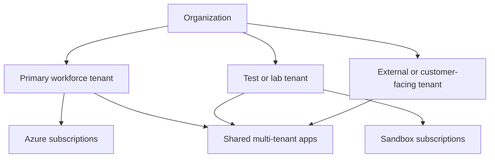
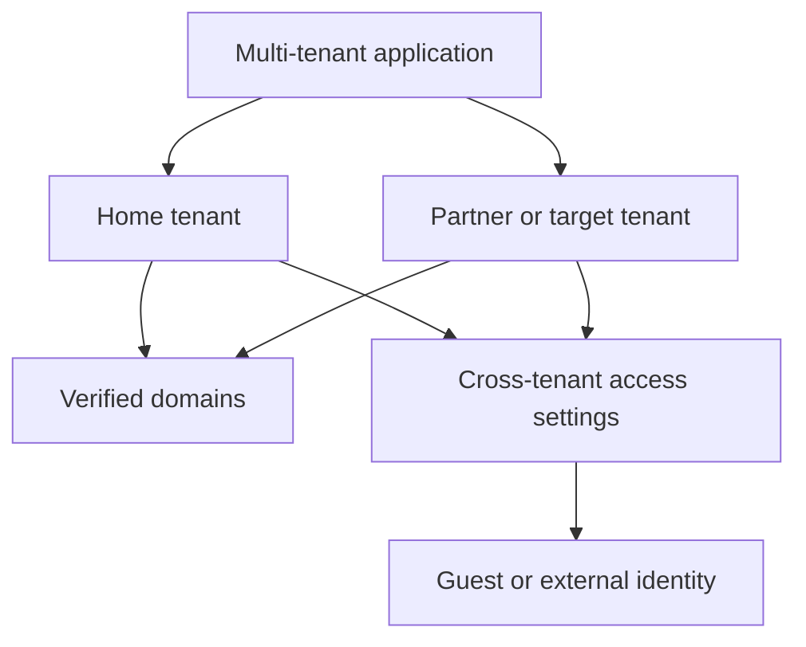
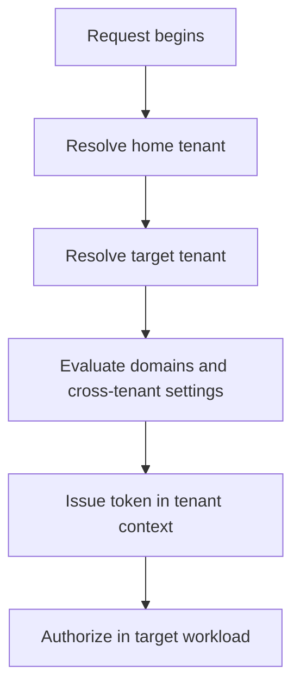

---
content_sources:
  diagrams:
    - id: tenant-directory-patterns
      type: flowchart
      source: mslearn-adapted
      mslearn_url: https://learn.microsoft.com/en-us/entra/fundamentals/create-new-tenant
    - id: cross-tenant-boundary-model
      type: flowchart
      source: self-generated
      justification: "Synthesized from Microsoft Learn guidance on tenant creation, domain ownership, and cross-tenant access."
      based_on:
        - https://learn.microsoft.com/en-us/entra/fundamentals/create-new-tenant
        - https://learn.microsoft.com/en-us/entra/external-id/cross-tenant-access-overview
        - https://learn.microsoft.com/en-us/entra/identity/users/domains-manage
    - id: cross-tenant-request-flow
      type: flowchart
      source: self-generated
      justification: "Synthesized from Microsoft Learn cross-tenant access documentation."
      based_on:
        - https://learn.microsoft.com/en-us/entra/external-id/cross-tenant-access-overview
---

# Tenants and Directories

Tenants define the administrative, security, and identity boundary in Microsoft Entra ID. Good tenant design determines how users collaborate, how applications are isolated, and how Azure subscriptions map to organizational ownership.

## Architecture Overview

<!-- diagram-id: tenant-directory-patterns -->


Some organizations operate with one tenant. Others separate workforce, development, or external identity scenarios across multiple tenants. The best pattern depends on regulatory boundaries, delegation requirements, and collaboration models.

The tenant is the unit that owns:

- Directory objects.
- Verified domains.
- Authentication and collaboration policy.
- Application registrations and service principals.
- The trust relationship used by Azure subscriptions.

<!-- diagram-id: cross-tenant-boundary-model -->


The important design principle is that collaboration across tenants does not erase boundaries. Cross-tenant trust is negotiated and configured; it does not merge policies, domains, or ownership.

## Core Concepts

### What a tenant contains

A tenant stores:

- Directory objects such as users, groups, devices, and applications
- Verified domains and branding settings
- Policies for authentication, external access, and lifecycle
- Enterprise applications and service principals instantiated in that tenant

```bash
az rest --method GET --url "https://graph.microsoft.com/v1.0/organization"
az rest --method GET --url "https://graph.microsoft.com/v1.0/domains"
```

Expected output pattern:

```json
{
  "value": [
    {
      "displayName": "Contoso",
      "id": "<tenant-id>"
    }
  ]
}
```

### Common tenant types

Typical designs include:

- Single workforce tenant for most organizations
- Separate development tenant for experimentation and break-glass isolation
- Dedicated tenant for mergers, acquisitions, or regional sovereignty
- External identity tenant pattern for customer or partner access

```bash
az account tenant list --output table
mgc organization list --output json
```

Tenant type questions to answer early:

- Which identities are internal workforce identities?
- Which workloads require stricter isolation?
- Which domains must remain exclusive to one tenant?
- Which administrators need rights across multiple tenants?

### Default directory and custom domains

Every tenant begins with an initial onmicrosoft.com domain. Custom verified domains are then added so users and applications can use business-owned namespaces.

```bash
az rest --method GET --url "https://graph.microsoft.com/v1.0/domains"
mgc domains list --output table
```

Important behavior:

- A verified domain can exist in only one tenant at a time.
- Domain ownership becomes a strategic constraint in mergers or restructures.
- Sign-in and UPN design often depend on domain planning as much as identity planning.

### Multi-tenant patterns

Multi-tenant planning usually addresses one of two problems:

1. Multiple internal tenants that need controlled collaboration.
2. One application that must sign in users from many customer or partner tenants.

These are related but different design questions. Cross-tenant access settings help with collaboration. Multi-tenant app registrations help with application sign-in across tenants.

### Administrative and security boundaries

The tenant is also the administrative boundary for many identity features:

- Authentication methods policy.
- Cross-tenant access settings.
- App registration ownership.
- Directory roles and delegated administration.

Business units can be separated inside one tenant, but some settings remain tenant-global and cannot be delegated perfectly.

### Subscription trust relationship

Azure subscriptions trust one tenant at a time. This means tenant design directly shapes who can get RBAC assignments and how automation identities are resolved.

```bash
az rest --method GET --url "https://management.azure.com/tenants?api-version=2022-12-01"
az account show --query "{tenantId:tenantId, subscriptionId:id}" --output json
```

## Data Flow

1. A client or administrator targets a tenant-specific or common endpoint.
2. Entra resolves the home tenant for the user or application.
3. The tenant's policies, domains, and trust settings are evaluated.
4. The request succeeds in the tenant boundary that owns the identity.
5. Resource access is granted locally or through a guest or multi-tenant relationship.

Expanded collaboration path:

1. The user starts from a workload or invitation.
2. Entra determines the user's home identity and target tenant.
3. Cross-tenant policy and guest settings are evaluated.
4. The target tenant decides whether to accept, restrict, or trust the request.
5. Tokens are issued in the relevant tenant context.
6. The target app or Azure resource applies local authorization.

<!-- diagram-id: cross-tenant-request-flow -->


## Integration Points

- Azure subscriptions linked to the tenant for RBAC
- Cross-tenant access settings for B2B collaboration
- Domain registrar and DNS for domain verification
- Enterprise applications that instantiate service principals per tenant

```bash
az rest --method GET --url "https://management.azure.com/tenants?api-version=2022-12-01"
az rest --method GET --url "https://graph.microsoft.com/v1.0/policies/crossTenantAccessPolicy"
```

Integration table:

| Area | Tenant relevance | Operational question |
|---|---|---|
| Azure subscriptions | Defines who can receive RBAC assignments | Which tenant owns resource administration? |
| Custom domains | Controls sign-in namespace | Which tenant owns example.com? |
| B2B collaboration | Defines guest trust and restrictions | Which partner tenants are trusted? |
| Multi-tenant apps | Creates tenant-local service principals | Which tenant consents and governs the app? |

## Configuration Options

Frequently configured tenant settings include:

- Custom domains and federation
- External collaboration restrictions
- Administrative units and delegated administration
- Self-service sign-up and consent boundaries

```bash
az rest --method PATCH --url "https://graph.microsoft.com/v1.0/organization/$TENANT_ID" --headers "Content-Type=application/json" --body '{"marketingNotificationEmails":["admin@example.com"]}'
az rest --method GET --url "https://graph.microsoft.com/v1.0/policies/crossTenantAccessPolicy"
mgc domains get --domain-id "$DISPLAY_NAME"
```

Additional tenant inspection examples:

```bash
az rest --method GET --url "https://graph.microsoft.com/v1.0/domains"
az rest --method GET --url "https://graph.microsoft.com/v1.0/organization"
az account tenant list --output table
```

Recommended configuration approach:

### Single-tenant organization

- Keep one workforce tenant where possible.
- Use strong governance before creating extra tenants.
- Avoid multiplying tenants just to mimic organizational charts.

### Multiple internal tenants

- Create them only for real regulatory, sovereignty, or lifecycle reasons.
- Standardize naming, break-glass strategy, and admin account model.
- Document domain ownership and cross-tenant trust clearly.

### External collaboration design

- Decide whether partner users should be guests, external users, or app users in their own tenant.
- Define cross-tenant settings before broad invitation campaigns.
- Align guest lifecycle with sponsor ownership and periodic review.

## Pricing Considerations

Multiple tenants can increase operational overhead even when the license SKU is unchanged. Cross-tenant governance, premium identity governance features, and advanced security controls may also require additional licensing in each tenant where they are enforced.

Cost patterns usually show up as:

- Duplicated administrative work across tenants.
- Repeated premium feature licensing where the feature must exist in each tenant.
- Extra monitoring, automation, and governance tooling.

## Limitations and Quotas

- Verified domain names can exist in only one tenant at a time.
- Moving subscriptions between tenants requires planning for RBAC and automation identities.
- Cross-tenant trust does not automatically merge audit, policy, or lifecycle processes.
- Some settings are tenant-global and cannot be scoped per business unit.

Additional planning limits:

- Tenant sprawl increases operational complexity quickly.
- App registration and enterprise application ownership can fragment across tenants.
- Collaboration experience can vary by partner policy and method support.

## Advanced Topics

### Tenant strategy questions

Before creating another tenant, ask:

1. Is there a compliance or sovereignty requirement?
2. Is there a strong blast-radius reduction benefit?
3. Can administrative units or groups solve the need inside one tenant?
4. Will domain ownership become harder later?

### Mergers and acquisitions

Directory strategy becomes especially important when multiple verified domains, subscriptions, and app portfolios already exist. Domain transfer, guest access, and app trust need staged migration planning.

### Tenant boundary mental model

Treat a tenant as:

- A directory data boundary.
- A policy boundary.
- A trust boundary for subscriptions and workloads.
- A collaboration boundary that can be opened deliberately but not dissolved casually.

## See Also

- [How Entra ID works](how-entra-id-works.md)
- [Users and groups](users-and-groups.md)
- [App registrations and service principals](app-registrations-and-service-principals.md)
- [Authentication methods](authentication-methods.md)

## Sources

- https://learn.microsoft.com/en-us/entra/fundamentals/create-new-tenant
- https://learn.microsoft.com/en-us/entra/external-id/cross-tenant-access-overview
- https://learn.microsoft.com/en-us/entra/identity/users/domains-manage
- https://learn.microsoft.com/en-us/azure/role-based-access-control/transfer-subscription
