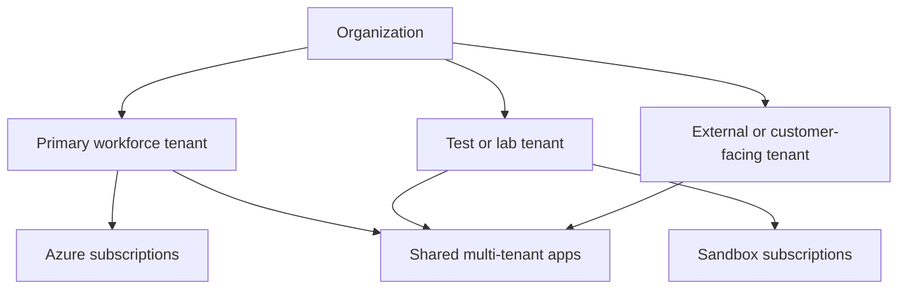

---
content_sources:
  diagrams:
    - id: tenant-directory-patterns
      type: flowchart
      source: mslearn-adapted
      mslearn_url: https://learn.microsoft.com/en-us/entra/fundamentals/create-new-tenant
---

# Tenants and Directories

Tenants define the administrative, security, and identity boundary in Microsoft Entra ID. Good tenant design determines how users collaborate, how applications are isolated, and how Azure subscriptions map to organizational ownership.

## Architecture Overview

<!-- diagram-id: tenant-directory-patterns -->


Some organizations operate with one tenant. Others separate workforce, development, or external identity scenarios across multiple tenants. The best pattern depends on regulatory boundaries, delegation requirements, and collaboration models.

## Core Concepts

### What a tenant contains

A tenant stores:

- Directory objects such as users, groups, devices, and applications
- Verified domains and branding settings
- Policies for authentication, external access, and lifecycle
- Enterprise applications and service principals instantiated in that tenant

```bash
az rest --method GET --url "https://graph.microsoft.com/v1.0/organization"
az rest --method GET --url "https://graph.microsoft.com/v1.0/domains"
```

### Common tenant types

Typical designs include:

- Single workforce tenant for most organizations
- Separate development tenant for experimentation and break-glass isolation
- Dedicated tenant for mergers, acquisitions, or regional sovereignty
- External identity tenant pattern for customer or partner access

```bash
az account tenant list --output table
mgc organization list --output json
```

### Default directory and custom domains

Every tenant begins with an initial onmicrosoft.com domain. Custom verified domains are then added so users and applications can use business-owned namespaces.

```bash
az rest --method GET --url "https://graph.microsoft.com/v1.0/domains"
mgc domains list --output table
```

### Multi-tenant patterns

Multi-tenant planning usually addresses one of two problems:

1. Multiple internal tenants that need controlled collaboration.
2. One application that must sign in users from many customer or partner tenants.

These are related but different design questions. Cross-tenant access settings help with collaboration. Multi-tenant app registrations help with application sign-in across tenants.

## Data Flow

1. A client or administrator targets a tenant-specific or common endpoint.
2. Entra resolves the home tenant for the user or application.
3. The tenant's policies, domains, and trust settings are evaluated.
4. The request succeeds in the tenant boundary that owns the identity.
5. Resource access is granted locally or through a guest or multi-tenant relationship.

## Integration Points

- Azure subscriptions linked to the tenant for RBAC
- Cross-tenant access settings for B2B collaboration
- Domain registrar and DNS for domain verification
- Enterprise applications that instantiate service principals per tenant

```bash
az rest --method GET --url "https://management.azure.com/tenants?api-version=2022-12-01"
az rest --method GET --url "https://graph.microsoft.com/v1.0/policies/crossTenantAccessPolicy"
```

## Configuration Options

Frequently configured tenant settings include:

- Custom domains and federation
- External collaboration restrictions
- Administrative units and delegated administration
- Self-service sign-up and consent boundaries

```bash
az rest --method PATCH --url "https://graph.microsoft.com/v1.0/organization/$TENANT_ID" --headers "Content-Type=application/json" --body '{"marketingNotificationEmails":["admin@example.com"]}'
az rest --method GET --url "https://graph.microsoft.com/v1.0/policies/crossTenantAccessPolicy"
mgc domains get --domain-id "$DISPLAY_NAME"
```

## Pricing Considerations

Multiple tenants can increase operational overhead even when the license SKU is unchanged. Cross-tenant governance, premium identity governance features, and advanced security controls may also require additional licensing in each tenant where they are enforced.

## Limitations and Quotas

- Verified domain names can exist in only one tenant at a time.
- Moving subscriptions between tenants requires planning for RBAC and automation identities.
- Cross-tenant trust does not automatically merge audit, policy, or lifecycle processes.
- Some settings are tenant-global and cannot be scoped per business unit.

## See Also

- [How Entra ID works](how-entra-id-works.md)
- [Users and groups](users-and-groups.md)
- [App registrations and service principals](app-registrations-and-service-principals.md)
- [Authentication methods](authentication-methods.md)

## Sources

- https://learn.microsoft.com/en-us/entra/fundamentals/create-new-tenant
- https://learn.microsoft.com/en-us/entra/external-id/cross-tenant-access-overview
- https://learn.microsoft.com/en-us/entra/identity/users/domains-manage
- https://learn.microsoft.com/en-us/azure/role-based-access-control/transfer-subscription
