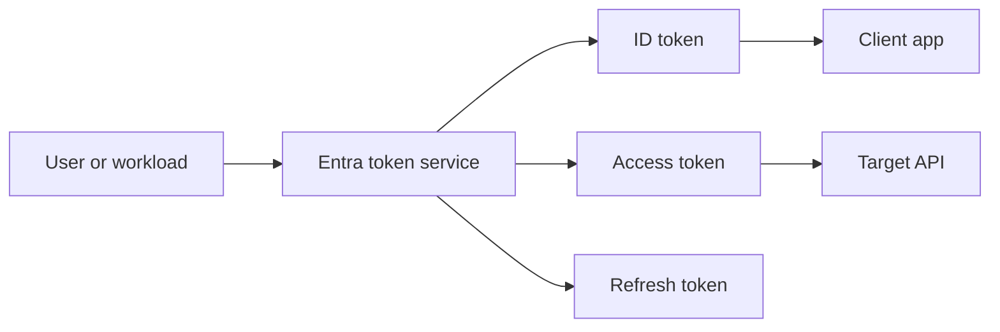
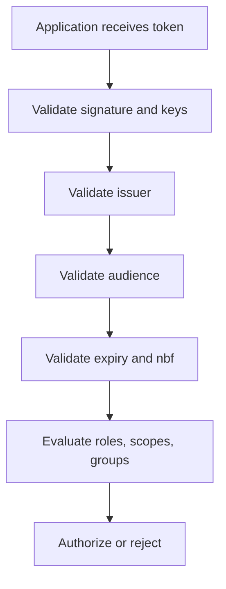
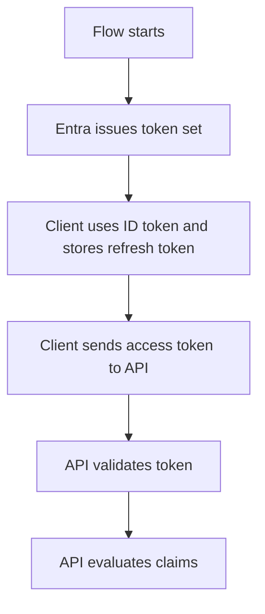

---
content_sources:
  diagrams:
    - id: token-issuance-claims-path
      type: flowchart
      source: mslearn-adapted
      mslearn_url: https://learn.microsoft.com/en-us/entra/identity-platform/id-tokens
    - id: token-validation-decision
      type: flowchart
      source: self-generated
      justification: "Synthesized from Microsoft Learn guidance on ID tokens, access tokens, refresh tokens, and optional claims."
      based_on:
        - https://learn.microsoft.com/en-us/entra/identity-platform/id-tokens
        - https://learn.microsoft.com/en-us/entra/identity-platform/access-tokens
        - https://learn.microsoft.com/en-us/entra/identity-platform/refresh-tokens
    - id: token-refresh-lifecycle
      type: flowchart
      source: self-generated
      justification: "Synthesized from Microsoft Learn guidance on token lifetimes and refresh token handling."
      based_on:
        - https://learn.microsoft.com/en-us/entra/identity-platform/refresh-tokens
        - https://learn.microsoft.com/en-us/entra/identity-platform/access-tokens
---

# Tokens and Claims

Tokens are the portable security artifacts Microsoft Entra ID issues after successful authentication and authorization checks. Claims inside those tokens tell applications who the subject is, what audience the token targets, and what authorization context is available.

## Architecture Overview

<!-- diagram-id: token-issuance-claims-path -->


Different tokens serve different purposes. Confusing them is one of the fastest ways to create broken or insecure application behavior.

Token thinking becomes simpler if you separate the parties:

- The **client** cares about the ID token for sign-in state.
- The **API** cares about the access token for authorization.
- The **authorization server** manages refresh tokens and renewal rules.

<!-- diagram-id: token-validation-decision -->


Applications should not trust a token simply because it exists. They must validate structure, issuer, signature, audience, and relevant authorization claims.

## Core Concepts

### ID tokens

ID tokens are intended for the client application to confirm the user's identity after sign-in. They are not meant to be sent to downstream APIs as authorization artifacts.

Key points:

- Audience is the client app.
- Primary purpose is user sign-in state.
- Useful claims often include subject, tenant, and authentication context.

### Access tokens

Access tokens are presented to APIs. They contain audience and authorization context that the resource validates before granting access.

The receiving API should check:

- Token signature.
- Correct issuer.
- Correct audience.
- Scope or role claims.
- Expiration and any other local requirements.

### Refresh tokens

Refresh tokens let a client obtain new tokens without forcing the user to reauthenticate each time. They are powerful and must be stored securely.

Design implications:

- Clients should protect them like long-lived credentials.
- APIs should never receive or process them.
- Their behavior depends on client type, session state, and policy.

### Common claims

Frequently evaluated claims include:

- `iss` for issuer
- `aud` for audience
- `sub` for subject
- `tid` for tenant ID
- `oid` for object ID
- `scp` or `roles` for authorization context

Useful mental model:

- Identity claims explain **who** the subject is.
- Context claims explain **where** the token came from.
- Authorization claims explain **what** the caller is allowed to do.

### Optional claims and claims mapping

Applications can request optional claims and define app roles. Claims customization should be deliberate because extra claims increase token size and processing complexity.

```bash
az rest --method GET --url "https://graph.microsoft.com/v1.0/applications/$OBJECT_ID"
mgc applications get --application-id "$OBJECT_ID" --output json
```

Typical reasons to add claims:

- Reduce extra directory lookups by the app.
- Expose app-specific roles.
- Carry selected identity context needed for downstream authorization.

### Group claims and overage behavior

Group-based authorization is common, but large memberships can affect token behavior. Applications must account for overage patterns instead of assuming every group will always appear directly in the token.

This is an application design concern, not just an identity configuration detail.

### Endpoint versions and token shape

Token contents can vary based on endpoint version, protocol, and target resource. Apps should validate the claims they actually require rather than assuming every token from Entra looks identical.

## Data Flow

1. The client starts an OAuth 2.0 or OIDC flow.
2. Entra validates identity, policy, app metadata, and consent.
3. Entra signs tokens with tenant-trusted keys.
4. The client stores or forwards the right token to the right party.
5. The application or API validates signature, issuer, audience, and lifetime.
6. Authorization logic evaluates scopes, roles, or groups claims.

Expanded lifecycle:

1. A user or workload requests a token through the chosen protocol flow.
2. Entra checks app configuration, tenant context, and policy.
3. Entra signs the token with appropriate keys.
4. The client receives the token set.
5. The client uses the ID token for sign-in state and the access token for API calls.
6. The API validates the access token before authorizing operations.
7. The client may later redeem a refresh token for renewal.

<!-- diagram-id: token-refresh-lifecycle -->


## Integration Points

- Application middleware for token validation
- APIs that check scopes or app roles
- Microsoft Graph and custom APIs consuming access tokens
- Conditional Access and Continuous Access Evaluation influences on token use

```bash
az rest --method GET --url "https://login.microsoftonline.com/$TENANT_ID/discovery/v2.0/keys"
az rest --method GET --url "https://graph.microsoft.com/v1.0/applications/$OBJECT_ID"
```

Integration table:

| Consumer | Main token used | Main validation focus |
|---|---|---|
| Web client | ID token | Sign-in identity and session context |
| API | Access token | Audience, issuer, scope, roles |
| Native or SPA client | ID token and access token | Proper storage and renewal behavior |
| Background client | Access token | App roles or application permissions |

## Configuration Options

Representative configuration areas include optional claims, app roles, and group claim behavior.

```bash
az rest --method PATCH --url "https://graph.microsoft.com/v1.0/applications/$OBJECT_ID" --headers "Content-Type=application/json" --body '{"optionalClaims":{"idToken":[{"name":"email"}],"accessToken":[{"name":"groups"}]}}'
az rest --method PATCH --url "https://graph.microsoft.com/v1.0/applications/$OBJECT_ID" --headers "Content-Type=application/json" --body '{"appRoles":[{"allowedMemberTypes":["Application"],"description":"Read data","displayName":"Data.Reader","id":"11111111-1111-1111-1111-111111111111","isEnabled":true,"origin":"Application","value":"Data.Reader"}]}'
mgc applications update --application-id "$OBJECT_ID" --body '{"groupMembershipClaims":"SecurityGroup"}'
```

More validation-oriented examples:

```bash
az rest --method GET --url "https://graph.microsoft.com/v1.0/applications/$OBJECT_ID" --query "{optionalClaims:optionalClaims, appRoles:appRoles, groupMembershipClaims:groupMembershipClaims}" --output json
az ad app show --id "$APP_ID" --output json
```

Expected output pattern:

```json
{
  "groupMembershipClaims": "SecurityGroup",
  "optionalClaims": {
    "idToken": [
      {
        "name": "email"
      }
    ]
  }
}
```

Recommended configuration principles:

### Keep tokens small

- Add only claims the app genuinely needs.
- Avoid large or redundant custom claim sets.
- Prefer directory lookups when claim sprawl becomes hard to manage.

### Align claims with authorization model

- Use scopes for delegated access.
- Use app roles for app-specific authorization semantics.
- Use groups carefully when group volume is large or nested membership is complex.

## Pricing Considerations

Token issuance is part of the platform, but advanced controls that influence claims and token validity windows can depend on premium security capabilities, licensing, and the consuming workload's requirements.

Practical cost factors include:

- Premium security features that influence session and token behavior.
- Application engineering effort to handle claims correctly.
- Monitoring and telemetry for token-related failures.

## Limitations and Quotas

- Token formats and claim presence vary by endpoint version and resource.
- Large group membership can cause overage behavior and alternate claim handling.
- Refresh token handling depends on client type, session state, and policy.
- Applications must validate tokens locally; possession of a token alone is not trust.

Additional limits to plan for:

- Tokens are not interchangeable between resources.
- Optional claims can increase payload size and processing cost.
- Authorization logic should not rely on undocumented claim presence.

## Advanced Topics

### Why tokens are frequently misused

Common mistakes include:

- Sending an ID token to an API.
- Ignoring audience or issuer validation.
- Treating groups, scopes, and roles as interchangeable.
- Forgetting that token issuance does not replace local authorization logic.

### App roles vs scopes

- Use **scopes** for delegated user-based permissions.
- Use **app roles** for application authorization models, especially with service principals and role assignments.

### Claims design checklist

1. Which application consumes the token?
2. Which claims are required for authorization?
3. Can the app tolerate missing or overage-driven claim changes?
4. Is the validation logic explicit and testable?

## See Also

- [OAuth 2.0 and OIDC](oauth2-and-oidc.md)
- [Authentication methods](authentication-methods.md)
- [App registrations and service principals](app-registrations-and-service-principals.md)
- [How Entra ID works](how-entra-id-works.md)

## Sources

- https://learn.microsoft.com/en-us/entra/identity-platform/id-tokens
- https://learn.microsoft.com/en-us/entra/identity-platform/access-tokens
- https://learn.microsoft.com/en-us/entra/identity-platform/refresh-tokens
- https://learn.microsoft.com/en-us/entra/identity-platform/optional-claims
