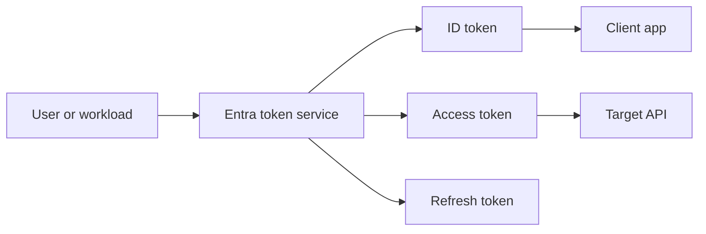

---
content_sources:
  diagrams:
    - id: token-issuance-claims-path
      type: flowchart
      source: mslearn-adapted
      mslearn_url: https://learn.microsoft.com/en-us/entra/identity-platform/id-tokens
---

# Tokens and Claims

Tokens are the portable security artifacts Microsoft Entra ID issues after successful authentication and authorization checks. Claims inside those tokens tell applications who the subject is, what audience the token targets, and what authorization context is available.

## Architecture Overview

<!-- diagram-id: token-issuance-claims-path -->


Different tokens serve different purposes. Confusing them is one of the fastest ways to create broken or insecure application behavior.

## Core Concepts

### ID tokens

ID tokens are intended for the client application to confirm the user's identity after sign-in. They are not meant to be sent to downstream APIs as authorization artifacts.

### Access tokens

Access tokens are presented to APIs. They contain audience and authorization context that the resource validates before granting access.

### Refresh tokens

Refresh tokens let a client obtain new tokens without forcing the user to reauthenticate each time. They are powerful and must be stored securely.

### Common claims

Frequently evaluated claims include:

- `iss` for issuer
- `aud` for audience
- `sub` for subject
- `tid` for tenant ID
- `oid` for object ID
- `scp` or `roles` for authorization context

### Optional claims and claims mapping

Applications can request optional claims and define app roles. Claims customization should be deliberate because extra claims increase token size and processing complexity.

```bash
az rest --method GET --url "https://graph.microsoft.com/v1.0/applications/$OBJECT_ID"
mgc applications get --application-id "$OBJECT_ID" --output json
```

## Data Flow

1. The client starts an OAuth 2.0 or OIDC flow.
2. Entra validates identity, policy, app metadata, and consent.
3. Entra signs tokens with tenant-trusted keys.
4. The client stores or forwards the right token to the right party.
5. The application or API validates signature, issuer, audience, and lifetime.
6. Authorization logic evaluates scopes, roles, or groups claims.

## Integration Points

- Application middleware for token validation
- APIs that check scopes or app roles
- Microsoft Graph and custom APIs consuming access tokens
- Conditional Access and Continuous Access Evaluation influences on token use

```bash
az rest --method GET --url "https://login.microsoftonline.com/$TENANT_ID/discovery/v2.0/keys"
az rest --method GET --url "https://graph.microsoft.com/v1.0/applications/$OBJECT_ID"
```

## Configuration Options

Representative configuration areas include optional claims, app roles, and group claim behavior.

```bash
az rest --method PATCH --url "https://graph.microsoft.com/v1.0/applications/$OBJECT_ID" --headers "Content-Type=application/json" --body '{"optionalClaims":{"idToken":[{"name":"email"}],"accessToken":[{"name":"groups"}]}}'
az rest --method PATCH --url "https://graph.microsoft.com/v1.0/applications/$OBJECT_ID" --headers "Content-Type=application/json" --body '{"appRoles":[{"allowedMemberTypes":["Application"],"description":"Read data","displayName":"Data.Reader","id":"11111111-1111-1111-1111-111111111111","isEnabled":true,"origin":"Application","value":"Data.Reader"}]}'
mgc applications update --application-id "$OBJECT_ID" --body '{"groupMembershipClaims":"SecurityGroup"}'
```

## Pricing Considerations

Token issuance is part of the platform, but advanced controls that influence claims and token validity windows can depend on premium security capabilities, licensing, and the consuming workload's requirements.

## Limitations and Quotas

- Token formats and claim presence vary by endpoint version and resource.
- Large group membership can cause overage behavior and alternate claim handling.
- Refresh token handling depends on client type, session state, and policy.
- Applications must validate tokens locally; possession of a token alone is not trust.

## See Also

- [OAuth 2.0 and OIDC](oauth2-and-oidc.md)
- [Authentication methods](authentication-methods.md)
- [App registrations and service principals](app-registrations-and-service-principals.md)
- [How Entra ID works](how-entra-id-works.md)

## Sources

- https://learn.microsoft.com/en-us/entra/identity-platform/id-tokens
- https://learn.microsoft.com/en-us/entra/identity-platform/access-tokens
- https://learn.microsoft.com/en-us/entra/identity-platform/refresh-tokens
- https://learn.microsoft.com/en-us/entra/identity-platform/optional-claims
