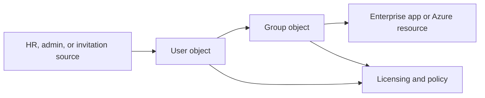
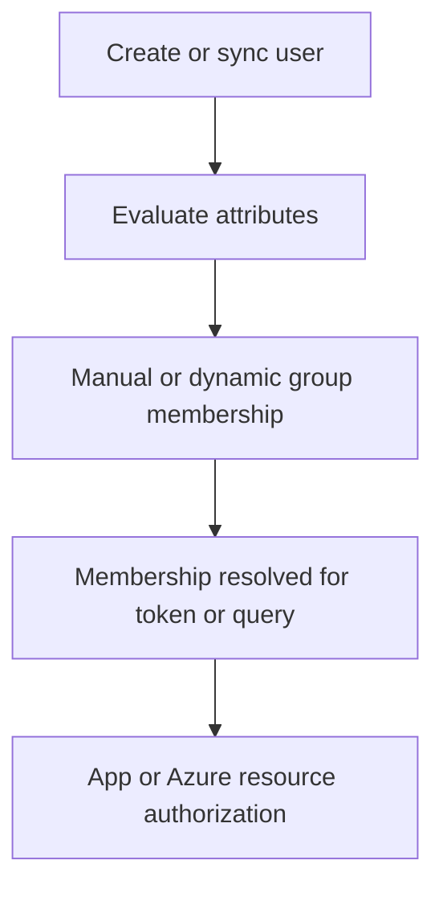
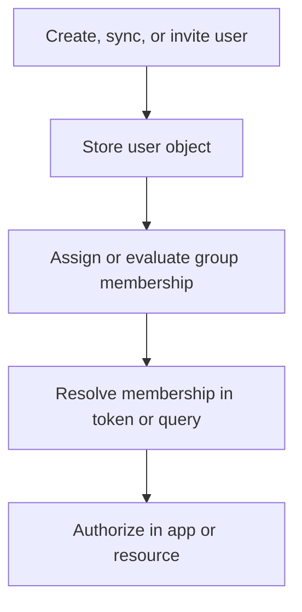

---
content_sources:
  diagrams:
    - id: user-group-lifecycle
      type: flowchart
      source: mslearn-adapted
      mslearn_url: https://learn.microsoft.com/en-us/entra/fundamentals/concept-learn-about-users
    - id: membership-resolution-path
      type: flowchart
      source: self-generated
      justification: "Synthesized from Microsoft Learn guidance on users, groups, dynamic membership, and membership evaluation."
      based_on:
        - https://learn.microsoft.com/en-us/entra/fundamentals/concept-learn-about-users
        - https://learn.microsoft.com/en-us/entra/fundamentals/concept-learn-about-groups
        - https://learn.microsoft.com/en-us/entra/identity/users/groups-create-rule
    - id: user-provisioning-flow
      type: flowchart
      source: self-generated
      justification: "Synthesized from Microsoft Learn user and group lifecycle documentation."
      based_on:
        - https://learn.microsoft.com/en-us/entra/fundamentals/concept-learn-about-users
---

# Users and Groups

Users and groups are the everyday objects administrators work with in Microsoft Entra ID. They control sign-in identity, collaboration, app assignments, and authorization decisions across Microsoft 365, Azure, and custom applications.

## Architecture Overview

<!-- diagram-id: user-group-lifecycle -->


User objects represent people or guests. Group objects create reusable authorization boundaries so that access can be managed at scale rather than user by user.

The practical reason groups matter is simple:

- Identities change constantly.
- Access targets change constantly.
- Group-based indirection lets administrators manage change without editing every assignment one principal at a time.

<!-- diagram-id: membership-resolution-path -->


The key distinction is that the directory stores membership, but each consuming workload still decides how and when it uses that membership during authorization.

## Core Concepts

### User types

Common user categories include:

- Member users managed directly in the tenant
- Guest users invited through B2B collaboration
- Synchronized users from on-premises identity sources

The user type affects lifecycle ownership, visibility, and collaboration controls.

```bash
az ad user list --filter "userType eq 'Member'"
az ad user list --filter "userType eq 'Guest'"
mgc users list --filter "accountEnabled eq true" --output table
```

Operational meaning:

- Members are internal identities for the tenant.
- Guests are external identities represented locally for collaboration.
- Synced users inherit some lifecycle facts from upstream identity systems.

### Group types

Entra supports several group models:

- Security groups for authorization and Azure RBAC references
- Microsoft 365 groups for collaboration workloads
- Mail-enabled groups in connected Microsoft 365 scenarios
- Dynamic groups whose membership is rule-based

```bash
az ad group list --filter "securityEnabled eq true"
mgc groups list --filter "groupTypes/any(c:c eq 'DynamicMembership')" --output json
```

Design guidance:

- Use security groups for access control first.
- Use Microsoft 365 groups when collaboration features are the goal.
- Avoid reusing one group for many unrelated business purposes.

### Membership models

Membership can be:

- Assigned manually by administrators or automation
- Dynamic based on user or device attributes
- Indirect through nested group patterns where supported by the consuming system

Dynamic membership rules reduce manual operations but increase dependence on accurate source attributes.

```bash
az rest --method GET --url "https://graph.microsoft.com/v1.0/groups?$filter=membershipRuleProcessingState eq 'On'"
mgc groups members list --group-id "$OBJECT_ID" --output table
```

Expected output pattern:

```text
Id            DisplayName
------------  -----------------
<object-id>   user@example.com
```

### Object identifiers that matter

Administrators frequently confuse sign-in name, application ID, and object ID. For users and groups, the object ID is the most important stable reference for scripting and RBAC.

```bash
az ad user show --id "$OBJECT_ID"
az ad group show --group "$OBJECT_ID"
```

Practical rule:

- Use UPN for human-friendly sign-in context.
- Use display name for communication.
- Use object ID for automation and role assignment references.

### Dynamic membership dependencies

Dynamic groups depend on directory attributes and rule evaluation. If source attributes are wrong or delayed, membership outcomes will also be wrong or delayed.

That means dynamic groups are a data quality feature as much as an identity feature.

### Assignment vs authorization

Users and groups often participate in several layers:

- Group membership in the directory.
- User or group assignment to enterprise applications.
- Role assignment in Azure RBAC.
- Claims resolution in tokens.

These layers are related but not identical, so operators should confirm where access actually fails.

## Data Flow

1. A user object is created or synchronized.
2. Group membership is assigned manually or evaluated dynamically.
3. Applications or Azure resources reference the user or group.
4. Tokens and policy engines resolve direct and indirect memberships.
5. Access decisions are made by the target workload.

Expanded lifecycle:

1. An identity source creates, syncs, or invites a user.
2. Attributes are written to the directory.
3. Static or dynamic group logic changes membership.
4. Apps and Azure resources reference the user or group for access.
5. Entra and downstream workloads resolve membership during sign-in or authorization checks.
6. Target workloads enforce their own supported group or role model.

<!-- diagram-id: user-provisioning-flow -->


## Integration Points

- HR-driven provisioning and on-premises sync
- Microsoft 365 licensing and collaboration services
- Azure RBAC and resource governance
- Enterprise applications for user assignment and provisioning

```bash
az rest --method GET --url "https://graph.microsoft.com/v1.0/users/$OBJECT_ID/memberOf"
az rest --method GET --url "https://graph.microsoft.com/v1.0/groups/$OBJECT_ID/members"
```

Integration table:

| Integration area | Uses users | Uses groups | Operational question |
|---|---|---|---|
| Microsoft 365 | Yes | Yes | Who should collaborate and be licensed? |
| Azure RBAC | Yes | Yes | Which principal should receive role assignments? |
| Enterprise apps | Yes | Yes | Should access be direct or group-based? |
| Provisioning systems | Yes | Indirectly | Which source system owns lifecycle? |

## Configuration Options

Representative tasks include creating users, creating groups, and managing membership.

```bash
az ad user create --display-name "$DISPLAY_NAME" --user-principal-name "user@example.com" --password "<temporary-password>"
az ad group create --display-name "$DISPLAY_NAME" --mail-nickname "$DISPLAY_NAME"
az ad group member add --group "$OBJECT_ID" --member-id "$OBJECT_ID"
mgc groups create --body '{"displayName":"'$DISPLAY_NAME'","mailEnabled":false,"mailNickname":"'$DISPLAY_NAME'","securityEnabled":true}'
```

More operational examples:

```bash
az ad user list --filter "accountEnabled eq true" --query "[].{displayName:displayName, id:id, userType:userType}" --output table
az ad group list --query "[].{displayName:displayName, id:id, securityEnabled:securityEnabled}" --output table
az ad group member check --group "$OBJECT_ID" --member-id "$OBJECT_ID"
```

Expected output pattern:

```text
DisplayName     Id            UserType
--------------  ------------  --------
Demo User       <object-id>   Member
```

Recommended patterns:

### Use groups as the access layer

- Assign groups to apps and roles where possible.
- Minimize direct per-user assignment.
- Keep group purpose narrow and documented.

### Use dynamic groups when source data is reliable

- Validate attribute quality first.
- Keep rules understandable and supportable.
- Monitor processing state during rollout.

### Manage guests explicitly

- Track sponsor or business owner.
- Review stale access regularly.
- Avoid guest sprawl with no lifecycle ownership.

!!! note
    Use placeholder values in scripts and automation examples. Do not embed real tenant names, user principal names, or object identifiers in documentation.

## Pricing Considerations

Basic user and group objects exist in the free tier. Dynamic groups, advanced self-service capabilities, and governance features often depend on Microsoft Entra ID P1 or P2 licensing.

Practical cost drivers include:

- Premium licensing for dynamic groups and governance features.
- Lifecycle automation and HR integration work.
- Operational review effort for guest populations and stale memberships.

## Limitations and Quotas

- Dynamic membership rules are powerful but not available for every object type or scenario.
- Not every downstream application supports nested groups the same way.
- Large tenants should plan for provisioning lag and eventual consistency in directory reads.
- Guest users require clear lifecycle and sponsor ownership to avoid stale access.

Additional planning limits:

- Display names are not reliable unique identifiers.
- Group reuse across unrelated systems creates authorization confusion.
- Some workloads resolve group membership differently from others.

## Advanced Topics

### Lifecycle ownership model

Ask these questions for every principal type:

1. Who creates it?
2. Who updates it?
3. Who removes it?
4. Which systems depend on it for access?

### Group design anti-patterns

- One giant catch-all group for many apps.
- Dynamic rules based on weak or manually curated attributes.
- Using display names rather than object IDs in automation.
- Keeping guests forever because no sponsor is accountable.

### Access modeling guidance

Use this hierarchy where possible:

1. User identity exists in the tenant.
2. User joins purpose-specific groups.
3. Groups are assigned to apps, roles, or Azure scopes.
4. Reviews and lifecycle automation keep the model current.

## See Also

- [Tenants and directories](tenants-and-directories.md)
- [Authentication methods](authentication-methods.md)
- [Tokens and claims](tokens-and-claims.md)
- [Operations: user lifecycle management](../operations/user-lifecycle-management.md)
- [Operations: group management](../operations/group-management.md)

## Sources

- https://learn.microsoft.com/en-us/entra/fundamentals/concept-learn-about-users
- https://learn.microsoft.com/en-us/entra/fundamentals/concept-learn-about-groups
- https://learn.microsoft.com/en-us/entra/identity/users/groups-create-rule
- https://learn.microsoft.com/en-us/graph/api/resources/users
