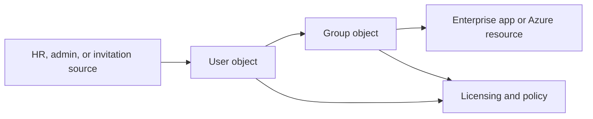

---
content_sources:
  diagrams:
    - id: user-group-lifecycle
      type: flowchart
      source: mslearn-adapted
      mslearn_url: https://learn.microsoft.com/en-us/entra/fundamentals/concept-learn-about-users
---

# Users and Groups

Users and groups are the everyday objects administrators work with in Microsoft Entra ID. They control sign-in identity, collaboration, app assignments, and authorization decisions across Microsoft 365, Azure, and custom applications.

## Architecture Overview

<!-- diagram-id: user-group-lifecycle -->


User objects represent people or guests. Group objects create reusable authorization boundaries so that access can be managed at scale rather than user by user.

## Core Concepts

### User types

Common user categories include:

- Member users managed directly in the tenant
- Guest users invited through B2B collaboration
- Synchronized users from on-premises identity sources

The user type affects lifecycle ownership, visibility, and collaboration controls.

```bash
az ad user list --filter "userType eq 'Member'"
az ad user list --filter "userType eq 'Guest'"
mgc users list --filter "accountEnabled eq true" --output table
```

### Group types

Entra supports several group models:

- Security groups for authorization and Azure RBAC references
- Microsoft 365 groups for collaboration workloads
- Mail-enabled groups in connected Microsoft 365 scenarios
- Dynamic groups whose membership is rule-based

```bash
az ad group list --filter "securityEnabled eq true"
mgc groups list --filter "groupTypes/any(c:c eq 'DynamicMembership')" --output json
```

### Membership models

Membership can be:

- Assigned manually by administrators or automation
- Dynamic based on user or device attributes
- Indirect through nested group patterns where supported by the consuming system

Dynamic membership rules reduce manual operations but increase dependence on accurate source attributes.

```bash
az rest --method GET --url "https://graph.microsoft.com/v1.0/groups?$filter=membershipRuleProcessingState eq 'On'"
mgc groups members list --group-id "$OBJECT_ID" --output table
```

### Object identifiers that matter

Administrators frequently confuse sign-in name, application ID, and object ID. For users and groups, the object ID is the most important stable reference for scripting and RBAC.

```bash
az ad user show --id "$OBJECT_ID"
az ad group show --group "$OBJECT_ID"
```

## Data Flow

1. A user object is created or synchronized.
2. Group membership is assigned manually or evaluated dynamically.
3. Applications or Azure resources reference the user or group.
4. Tokens and policy engines resolve direct and indirect memberships.
5. Access decisions are made by the target workload.

## Integration Points

- HR-driven provisioning and on-premises sync
- Microsoft 365 licensing and collaboration services
- Azure RBAC and resource governance
- Enterprise applications for user assignment and provisioning

```bash
az rest --method GET --url "https://graph.microsoft.com/v1.0/users/$OBJECT_ID/memberOf"
az rest --method GET --url "https://graph.microsoft.com/v1.0/groups/$OBJECT_ID/members"
```

## Configuration Options

Representative tasks include creating users, creating groups, and managing membership.

```bash
az ad user create --display-name "$DISPLAY_NAME" --user-principal-name "user@$DISPLAY_NAME" --password "<temporary-password>"
az ad group create --display-name "$DISPLAY_NAME" --mail-nickname "$DISPLAY_NAME"
az ad group member add --group "$OBJECT_ID" --member-id "$OBJECT_ID"
mgc groups create --body '{"displayName":"'$DISPLAY_NAME'","mailEnabled":false,"mailNickname":"'$DISPLAY_NAME'","securityEnabled":true}'
```

!!! note
    Use placeholder values in scripts and automation examples. Do not embed real tenant names, user principal names, or object identifiers in documentation.

## Pricing Considerations

Basic user and group objects exist in the free tier. Dynamic groups, advanced self-service capabilities, and governance features often depend on Microsoft Entra ID P1 or P2 licensing.

## Limitations and Quotas

- Dynamic membership rules are powerful but not available for every object type or scenario.
- Not every downstream application supports nested groups the same way.
- Large tenants should plan for provisioning lag and eventual consistency in directory reads.
- Guest users require clear lifecycle and sponsor ownership to avoid stale access.

## See Also

- [Tenants and directories](tenants-and-directories.md)
- [Authentication methods](authentication-methods.md)
- [Tokens and claims](tokens-and-claims.md)
- [Operations: user lifecycle management](../operations/user-lifecycle-management.md)
- [Operations: group management](../operations/group-management.md)

## Sources

- https://learn.microsoft.com/en-us/entra/fundamentals/concept-learn-about-users
- https://learn.microsoft.com/en-us/entra/fundamentals/concept-learn-about-groups
- https://learn.microsoft.com/en-us/entra/identity/users/groups-create-rule
- https://learn.microsoft.com/en-us/graph/api/resources/users
