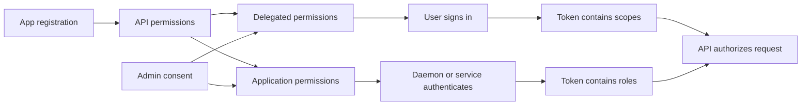

# Configure API Permissions

This scenario explains how to assign delegated and application permissions to an app registration, understand the consent boundary, and validate that the resulting tokens are authorized for the intended API calls.

## Prerequisites

- An existing app registration with `$APP_ID` and `$OBJECT_ID`.
- Administrative rights to grant tenant-wide admin consent when needed.
- A target API such as Microsoft Graph or a custom API.
- A clear distinction between user-present and daemon scenarios.

## Architecture

<!-- diagram-id: api-permissions-consent-model -->


## Step-by-Step Configuration

1. Review the current permission state.

    ```bash
    az ad app permission list \
        --id "$APP_ID" \
        --output json
    ```

2. Add a delegated Microsoft Graph permission for interactive user access.

    ```bash
    az ad app permission add \
        --id "$APP_ID" \
        --api 00000003-0000-0000-c000-000000000000 \
        --api-permissions e1fe6dd8-ba31-4d61-89e7-88639da4683d=Scope
    ```

    This example adds `User.Read` as a delegated scope.

3. Add an application permission for app-only processing.

    ```bash
    az ad app permission add \
        --id "$APP_ID" \
        --api 00000003-0000-0000-c000-000000000000 \
        --api-permissions 62a82d76-70ea-41e2-9197-370581804d09=Role
    ```

    This example adds the `Directory.Read.All` application permission. Use it only when the daemon scenario genuinely requires directory-wide read access.

4. Inspect the application object through Microsoft Graph for full permission metadata.

    ```bash
    az rest \
        --method GET \
        --uri "https://graph.microsoft.com/v1.0/applications/$OBJECT_ID"
    ```

5. Grant admin consent for permissions that require tenant approval.

    ```bash
    az ad app permission admin-consent \
        --id "$APP_ID"
    ```

6. If you are exposing your own API, confirm that the resource app defines scopes or app roles before granting permissions from the client app.

    ```bash
    az rest \
        --method GET \
        --uri "https://graph.microsoft.com/v1.0/applications/$OBJECT_ID?$select=api,appRoles"
    ```

7. Validate the service principal permissions in the tenant.

    ```bash
    az ad sp list \
        --filter "appId eq '$APP_ID'" \
        --query "[0].id" \
        --output tsv
    ```

8. Test delegated access.

    - Sign in interactively through the app.
    - Request only the scopes the application actually needs.
    - Decode the access token and verify the `scp` claim includes the delegated scope.

9. Test application access.

    - Acquire a token with client credentials.
    - Decode the access token.
    - Verify the `roles` claim contains the application permission.
    - Call the target API and confirm the API accepts the role.

10. Remove any unnecessary permissions after testing.

    ```bash
    az ad app permission delete \
        --id "$APP_ID" \
        --api 00000003-0000-0000-c000-000000000000
    ```

    Re-add only the minimum required set if you use this reset pattern.

## Verification

- `az ad app permission list --id "$APP_ID"` shows the expected permissions.
- The consent state aligns with the deployment model.
- Delegated tokens contain `scp` values, not `roles`, for user-present calls.
- App-only tokens contain `roles`, not delegated scopes.
- The target API enforces the expected authorization path.

## Common Issues

| Issue | What it usually means | Fix |
|---|---|---|
| Overprivileged app | Too many broad Graph permissions were granted. | Remove unused entries and redesign around least privilege. |
| Admin consent required error | The permission cannot be self-consented by users. | Have a tenant admin grant consent or choose a lower-privilege permission if appropriate. |
| `scp` missing | You acquired an app-only token instead of delegated access. | Use an interactive flow and request scopes, not `.default`, for delegated testing. |
| `roles` missing | The application permission was not granted or the wrong token flow was used. | Grant admin consent and acquire the token through client credentials. |
| Custom API permission not visible | The resource API has not exposed scopes or app roles. | Define the API surface on the resource app first, then grant from the client app. |

## See Also

- [App Registration Scenarios](index.md)
- [Web App Auth](web-app-auth.md)
- [Operations: App Consent Management](../../operations/app-consent-management.md)
- [Best Practices: Least Privilege RBAC](../../best-practices/least-privilege-rbac.md)

## Sources

- https://learn.microsoft.com/en-us/entra/identity-platform/quickstart-configure-app-access-web-apis
- https://learn.microsoft.com/en-us/entra/identity-platform/permissions-consent-overview
- https://learn.microsoft.com/en-us/entra/identity-platform/v2-oauth2-client-creds-grant-flow
