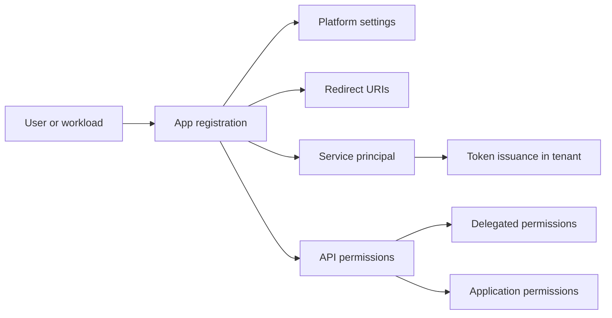

# App Registration Scenarios

Use these guides when you need to register an application, configure sign-in, or assign Microsoft Graph and custom API permissions. App registration is the control plane for application identity, while the service principal represents the application inside a tenant.

## Why this category matters

- It defines how users and workloads obtain tokens.
- It controls which redirect URIs and platforms are trusted.
- It sets the permission model for delegated and app-only access.
- It establishes the consent and governance boundary for the app.

<!-- diagram-id: app-registration-scenarios-map -->

## Topics in this section

| Topic | Focus | Why you would use it |
|---|---|---|
| [Web App Auth](web-app-auth.md) | Interactive web application sign-in using MSAL and authorization code flow. | Use when users sign in through a browser and the app needs ID and access tokens. |
| [API Permissions](api-permissions.md) | Delegated and application permission planning, grant flow, and admin consent. | Use when the app must call Microsoft Graph or a custom API. |

## Design checkpoints

1. Decide whether the app is single-tenant or multi-tenant.
2. Confirm the redirect URI pattern before releasing code.
3. Minimize permissions and separate delegated from app-only needs.
4. Plan admin consent and application secret or certificate management.

## Common building blocks

- App registration object in the home tenant.
- Service principal object in each consuming tenant.
- Platform configuration for web, SPA, public client, or daemon patterns.
- Secrets or certificates for confidential clients.
- Microsoft Graph permissions and admin consent workflow.

## Operational notes

!!! note
    Rotate secrets before expiration and prefer certificates or managed identities for long-lived production workloads.

!!! note
    Test redirect URIs and permission grants in a pilot tenant before applying the same pattern to production.

## See Also

- [Scenarios](../index.md)
- [Platform: App Registrations and Service Principals](../../platform/app-registrations-and-service-principals.md)
- [Platform: OAuth2 and OIDC](../../platform/oauth2-and-oidc.md)
- [Best Practices: App Registration Hygiene](../../best-practices/app-registration-hygiene.md)

## Sources

- https://learn.microsoft.com/en-us/entra/identity-platform/quickstart-register-app
- https://learn.microsoft.com/en-us/entra/identity-platform/v2-protocols-oidc
- https://learn.microsoft.com/en-us/entra/identity-platform/quickstart-configure-app-access-web-apis
